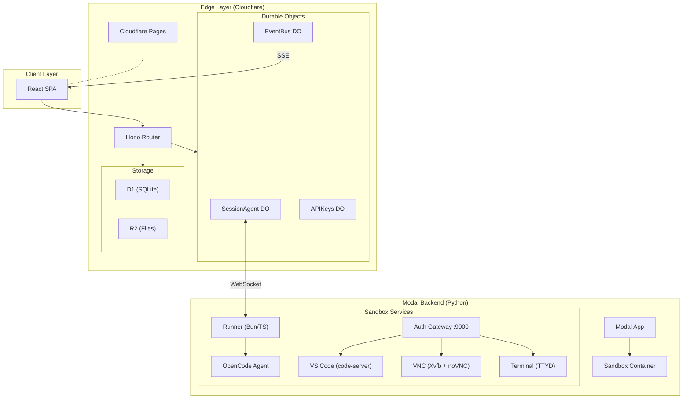
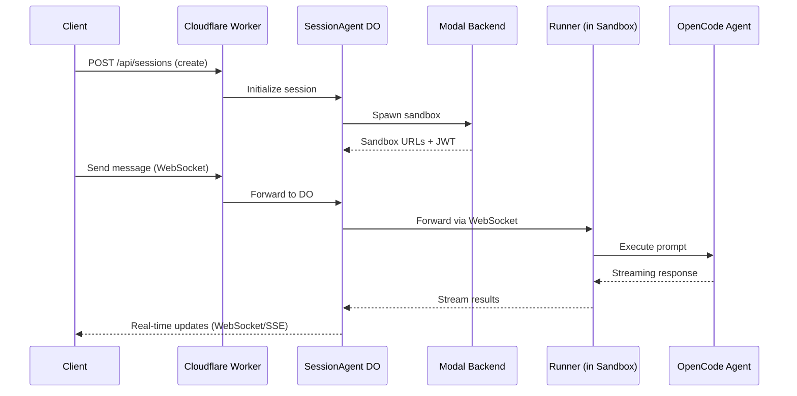

# Agent Ops

A hosted background coding agent platform. Users interact with an AI coding agent through a web UI or Slack. Each session runs in an isolated Modal sandbox with a full dev environment — VS Code, browser via VNC, terminal, and an OpenCode agent.

## Architecture



## Request Flow



## Packages

| Package | Tech | Description |
|---------|------|-------------|
| `packages/client` | React 19, Vite 6, TanStack Router/Query, Zustand, Tailwind, Radix UI | Web frontend (deployed to Cloudflare Pages) |
| `packages/worker` | Cloudflare Workers, Hono 4, D1, R2, Durable Objects | API layer and session orchestration |
| `packages/runner` | Bun, TypeScript, Hono, OpenCode SDK | Runs inside each sandbox, bridges DO <-> OpenCode |
| `packages/shared` | TypeScript | Shared types and error classes |
| `backend` | Python 3.12, Modal SDK | Sandbox lifecycle management |
| `docker` | Dockerfile, shell scripts | Sandbox container image (code-server, VNC, TTYD) |

## Project Structure

```
agent-ops/
├── packages/
│   ├── client/                # React SPA
│   │   └── src/
│   │       ├── api/           # API client, React Query hooks
│   │       ├── components/    # UI components (chat, sessions, panels, etc.)
│   │       ├── hooks/         # Custom hooks (chat, websocket, SSE, theme)
│   │       ├── routes/        # TanStack file-based routes
│   │       └── stores/        # Zustand state (auth, UI)
│   ├── worker/                # Cloudflare Worker
│   │   ├── src/
│   │   │   ├── routes/        # Hono API routes
│   │   │   ├── durable-objects/  # SessionAgent, EventBus, APIKeys
│   │   │   ├── middleware/    # Auth middleware
│   │   │   └── lib/           # DB helpers, utilities
│   │   └── migrations/        # D1 SQL migrations
│   ├── runner/                # Sandbox runner
│   │   └── src/
│   │       ├── bin.ts         # Entry point
│   │       ├── agent-client.ts  # WebSocket client to DO
│   │       ├── prompt.ts      # OpenCode prompt handling
│   │       └── gateway.ts     # Auth proxy (port 9000)
│   └── shared/                # Shared types & errors
├── backend/                   # Modal Python backend
│   ├── app.py                 # Modal App, web endpoints
│   ├── session.py             # Session state tracking
│   ├── sandboxes.py           # Sandbox lifecycle
│   └── images/                # Sandbox image definitions
├── docker/                    # Sandbox container setup
│   ├── Dockerfile.sandbox
│   └── start.sh
├── V1.md                      # Full architecture spec
├── Makefile                   # Dev, test, deploy commands
└── .beans/                    # Task tracking
```

## Quick Start

```bash
pnpm install
make db-setup        # Migrate + seed D1
```

Configure OAuth credentials in `packages/worker/.dev.vars` (see [OAuth Setup](#oauth-setup) below), then:

```bash
make dev-all         # Starts worker (:8787), client (:5173), and OpenCode container
```

## Development Commands

```bash
# Start services
make dev-all              # All services in parallel
make dev-worker           # Cloudflare Worker on :8787
make dev-client           # Vite dev server on :5173
make dev-opencode         # OpenCode container on :4096

# Database
make db-migrate           # Run D1 migrations locally
make db-seed              # Seed test data
make db-reset             # Drop and recreate

# Code quality
make typecheck            # TypeScript check (all packages)
make lint                 # Linter

# Health checks
make health               # Check all services
make health-worker        # Check worker only

# Deploy
make deploy               # Deploy worker + Modal + client
make deploy-worker        # Cloudflare Worker only
make deploy-modal         # Modal backend only
make deploy-client        # Cloudflare Pages only
make release              # Full release (install, typecheck, build, push image, deploy all)
```

### Modal Backend Deployment

Modal deployment requires the `agent-ops` conda environment and runs from the project root:

```bash
~/anaconda3/envs/agent-ops/bin/modal deploy backend/app.py
```

To force a sandbox image rebuild after changing `docker/` or `packages/runner/`:

1. Bump `IMAGE_BUILD_VERSION` in `backend/images/base.py`
2. Redeploy: `make deploy-modal`
3. New sessions will use the updated image

## OAuth Setup

Authentication uses GitHub OAuth (primary) and optionally Google OAuth.

### GitHub OAuth (Required)

1. Go to [GitHub > Settings > Developer settings > OAuth Apps](https://github.com/settings/developers)
2. Create a new OAuth App:

   | Field | Dev | Production |
   |-------|-----|------------|
   | Homepage URL | `http://localhost:5173` | `https://your-domain.com` |
   | Callback URL | `http://localhost:8787/auth/github/callback` | `https://agent-ops.conner-7e8.workers.dev/auth/github/callback` |

3. Copy the **Client ID** and generate a **Client Secret**

Scopes requested: `repo read:user user:email` (needed for repo cloning and PR creation inside sandboxes).

### Google OAuth (Optional)

1. In [Google Cloud Console](https://console.cloud.google.com/), create OAuth credentials
2. Add scopes: `openid`, `email`, `profile`
3. Add redirect URI: `http://localhost:8787/auth/google/callback` (dev)

### Local Credentials

Create `packages/worker/.dev.vars`:

```
ENCRYPTION_KEY=any-string-at-least-32-characters-long
ENVIRONMENT=development
GITHUB_CLIENT_ID=your_github_client_id
GITHUB_CLIENT_SECRET=your_github_client_secret
GOOGLE_CLIENT_ID=your_google_client_id        # optional
GOOGLE_CLIENT_SECRET=your_google_client_secret  # optional
```

### Production Secrets

```bash
cd packages/worker
npx wrangler secret put ENCRYPTION_KEY
npx wrangler secret put GITHUB_CLIENT_ID
npx wrangler secret put GITHUB_CLIENT_SECRET
npx wrangler secret put FRONTEND_URL
```

## API Endpoints

### Auth

| Endpoint | Method | Description |
|----------|--------|-------------|
| `/auth/github` | GET | Start GitHub OAuth flow |
| `/auth/google` | GET | Start Google OAuth flow |
| `/auth/github/callback` | GET | GitHub OAuth callback |
| `/auth/google/callback` | GET | Google OAuth callback |
| `/api/auth/me` | GET | Current user info |
| `/health` | GET | Health check |

### Sessions

| Endpoint | Method | Description |
|----------|--------|-------------|
| `/api/sessions` | GET | List sessions |
| `/api/sessions` | POST | Create session (spawns sandbox) |
| `/api/sessions/:id` | GET | Session details |
| `/api/sessions/:id` | DELETE | Terminate session |
| `/api/sessions/:id/ws` | WebSocket | Real-time session communication |
| `/api/sessions/:id/events` | GET | SSE event stream |

### Files & Repos

| Endpoint | Method | Description |
|----------|--------|-------------|
| `/api/files` | GET | List files |
| `/api/files` | POST | Upload file |
| `/api/files/:id` | GET | Download file |
| `/api/repos` | GET | List available repos |

### Integrations & API Keys

| Endpoint | Method | Description |
|----------|--------|-------------|
| `/api/integrations/available` | GET | Available integrations |
| `/api/integrations` | GET | User integrations |
| `/api/integrations/:service/configure` | POST | Configure integration |
| `/api/api-keys` | GET/POST/DELETE | Manage API keys |

### Workflows & Triggers

| Endpoint | Method | Description |
|----------|--------|-------------|
| `/api/workflows` | GET/POST | List/create workflows |
| `/api/workflows/:id` | GET/PUT/DELETE | Manage workflow |
| `/api/triggers` | GET/POST | List/create triggers |
| `/api/executions` | GET | Execution history |
| `/webhooks/:path` | POST | Webhook trigger endpoint |

## How Auth Works

```
Browser                   Worker (:8787)              GitHub/Google
  |                           |                           |
  |-- click "Sign in" ------>|                           |
  |                          |-- 302 to provider ------->|
  |                          |                           |-- user grants access
  |                          |<-- callback?code=xxx -----|
  |                          |-- exchange code for token  |
  |                          |-- encrypt + store token    |
  |                          |-- create auth_session      |
  |<-- 302 to /auth/callback?token=yyy                   |
  |-- store token in localStorage                        |
  |-- GET /api/auth/me ----->|                           |
  |<-- { user, providers } --|                           |
```

- Session tokens: random 32-byte hex, SHA-256 hashed, 7-day expiry
- GitHub access tokens: AES-256-GCM encrypted in `oauth_tokens`
- JWT tokens: issued by Worker for sandbox service auth, validated by Runner gateway

## Environment Variables

### Worker (`packages/worker/.dev.vars`)

| Variable | Required | Description |
|----------|----------|-------------|
| `ENCRYPTION_KEY` | Yes | AES-256-GCM key for OAuth token encryption (32+ chars) |
| `GITHUB_CLIENT_ID` | Yes | GitHub OAuth client ID |
| `GITHUB_CLIENT_SECRET` | Yes | GitHub OAuth client secret |
| `GOOGLE_CLIENT_ID` | No | Google OAuth client ID |
| `GOOGLE_CLIENT_SECRET` | No | Google OAuth client secret |
| `FRONTEND_URL` | Prod | Frontend URL for OAuth redirects |
| `ENVIRONMENT` | No | `development` or `production` |

## License

MIT

---

<details>
<summary>🎉 You found the Easter egg! Click to reveal...</summary>

```
    _______________
   /               \
  /  AGENT OPS HQ  \
 /___________________\
        |  |
        |  |
   _____|  |_____
  |  __________  |
  | |          | |
  | | > █      | |    "I'm in."
  | |__________| |
  |   _______ ___|
  |  |       |   |
  |  | BEEP  |   |    *hacker voice*
  |  | BOOP  |   |
  |__|_______|___|

Fun fact: This entire platform was bootstrapped 
by an AI agent... running inside its own platform.
We've achieved agent-ception. 🤖

Built with ☕ and an unhealthy amount of Durable Objects.
```

**Achievement Unlocked**: *README Completionist*

</details>
