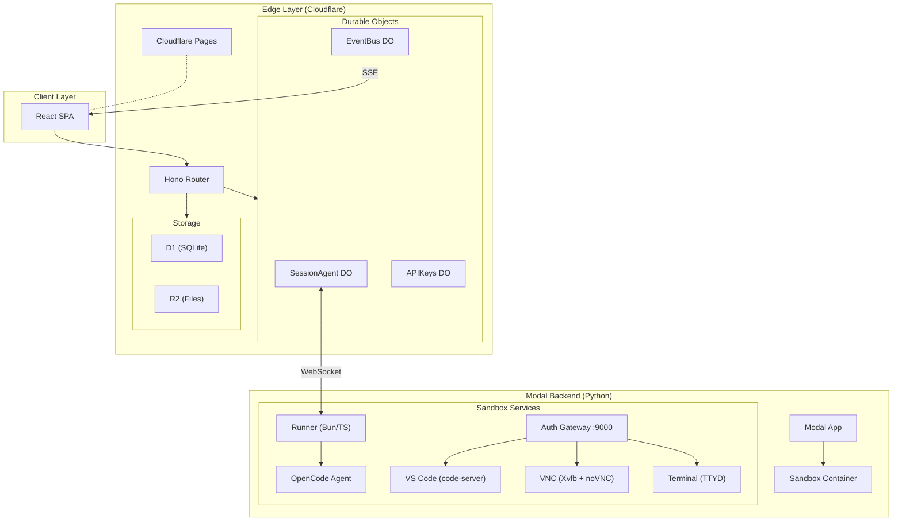

# Agent Ops

**Self-hosted background coding agents with full dev environments.**

Give your AI coding agent its own sandbox — complete with VS Code, a browser, and a terminal — and let it work in the background while you do something else. Watch it think, intervene when needed, or check back when it's done.

<!-- TODO: Add screenshot or GIF of a running session showing the chat + IDE panels -->

## Features

- **Isolated sandboxes** — Every session gets its own container with a full dev environment. No local machine risk, no shared state between tasks.
- **Full dev environment** — VS Code, browser (via VNC), and terminal accessible directly in the web UI. The agent has the same tools a human developer would.
- **Watch or walk away** — Stream the agent's work in real-time, or let it run in the background. Pick up where it left off anytime.
- **Repo-aware** — Connect your GitHub repos. The agent clones, branches, codes, and opens PRs — using your OAuth credentials, scoped to each sandbox.
- **Team-ready** — Invite your team, manage roles, share sessions. Built for collaborative use from day one.
- **Self-hosted** — Deploy on your own Cloudflare + Modal infrastructure. Your code and API keys stay on your accounts.
- **Workflow automation** — Create deterministic workflows with triggers (schedule, webhook, manual) for recurring tasks.
- **Secret management** — Built-in 1Password integration for secure credential storage and injection.
- **Multi-channel** — Interact via web UI, Telegram, or Slack — stay connected wherever you are.

## Quick Start

### Prerequisites

- [Node.js](https://nodejs.org/) 22+ and [pnpm](https://pnpm.io/)
- [uv](https://docs.astral.sh/uv/) (Python package manager for Modal)
- A [Cloudflare](https://dash.cloudflare.com/) account (Workers, D1, R2, Pages)
- A [Modal](https://modal.com/) account (sandbox compute)
- A [GitHub OAuth App](https://github.com/settings/developers) (authentication)

### Setup

```bash
# Install dependencies
pnpm install

# Copy config templates
cp .env.deploy.example .env.deploy    # Deployment config (Cloudflare IDs, Modal workspace)
cp .env.example .env                  # Secrets (API keys)

# Configure OAuth — create packages/worker/.dev.vars with your GitHub OAuth credentials
# See docs/oauth-setup.md for detailed OAuth setup instructions

# Set up the database
make db-setup
```

### Run locally

```bash
make dev-all    # Starts worker (:8787), client (:5173), and OpenCode container (:4096)
```

The first user to sign in is automatically promoted to admin.

### Deploy

```bash
make release    # Full release: typecheck, build, push image, deploy worker + Modal + client
```

## Architecture



**How a session works:** You send a message through the web UI. The Cloudflare Worker routes it to a SessionAgent Durable Object, which forwards it over WebSocket to a Runner process inside a Modal sandbox. The Runner passes the prompt to an OpenCode agent, streams results back through the same chain, and you see the agent's work in real-time.

## Packages

| Package | Description |
|---------|-------------|
| `packages/client` | React SPA — chat UI, session management, embedded IDE panels |
| `packages/worker` | Cloudflare Worker — API routes, session orchestration, Durable Objects |
| `packages/runner` | Bun/TS process inside each sandbox — bridges the DO and OpenCode agent |
| `packages/shared` | Shared TypeScript types and error classes |
| `backend` | Python/Modal — sandbox lifecycle, image builds, compute management |
| `docker` | Sandbox container image — code-server, VNC, TTYD, auth gateway, Playwright |

## Development

```bash
# Individual services
make dev-worker           # Cloudflare Worker on :8787
make dev-client           # Vite dev server on :5173
make dev-opencode         # OpenCode container on :4096

# Database
make db-migrate           # Run D1 migrations locally
make db-seed              # Seed test data
make db-reset             # Drop and recreate

# Code quality
make typecheck            # TypeScript check (all packages)
make lint                 # Run linter

# Testing
make test                 # Run all tests
make test-integration     # Integration tests
make test-e2e             # End-to-end tests

# Deploy individually
make deploy-worker        # Cloudflare Worker
make deploy-modal         # Modal backend
make deploy-client        # Cloudflare Pages

# Docker image management
make image-build          # Build sandbox Docker image
make image-push           # Push to GHCR
```

## Documentation

- **[Deployment Guide](docs/deployment.md)** — Production deployment, secrets management, image rebuilds
- **[OAuth Setup](docs/oauth-setup.md)** — GitHub and Google OAuth configuration for dev and production
- **[Environment Variables](docs/environment-variables.md)** — Full reference for all config vars across packages
- **[API Reference](docs/api-reference.md)** — Complete endpoint documentation
- **[Architecture Deep Dive](docs/architecture.md)** — Request flows, auth model, sandbox internals
- **[Project Structure](docs/project-structure.md)** — Detailed source tree walkthrough
- **[Workflow Runtime RFC](docs/rfc-deterministic-workflow-runtime.md)** — Workflow engine specification

## Contributing

Contributions are welcome. Please open an issue to discuss larger changes before submitting a PR.

```bash
pnpm install              # Install dependencies
make db-setup             # Set up local database
make dev-all              # Start all services
make typecheck            # Verify your changes compile
```

## License

MIT
