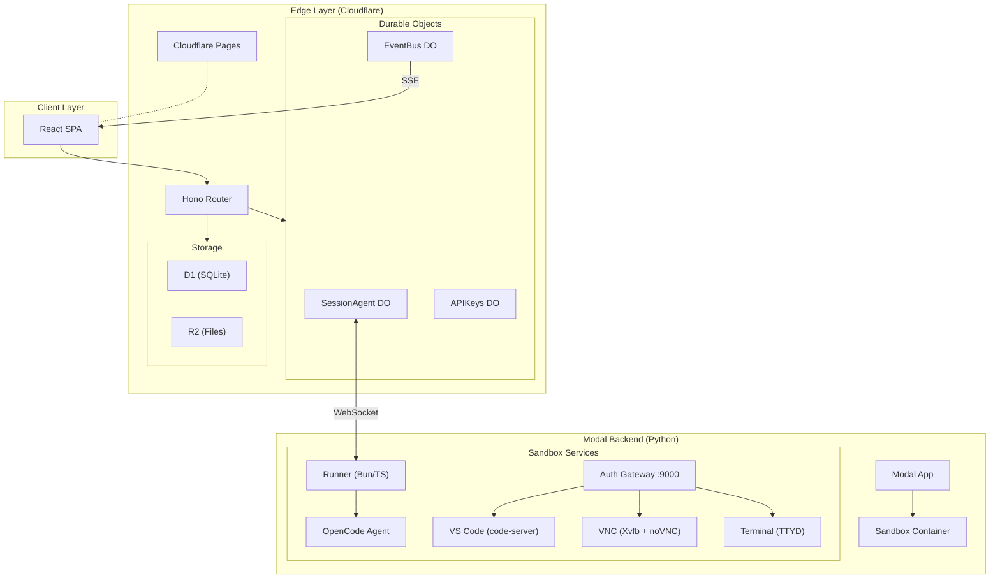

# Agent Ops

**Self-hosted background coding agents with full dev environments.**

Give your AI coding agent its own sandbox — complete with VS Code, a browser, and a terminal — and let it work in the background while you do something else. Watch it think, intervene when needed, or check back when it's done.

<!-- TODO: Add screenshot or GIF of a running session showing the chat + IDE panels -->

---

## Table of Contents

- [Features](#features)
- [Quick Start](#quick-start)
- [Installation](#installation)
- [Usage](#usage)
- [Architecture](#architecture)
- [Packages](#packages)
- [Development](#development)
- [Documentation](#documentation)
- [Contributing](#contributing)
- [License](#license)

---

## Features

- **Isolated sandboxes** — Every session gets its own container with a full dev environment. No local machine risk, no shared state between tasks.
- **Full dev environment** — VS Code, browser (via VNC), and terminal accessible directly in the web UI. The agent has the same tools a human developer would.
- **Watch or walk away** — Stream the agent's work in real-time, or let it run in the background. Pick up where it left off anytime.
- **Repo-aware** — Connect your GitHub repos. The agent clones, branches, codes, and opens PRs — using your OAuth credentials, scoped to each sandbox.
- **Team-ready** — Invite your team, manage roles, share sessions. Built for collaborative use from day one.
- **Self-hosted** — Deploy on your own Cloudflare + Modal infrastructure. Your code and API keys stay on your accounts.

---

## Quick Start

### Prerequisites

- [Node.js](https://nodejs.org/) 18+ and [pnpm](https://pnpm.io/)
- A [Cloudflare](https://dash.cloudflare.com/) account (Workers, D1, R2, Pages)
- A [Modal](https://modal.com/) account (sandbox compute)
- A [GitHub OAuth App](https://github.com/settings/developers) (authentication)

### Setup

```bash
# Clone the repository
git clone https://github.com/yourbuddyconner/agent-ops.git
cd agent-ops

# Install dependencies
pnpm install

# Copy config templates
cp .env.deploy.example .env.deploy    # Deployment config (Cloudflare IDs, Modal workspace)
cp .env.example .env                  # Secrets (API keys)

# Configure OAuth — create packages/worker/.dev.vars with your GitHub OAuth credentials
# See the wiki for detailed OAuth setup instructions

# Set up the database
make db-setup
```

### Run locally

```bash
make dev-all    # Starts worker (:8787), client (:5173), and OpenCode container
```

The first user to sign in is automatically promoted to admin.

### Deploy

```bash
make release    # Full release: typecheck, build, push image, deploy worker + Modal + client
```

---

## Installation

### Step 1: Install Dependencies

Agent Ops uses pnpm for package management. Make sure you have Node.js 18+ and pnpm installed:

```bash
# Check versions
node --version    # Should be v18.0.0 or higher
pnpm --version    # Should be 8.x or higher

# Install dependencies
pnpm install
```

### Step 2: Configure Environment Variables

Copy the example environment files and fill in your credentials:

```bash
# Deployment configuration
cp .env.deploy.example .env.deploy
# Edit .env.deploy and add:
# - Your Cloudflare account ID
# - Your Cloudflare Workers/Pages IDs
# - Your Modal workspace name
# - Your GitHub OAuth app credentials

# Local development secrets
cp .env.example .env
# Edit .env and add:
# - ANTHROPIC_API_KEY (for the AI agent)
# - OPENAI_API_KEY (optional, for alternative models)
# - GOOGLE_API_KEY (optional, for alternative models)
# - SLACK_BOT_TOKEN (optional, for Slack integration)
```

### Step 3: Set Up OAuth

Create a GitHub OAuth App:

1. Go to [GitHub Developer Settings](https://github.com/settings/developers)
2. Click "New OAuth App"
3. Fill in the application details:
   - **Application name**: Agent Ops (Dev)
   - **Homepage URL**: `http://localhost:5173`
   - **Authorization callback URL**: `http://localhost:5173/auth/callback`
4. Save the Client ID and Client Secret

Create `packages/worker/.dev.vars` with your OAuth credentials:

```bash
GITHUB_CLIENT_ID=your_github_client_id
GITHUB_CLIENT_SECRET=your_github_client_secret
```

### Step 4: Database Setup

```bash
# Set up the local D1 database
make db-setup

# This will:
# - Create the local database
# - Run all migrations
# - Seed with test data
```

### Step 5: Start Development

```bash
# Start all services
make dev-all

# Services will be available at:
# - Frontend: http://localhost:5173
# - API Worker: http://localhost:8787
# - OpenCode Agent: http://localhost:4096
```

---

## Usage

### Starting a New Session

1. Open the web UI at `http://localhost:5173`
2. Sign in with your GitHub account
3. Click "New Session"
4. Enter your task or question
5. The AI agent will start working in an isolated sandbox

### Working with Repositories

The agent can work with your GitHub repositories:

```
# Example prompt to the agent:
"Clone the repo https://github.com/myorg/myrepo and add a README file"

"Fix the bug in src/components/Button.tsx and create a PR"

"Review the latest changes in the main branch and suggest improvements"
```

### Real-time Collaboration

- Watch the agent work in real-time through the VNC panel
- See terminal output in the TTYD panel
- Edit code directly in the VS Code panel
- Intervene at any time by sending messages

### Slack Integration

Connect Agent Ops to Slack for team collaboration:

1. Configure your Slack Bot Token in `.env`
2. Invite the bot to your Slack workspace
3. Use slash commands to interact with sessions:
   - `/agent-ops new "Fix the login bug"` — Start a new session
   - `/agent-ops list` — List active sessions
   - `/agent-ops status <session-id>` — Check session status

---

## Architecture



**How a session works:** You send a message through the web UI. The Cloudflare Worker routes it to a SessionAgent Durable Object, which forwards it over WebSocket to a Runner process inside a Modal sandbox. The Runner passes the prompt to an OpenCode agent, streams results back through the same chain, and you see the agent's work in real-time.

---

## Packages

| Package | Description |
|---------|-------------|
| `packages/client` | React SPA — chat UI, session management, embedded IDE panels |
| `packages/worker` | Cloudflare Worker — API routes, session orchestration, Durable Objects |
| `packages/runner` | Bun/TS process inside each sandbox — bridges the DO and OpenCode agent |
| `packages/shared` | Shared TypeScript types and error classes |
| `backend` | Python/Modal — sandbox lifecycle, image builds, compute management |
| `docker` | Sandbox container image — code-server, VNC, TTYD, auth gateway |

---

## Development

```bash
# Individual services
make dev-worker           # Cloudflare Worker on :8787
make dev-client           # Vite dev server on :5173
make dev-opencode         # OpenCode container on :4096

# Database
make db-migrate           # Run D1 migrations locally
make db-seed              # Seed test data
make db-reset             # Drop and recreate

# Code quality
make typecheck            # TypeScript check (all packages)
make lint                 # Run linter

# Testing
make test                 # Run all tests
make test:worker          # Test worker package
make test:client          # Test client package

# Deploy individually
make deploy-worker        # Cloudflare Worker
make deploy-modal         # Modal backend
make deploy-client        # Cloudflare Pages
```

### Running Tests

```bash
# Run all tests
pnpm test

# Run tests for specific package
cd packages/worker && pnpm test
cd packages/client && pnpm test
```

### Code Style

We use ESLint and Prettier for code formatting. Run before committing:

```bash
pnpm lint           # Check for linting errors
pnpm lint:fix       # Fix auto-fixable issues
pnpm format         # Format with Prettier
```

---

## Documentation

- **[OAuth Setup](docs/oauth-setup.md)** — GitHub and Google OAuth configuration for dev and production
- **[Environment Variables](docs/environment-variables.md)** — Full reference for all config vars across packages
- **[API Reference](docs/api-reference.md)** — Complete endpoint documentation
- **[Architecture Deep Dive](docs/architecture.md)** — Request flows, auth model, sandbox internals
- **[Deployment Guide](docs/deployment.md)** — Production deployment, secrets management, image rebuilds
- **[Project Structure](docs/project-structure.md)** — Detailed source tree walkthrough
- **[Troubleshooting](docs/troubleshooting.md)** — Common issues and solutions

---

## Contributing

We welcome contributions to Agent Ops! Here's how to get started:

### Getting Started

1. **Fork the repository** and clone your fork
2. **Create a new branch** for your feature or fix:
   ```bash
   git checkout -b feature/my-new-feature
   # or
   git checkout -b fix/bug-description
   ```
3. **Set up your development environment** following the [Installation](#installation) guide
4. **Make your changes** and ensure they follow our code style

### Before Submitting

```bash
# Ensure your code passes all checks
pnpm install              # Install dependencies
make db-setup             # Set up local database
make dev-all              # Start all services
make typecheck            # Verify your changes compile
make lint                 # Check for linting errors
make test                 # Run the test suite
```

### Submitting Changes

1. **Commit your changes** with a clear, descriptive message:
   ```bash
   git commit -m "feat: add user authentication to sessions"
   ```

2. **Push to your fork**:
   ```bash
   git push origin feature/my-new-feature
   ```

3. **Open a Pull Request** against the `main` branch with:
   - A clear description of the changes
   - Screenshots/GIFs for UI changes
   - Reference to any related issues

### Code Guidelines

- Follow TypeScript best practices and strict typing
- Write tests for new features
- Keep functions small and focused
- Document complex logic with comments
- Use conventional commit messages (feat:, fix:, docs:, etc.)

### Reporting Issues

Found a bug or have a feature request?

- Check [existing issues](https://github.com/yourbuddyconner/agent-ops/issues) first
- Provide detailed reproduction steps for bugs
- Include your environment details (OS, Node version, etc.)

### Code of Conduct

This project follows a standard code of conduct. Be respectful, constructive, and inclusive in all interactions.

---

## License

MIT License

Copyright (c) 2026 Agent Ops Contributors

Permission is hereby granted, free of charge, to any person obtaining a copy
of this software and associated documentation files (the "Software"), to deal
in the Software without restriction, including without limitation the rights
to use, copy, modify, merge, publish, distribute, sublicense, and/or sell
copies of the Software, and to permit persons to whom the Software is
furnished to do so, subject to the following conditions:

The above copyright notice and this permission notice shall be included in all
copies or substantial portions of the Software.

THE SOFTWARE IS PROVIDED "AS IS", WITHOUT WARRANTY OF ANY KIND, EXPRESS OR
IMPLIED, INCLUDING BUT NOT LIMITED TO THE WARRANTIES OF MERCHANTABILITY,
FITNESS FOR A PARTICULAR PURPOSE AND NONINFRINGEMENT. IN NO EVENT SHALL THE
AUTHORS OR COPYRIGHT HOLDERS BE LIABLE FOR ANY CLAIM, DAMAGES OR OTHER
LIABILITY, WHETHER IN AN ACTION OF CONTRACT, TORT OR OTHERWISE, ARISING FROM,
OUT OF OR IN CONNECTION WITH THE SOFTWARE OR THE USE OR OTHER DEALINGS IN THE
SOFTWARE.

---

## Support

- 📖 [Documentation](docs/)
- 🐛 [Issue Tracker](https://github.com/yourbuddyconner/agent-ops/issues)
- 💬 [Discussions](https://github.com/yourbuddyconner/agent-ops/discussions)

---

<p align="center">Built with ❤️ for developers who love coding agents</p>
