# Agent-Ops V1 — Architecture & Implementation Plan

## Table of Contents

1. [Vision & Scope](#1-vision--scope)
2. [System Overview](#2-system-overview)
3. [Technology Stack](#3-technology-stack)
4. [Layer 1 — Frontend (React)](#4-layer-1--frontend-react)
5. [Layer 2 — Cloudflare Worker (API & Orchestration)](#5-layer-2--cloudflare-worker-api--orchestration)
6. [Layer 3 — Modal Backend (Python)](#6-layer-3--modal-backend-python)
7. [Layer 4 — Modal Sandbox (Container Runtime)](#7-layer-4--modal-sandbox-container-runtime)
8. [Layer 5 — External Services](#8-layer-5--external-services)
9. [Data Flow & Sequences](#9-data-flow--sequences)
10. [Database Schema](#10-database-schema)
11. [Authentication & Security](#11-authentication--security)
12. [Infrastructure & Deployment](#12-infrastructure--deployment)
13. [Gap Analysis — Current vs V1](#13-gap-analysis--current-vs-v1)
14. [Implementation Phases](#14-implementation-phases)
15. [Open Questions & Decisions](#15-open-questions--decisions)

---

## 1. Vision & Scope

Agent-Ops is a hosted background coding agent platform inspired by [Ramp's Inspect](https://builders.ramp.com/post/why-we-built-our-background-agent). Engineers interact with an AI agent through a web UI (or Slack, or webhooks). Each session runs inside an isolated Modal sandbox with a full development environment — VS Code, a browser (VNC), a terminal, and an OpenCode agent that can read, write, and execute code.

### V1 Goals

- **Session-based coding agent**: Users create sessions, send prompts, and watch the agent work in real-time
- **Full dev environment per session**: Code editor (VS Code), browser preview (VNC), web terminal (TTYD) — all accessible via iframes
- **Deterministic workflows**: YAML-defined workflows triggered by webhooks, schedules, or manual invocation
- **Multiplayer sessions**: Multiple users observe and contribute to the same session
- **Fast startup**: Pre-built images, warm sandbox pools, snapshot-based restore
- **Integrations**: GitHub (OAuth + webhooks), Slack (notifications), Linear (issue tracking)
- **LLM flexibility**: Support Anthropic Claude, OpenAI, and Google Gemini via OpenCode

### What V1 Does NOT Include

- Chrome extension
- Mobile-native apps (web is responsive)
- Self-hosted / on-prem deployment
- Custom fine-tuned models
- Full CI/CD integration (Buildkite, etc.) — webhook triggers cover basic cases

---

## 2. System Overview


---

## 3. Technology Stack

### Monorepo Structure

```
agent-ops/
├── packages/
│   ├── client/          # React SPA (Vite + TanStack Router)
│   ├── worker/          # Cloudflare Worker (Hono + D1 + R2 + DOs)
│   ├── shared/          # Shared TypeScript types & errors
│   └── runner/          # NEW — Bun/TS runner that runs inside sandbox
├── backend/             # NEW — Modal Python backend
│   ├── session.py
│   ├── sandboxes.py
│   └── images/
│       ├── base.py
│       ├── webapp.py
│       └── core.py
├── docker/              # NEW — Sandbox Dockerfile + startup scripts
│   ├── Dockerfile.sandbox
│   └── start.sh
└── ...
```

### Technology Choices

| Layer | Technology | Rationale |
|-------|-----------|-----------|
| **Frontend** | React 19, Vite 6, TanStack Router 1.x, TanStack Query 5, Zustand 5, Tailwind CSS 3, Radix UI | Already established. Modern, fast, type-safe. |
| **API/Worker** | Cloudflare Workers, Hono 4, D1 (SQLite), R2 (S3-compatible), Durable Objects | Already established. Edge-first, low latency, hibernation for cost. |
| **Backend** | Python 3.12, Modal SDK, `modal.App`, `modal.Image`, `modal.Dict`, `modal.Queue` | Modal's Python SDK is the primary interface for sandbox orchestration. Image definitions are Python code. |
| **Runner** | Bun 1.x, TypeScript, `@opencode-ai/sdk` | Runs inside sandbox. Bun for fast startup. SDK for typed OpenCode interaction. |
| **Agent** | OpenCode (`opencode serve`), `@opencode-ai/sdk` | Coding agent with server-first architecture, typed SDK, plugin system. |
| **VS Code** | code-server (coder/code-server) | Open-source VS Code in browser. Runs inside sandbox. |
| **VNC** | Xvfb + Fluxbox + x11vnc + websockify + Chromium | Virtual desktop for browser preview. websockify for WebSocket access. |
| **Terminal** | ttyd | Web terminal over WebSocket. Lightweight. |
| **Auth Proxy** | Custom Bun proxy with JWT validation | Each sandbox service (VS Code, VNC, TTYD) fronted by a thin proxy that validates JWTs issued by the Worker. |
| **LLM Providers** | Anthropic Claude, OpenAI GPT, Google Gemini | Multi-provider via OpenCode config. Keys passed as Modal secrets. |
| **CI/Infra** | GitHub Actions, GHCR (container registry) | Build + push sandbox images. Deploy worker via Wrangler. |

### Package Versions (Locked)

**Frontend** (`packages/client`):
- `react` / `react-dom`: ^19.0.0
- `@tanstack/react-query`: ^5.60.0
- `@tanstack/react-router`: ^1.151.0
- `zustand`: ^5.0.1
- `tailwindcss`: ^3.4.15
- `vite`: ^6.0.3
- ~~`@novnc/novnc`~~ — Not needed for V1 (iframe to websockify instead)
- ~~`xterm` + addons~~ — Not needed for V1 (iframe to TTYD instead)

**Worker** (`packages/worker`):
- `hono`: ^4.3.0
- `@opencode-ai/sdk`: ^1.1.25
- `modal`: ^0.6.0
- `zod`: ^3.22.4
- `@cloudflare/workers-types`: ^4.20240117.0
- `wrangler`: ^3.28.0
- NEW: `jose`: ^5.x (JWT signing/verification)

**Runner** (`packages/runner`) — NEW:
- Runtime: `bun` ^1.1.x
- `@opencode-ai/sdk`: ^1.1.25
- `hono`: ^4.3.0 (lightweight HTTP server for prompt/callback endpoints)

**Backend** (`backend/`) — NEW:
- `python`: 3.12
- `modal`: latest
- `httpx`: for HTTP calls to Worker API

---

## 4. Layer 1 — Frontend (React)

### 4.1 Existing Components (Keep)

- **Routing**: TanStack Router file-based routing
- **State**: Zustand for auth (`stores/auth.ts`) and UI (`stores/ui.ts`)
- **Data fetching**: React Query with query key factories
- **Auth**: Token-based via `Authorization: Bearer` header
- **UI library**: Radix UI primitives + Tailwind
- **Layout**: Sidebar + Header + PageContainer pattern
- **Sessions**: List, create, delete, chat interface with streaming
- **Containers**: List, create, start/stop, heartbeat, OpenCode iframe
- **Workflows**: List, create, edit, execution history
- **Triggers**: Webhook/schedule/manual management
- **Integrations**: List, connect (OAuth), sync status

### 4.2 New Components Required

#### Session Editor Page (Enhanced)

The session page (`/sessions/:sessionId`) becomes a full IDE-like layout:

```mermaid
block-beta
    columns 5

    Header["Header: Session Name · Status · Collaborators · Actions"]:5

    block:ChatPanel:2
        columns 1
        Messages["Messages</br>Streaming</br>Questions"]
        Input["Chat Input"]
    end

    block:TabPanel:3
        columns 3
        TabCode["Code (VS Code)"] TabBrowser["Browser"] TabTerminal["Terminal"]
        IframeContent["Active Tab Content (iframe)"]:3
    end
```



**New components:**
- `components/sessions/session-editor-page.tsx` — Full session layout with resizable panels
- `components/sessions/session-tabs.tsx` — Tab bar for Code/Browser/Terminal
- `components/sessions/vscode-panel.tsx` — iframe to code-server via Modal tunnel + JWT
- `components/sessions/vnc-panel.tsx` — iframe to websockify noVNC web UI via Modal tunnel + JWT
- `components/sessions/terminal-panel.tsx` — iframe to TTYD web UI via Modal tunnel + JWT
- `components/sessions/question-prompt.tsx` — UI for answering agent questions (yes/no, text input, file selection)
- `components/sessions/collaborators-bar.tsx` — Shows connected users with avatars
- `components/sessions/session-status-badge.tsx` — Real-time agent status (thinking, coding, running tests, etc.)

#### WebSocket Enhancements

Extend `use-websocket.ts` and `use-chat.ts` to handle:
- `question` events — Agent is asking the user something
- `collaborator_join` / `collaborator_leave` — Multiplayer presence
- `sandbox_urls` — Receive tunnel URLs for VS Code/VNC/TTYD after sandbox starts
- `screenshot` — Agent took a browser screenshot (render inline in chat)

#### New Route: `/sessions/:sessionId` (enhanced)

Replace current simple chat page with full `SessionEditorPage`. Existing chat components remain as the left panel.

#### Dashboard Enhancements

- Active sessions count with status breakdown
- Merged PRs count (from GitHub integration)
- Execution success/failure rates
- Sandbox utilization metrics

### 4.3 Frontend Configuration

**Vite proxy** (`vite.config.ts`):
```typescript
proxy: {
  '/api': 'http://localhost:8787',
  '/webhooks': 'http://localhost:8787',
  '/agent': 'http://localhost:8787',
}
```

No changes needed — all sandbox access goes through Worker API proxy or direct Modal tunnel URLs.

---

## 5. Layer 2 — Cloudflare Worker (API & Orchestration)

### 5.1 Existing (Keep & Extend)

| Component | Status | Notes |
|-----------|--------|-------|
| `index.ts` main router | Keep | Add new routes |
| Auth middleware (CF Access JWT + Bearer token) | Keep | Add JWT issuance for sandbox access |
| `APIKeysDurableObject` | Keep | Encrypted credential storage |
| `AgentSessionDurableObject` | **Delete** | Replaced by merged `SessionAgentDO` |
| `OpenCodeContainerDO` | **Delete** | Replaced by merged `SessionAgentDO` |
| D1 schema (users, sessions, messages, etc.) | Extend | Add memories, screenshots tables |
| R2 storage | Extend | Add screenshot + asset storage paths |
| Routes: sessions, containers, workflows, triggers, executions, integrations, files, webhooks, agent, auth, api-keys | Keep | Extend as needed |
| `ModalService` | **Delete** | Replaced by Python backend; Worker calls Python backend via HTTP |
| `lib/db.ts` helpers | Keep | Add new query helpers |
| Error handler middleware | Keep | |
| Webhook signature verification | Keep | |

### 5.2 New: EventBus Durable Object

**Purpose**: Centralized real-time event broadcasting with user-level subscriptions.

```typescript
// durable-objects/event-bus.ts
export class EventBusDO {
  // WebSocket connections tagged by userId
  // Broadcasts: session status changes, notifications, collaborator events
  // Supports: subscribe to specific sessions, user-level notifications

  async fetch(request: Request): Promise<Response> {
    // /ws — WebSocket upgrade (tagged with userId from auth)
    // /publish — Internal endpoint for other DOs to publish events
    // /notify — Send notification to specific user
  }

  async webSocketMessage(ws: WebSocket, message: string | ArrayBuffer) {
    // Handle subscriptions: { type: 'subscribe', sessionId: '...' }
    // Handle unsubscriptions: { type: 'unsubscribe', sessionId: '...' }
  }
}
```

**Wrangler binding**:
```toml
[[durable_objects.bindings]]
name = "EVENT_BUS"
class_name = "EventBusDO"
```

One global EventBus instance (or per-user for scalability). Other DOs publish to it. Frontend maintains a single WebSocket to EventBus for all real-time updates.

### 5.3 SessionAgent DO (New, Replaces Both Old DOs)

`AgentSessionDurableObject` and `OpenCodeContainerDO` are **deleted**. A single `SessionAgentDO` is built from scratch:

```typescript
// durable-objects/session-agent.ts
export class SessionAgentDO {
  // Durable Object SQLite tables:
  //   messages (id, role, content, parts JSON, created_at)
  //   questions (id, text, options JSON, status, answer, created_at)
  //   prompt_queue (id, content, status, created_at)
  //   state (key, value) — session metadata

  // Two classes of WebSocket connections (hibernation-compatible):
  //   Tag 'client:{userId}'  — Browser clients (multiplayer)
  //   Tag 'runner'           — Single Runner process in sandbox

  // Endpoints:
  // /ws?role=client&userId=...  — Client WebSocket upgrade
  // /ws?role=runner&token=...   — Runner WebSocket upgrade (token auth)
  // /start     — Initialize session + spawn sandbox via Python backend
  // /stop      — Terminate session + sandbox
  // /status    — Get session status + sandbox health
  // /proxy/*   — Proxy HTTP to sandbox (OpenCode UI)

  // Client → DO messages:
  //   { type: 'prompt', content }       — User sends prompt
  //   { type: 'answer', questionId, answer } — User answers question
  //   { type: 'ping' }

  // DO → Client messages:
  //   { type: 'message', data }         — New/complete message
  //   { type: 'stream', messageId, content } — Streaming chunk
  //   { type: 'question', questionId, text, options }
  //   { type: 'status', data }          — Session/sandbox status
  //   { type: 'pong' }

  // Runner → DO messages:
  //   { type: 'stream', messageId, content }   — Chunk from OpenCode
  //   { type: 'result', messageId, content }   — Final message
  //   { type: 'tool', toolName, args, result } — Tool call
  //   { type: 'question', questionId, text, options }
  //   { type: 'screenshot', data, description }
  //   { type: 'error', messageId, error }
  //   { type: 'complete' }              — Prompt done, check queue

  // DO → Runner messages:
  //   { type: 'prompt', messageId, content }  — Execute this prompt
  //   { type: 'answer', questionId, answer }  — User answered question
  //   { type: 'stop' }                        — Terminate gracefully
}
```

**Design principles**:
- **WebSocket only** between Runner and DO — no HTTP callbacks. The Runner connects on startup and maintains the connection. If it drops, Runner reconnects automatically.
- **Durable SQLite** for the message ledger, question queue, and prompt queue. Enables pagination, querying, and survives hibernation without manual serialization.
- **Prompt queuing**: When a prompt arrives and the Runner is busy (has an outstanding unfinished prompt), it's inserted into `prompt_queue` with `status='queued'`. When Runner sends `{ type: 'complete' }`, the DO dequeues the next prompt and forwards it.
- **User-tagged WebSockets**: Each client connection tagged with `client:{userId}` for multiplayer attribution and targeted messaging.
- **EventBus integration**: Publishes lifecycle events (session started, completed, errored) to EventBus DO for cross-session notifications.

### 5.4 New: JWT Issuance for Sandbox Access

```typescript
// lib/jwt.ts
// Issue short-lived JWTs for iframe access to sandbox services
// Claims: { sub: userId, sessionId, service: 'vscode'|'vnc'|'ttyd', exp }
// Signed with HMAC-SHA256 using ENCRYPTION_KEY
// Frontend embeds JWT in iframe URL query param
// Auth proxy in sandbox validates JWT before proxying
```

**New endpoint**:
```
GET /api/sessions/:id/sandbox-token
→ { token: string, urls: { vscode, vnc, ttyd } }
```

### 5.5 New: Agent Memories

```sql
-- Migration: 0006_agent_memories.sql
CREATE TABLE agent_memories (
  id TEXT PRIMARY KEY,
  user_id TEXT NOT NULL,
  session_id TEXT,           -- NULL for global memories
  workspace TEXT,            -- Scoped to repo/workspace
  content TEXT NOT NULL,
  category TEXT DEFAULT 'general',  -- 'preference', 'codebase', 'workflow', etc.
  embedding_key TEXT,        -- For future semantic search
  created_at TEXT DEFAULT (datetime('now')),
  updated_at TEXT DEFAULT (datetime('now')),
  FOREIGN KEY (user_id) REFERENCES users(id)
);
CREATE INDEX idx_memories_user ON agent_memories(user_id);
CREATE INDEX idx_memories_workspace ON agent_memories(user_id, workspace);
```

### 5.6 New: Screenshots Table

```sql
-- Migration: 0007_screenshots.sql
CREATE TABLE screenshots (
  id TEXT PRIMARY KEY,
  session_id TEXT NOT NULL,
  r2_key TEXT NOT NULL,         -- R2 object key
  description TEXT,             -- Agent-generated description
  taken_at TEXT DEFAULT (datetime('now')),
  metadata TEXT,                -- JSON: { width, height, url, viewport }
  FOREIGN KEY (session_id) REFERENCES sessions(id) ON DELETE CASCADE
);
CREATE INDEX idx_screenshots_session ON screenshots(session_id);
```

### 5.7 Worker → Python Backend Communication

The Worker no longer calls the Modal SDK directly. Instead, it calls the Modal Python backend via HTTP:

```
POST /api/sessions/:id/start
  → Worker validates auth
  → Worker generates runnerToken (random 256-bit hex)
  → Worker constructs doWsUrl (WebSocket URL to SessionAgent DO)
  → Worker calls Python backend: POST http://modal-backend/sessions/create
    Body: { sessionId, userId, workspace, imageType,
            doWsUrl, runnerToken, jwtSecret, envVars }
  → Python backend creates sandbox with secrets, returns { sandboxId, tunnelUrls }
  → Worker stores tunnelUrls + runnerToken in SessionAgent DO
  → Worker returns sandbox URLs + sandbox JWT to client
```

**Why?** The Python backend manages image definitions, warm pools, snapshots, and queues — things that require persistent state and Modal's Python SDK (which is more mature than the JS SDK).

**Communication model**: The sandbox Runner connects back to the Worker via WebSocket (using `doWsUrl` + `runnerToken`). There are no HTTP callbacks from sandbox to worker — all sandbox→worker communication flows over the Runner's persistent WebSocket to `SessionAgentDO`.

### 5.8 Cron: Scheduled Trigger Execution

Extend the existing `scheduled` handler to fire workflow triggers:

```typescript
// In index.ts scheduled handler:
// 1. Query triggers WHERE type = 'schedule' AND enabled = 1
// 2. For each trigger, check if cron expression matches current time
// 3. Create execution record + create session + send prompt
```

Requires a cron expression parser (e.g., `cron-parser` package or simple implementation).

### 5.9 Cost Management & Usage Tracking

Sandboxes are running VMs on Modal. Without guardrails, a single user could run up unbounded costs. The system implements multiple layers of cost control:

#### Layer 1: Automatic Lifecycle Limits (per sandbox)

Already in place:
- **Idle timeout**: Default 15 minutes (`auto_sleep_minutes`), configurable per session. Modal terminates the sandbox when no activity detected.
- **Hard timeout**: 24 hours max (`timeout=86400` on sandbox creation). No sandbox lives forever.
- **Visibility-based heartbeats**: Frontend only sends heartbeats when the page is visible. Navigate away → heartbeats stop → sandbox idles out.

#### Layer 2: Per-User Concurrency Limits

Enforced by the Worker before calling the Python backend:

```typescript
// middleware/usage-limits.ts
// Check before creating a session or starting a sandbox:
// 1. Count active sandboxes for this user
//    SELECT COUNT(*) FROM sessions
//    WHERE user_id = ? AND status IN ('initializing', 'running', 'idle')
// 2. Compare against user's concurrency limit
// 3. Reject with 429 if over limit

interface UsageLimits {
  maxConcurrentSessions: number;   // Default: 5
  maxDailySessions: number;        // Default: 50
  maxSessionDurationHours: number; // Default: 24 (hard cap)
  maxIdleMinutes: number;          // Default: 15
}
```

Limits stored per-user (or per-org) in D1, with sensible defaults. Admins can adjust via API.

#### Layer 3: Usage Tracking

Every sandbox lifecycle event is recorded for cost attribution and alerting:

```sql
-- D1 table
CREATE TABLE sandbox_usage (
  id TEXT PRIMARY KEY,
  user_id TEXT NOT NULL,
  session_id TEXT NOT NULL,
  sandbox_id TEXT,
  instance_size TEXT DEFAULT 'dev',
  started_at TEXT NOT NULL,
  stopped_at TEXT,
  duration_seconds INTEGER,           -- Computed on stop
  stop_reason TEXT,                    -- 'user', 'idle_timeout', 'hard_timeout', 'error', 'limit'
  created_at TEXT DEFAULT (datetime('now')),
  FOREIGN KEY (user_id) REFERENCES users(id),
  FOREIGN KEY (session_id) REFERENCES sessions(id)
);
CREATE INDEX idx_sandbox_usage_user ON sandbox_usage(user_id);
CREATE INDEX idx_sandbox_usage_user_date ON sandbox_usage(user_id, started_at);
```

**Recording flow**:
- On sandbox start → insert row with `started_at`, no `stopped_at`
- On sandbox stop → update row with `stopped_at`, compute `duration_seconds`, set `stop_reason`
- Cron job (hourly) → check for orphaned rows (started but never stopped) and reconcile with Modal API

#### Layer 4: Budget Alerts

```sql
CREATE TABLE usage_budgets (
  id TEXT PRIMARY KEY,
  user_id TEXT,                        -- NULL = org-wide default
  org_id TEXT,
  daily_sandbox_hours REAL DEFAULT 20, -- Max sandbox-hours per day
  monthly_sandbox_hours REAL DEFAULT 500,
  alert_threshold_pct INTEGER DEFAULT 80, -- Alert at 80% of budget
  hard_limit INTEGER DEFAULT 0,        -- 0 = soft limit (alert only), 1 = hard limit (block)
  created_at TEXT DEFAULT (datetime('now')),
  updated_at TEXT DEFAULT (datetime('now'))
);
```

**Alert flow**:
- Hourly cron aggregates `sandbox_usage` by user/org for current day and month
- If usage exceeds `alert_threshold_pct`:
  - Post to Slack (if integration connected) via EventBus → Slack notifier
  - Set flag on user record for frontend to show warning banner
- If `hard_limit = 1` and usage exceeds 100%:
  - Block new session creation (return 429 with explanation)
  - Existing sessions continue until they naturally terminate

#### Layer 5: Warm Pool Cost Caps

The warm pool (Phase 5) pre-allocates sandboxes for fast startup. Without limits this could be expensive:

```python
# In SandboxManager
WARM_POOL_CONFIG = {
    "max_total_warm": 10,         # Max warm sandboxes across all repos
    "max_per_repo": 3,            # Max warm sandboxes per repo
    "warm_ttl_minutes": 30,       # Kill unclaimed warm sandboxes after 30 min
    "high_volume_threshold": 10,  # Sessions/hour to qualify for warm pool
}
```

Only repos that exceed `high_volume_threshold` sessions/hour get warm sandboxes. Others use cold starts.

#### API Endpoints

```
GET  /api/usage                    — Current user's usage summary (today, this month)
GET  /api/usage/history            — Historical usage data (for charts)
GET  /api/admin/usage              — All users' usage (admin only)
GET  /api/admin/usage/budgets      — Budget configuration
PUT  /api/admin/usage/budgets/:id  — Update budget
PUT  /api/admin/usage/limits/:userId — Update per-user limits
```

#### Frontend

- **Usage indicator** in sidebar: shows sandbox-hours used today / budget
- **Warning banner** when approaching budget threshold
- **Admin dashboard**: usage charts by user, cost breakdown, limit management
- **Session creation dialog**: shows current active sessions count vs limit

---

## 6. Layer 3 — Modal Backend (Python)

This is a new Python package deployed as a Modal App.

### 6.1 Directory Structure

```
backend/
├── app.py                # Modal App definition + HTTP endpoints
├── session.py            # Session Manager
├── sandboxes.py          # Sandbox Manager
├── images/
│   ├── __init__.py
│   ├── base.py           # Base sandbox image (all common tools)
│   ├── webapp.py         # Web app image (Node, Vite, etc.)
│   ├── core.py           # Backend services image (Postgres, Redis, Temporal)
│   └── custom.py         # Per-repo custom images
├── config.py             # Configuration and secrets
├── requirements.txt
└── README.md
```

### 6.2 Image Definitions

Each image is a `modal.Image` definition:

```python
# images/base.py
import modal

def create_base_image() -> modal.Image:
    """Base image with all common tools for coding agent sandboxes."""
    return (
        modal.Image.debian_slim(python_version="3.12")
        # System tools
        .apt_install([
            "git", "curl", "wget", "jq", "ripgrep", "fd-find",
            "build-essential", "pkg-config", "libssl-dev",
        ])
        # Node.js + Bun
        .run_commands([
            "curl -fsSL https://deb.nodesource.com/setup_22.x | bash -",
            "apt-get install -y nodejs",
            "curl -fsSL https://bun.sh/install | bash",
        ])
        # code-server (VS Code in browser)
        .run_commands([
            "curl -fsSL https://code-server.dev/install.sh | sh",
        ])
        # TTYD (web terminal)
        .run_commands([
            "apt-get install -y ttyd",
        ])
        # VNC stack
        .apt_install([
            "xvfb", "fluxbox", "x11vnc", "websockify",
            "chromium", "chromium-driver",
        ])
        # OpenCode CLI
        .run_commands([
            "curl -fsSL https://opencode.ai/install.sh | bash",
        ])
        # Runner (Bun/TS) — copied from build
        .copy_local_dir("../packages/runner/dist", "/runner")
        # Startup script
        .copy_local_file("../docker/start.sh", "/start.sh")
        .run_commands(["chmod +x /start.sh"])
    )
```

```python
# images/webapp.py
from .base import create_base_image

def create_webapp_image() -> modal.Image:
    """Extended image for web application development."""
    return (
        create_base_image()
        .apt_install(["nginx"])
        .run_commands([
            "npm install -g vite@latest create-vite@latest",
            "npm install -g next@latest",
        ])
    )
```

```python
# images/core.py
from .base import create_base_image

def create_core_image() -> modal.Image:
    """Extended image with backend services (Postgres, Redis, etc.)."""
    return (
        create_base_image()
        .apt_install([
            "postgresql", "postgresql-client",
            "redis-server",
        ])
        .run_commands([
            # Install Temporal CLI
            "curl -sSf https://temporal.download/cli.sh | sh",
        ])
    )
```

### 6.3 Session Manager

```python
# session.py
import modal
from sandboxes import SandboxManager

class SessionManager:
    """Manages the lifecycle of agent sessions."""

    def __init__(self, app: modal.App):
        self.sandbox_mgr = SandboxManager(app)
        self.session_locks = modal.Dict.from_name("session-locks", create_if_missing=True)
        self.prompt_queue = modal.Queue.from_name("prompt-queue", create_if_missing=True)

    async def create_session(self, session_id: str, user_id: str,
                              workspace: str, image_type: str,
                              env_vars: dict) -> dict:
        """Create a new session with a sandbox."""
        # Acquire session lock
        # Determine image from workspace/image_type
        # Create or reuse sandbox
        # Return sandbox details (tunnel URLs, sandbox ID)
        ...

    async def terminate_session(self, session_id: str):
        """Terminate a session and its sandbox."""
        ...

    async def queue_prompt(self, session_id: str, prompt: dict):
        """Queue a prompt for execution (supports follow-up queuing)."""
        ...

    async def get_session_status(self, session_id: str) -> dict:
        """Get session sandbox status."""
        ...
```

### 6.4 Sandbox Manager

```python
# sandboxes.py
import modal
from images import get_image_for_workspace

class SandboxManager:
    """Manages Modal sandbox lifecycle, pools, and snapshots."""

    def __init__(self, app: modal.App):
        self.app = app
        self.image_store = modal.Dict.from_name("image-store", create_if_missing=True)

    async def create_sandbox(self, config: SandboxConfig) -> SandboxResult:
        """Create a sandbox from an image snapshot."""
        image = get_image_for_workspace(config.workspace, config.image_type)

        sandbox = await modal.Sandbox.create(
            app=self.app,
            image=image,
            command=["/start.sh"],
            encrypted_ports=[4096, 9000],  # OpenCode, Auth Gateway (routes to VSCode/VNC/TTYD)
            timeout=86400,  # 24h
            idle_timeout=config.idle_timeout,
            secrets=[
                modal.Secret.from_dict({
                    "DO_WS_URL": config.do_ws_url,         # WebSocket URL to SessionAgent DO
                    "RUNNER_TOKEN": config.runner_token,     # Auth token for runner WS connection
                    "SESSION_ID": config.session_id,
                    "JWT_SECRET": config.jwt_secret,         # For iframe auth proxy validation
                    "OPENCODE_SERVER_PASSWORD": config.opencode_password,
                    # LLM keys
                    "ANTHROPIC_API_KEY": config.anthropic_key,
                    "OPENAI_API_KEY": config.openai_key,
                    "GOOGLE_API_KEY": config.google_key,
                }),
            ],
            volumes={
                "/workspace": modal.Volume.from_name(
                    f"workspace-{config.session_id}",
                    create_if_missing=True
                ),
            },
        )

        tunnels = await sandbox.tunnels()
        gateway_url = tunnels[9000].url
        return SandboxResult(
            sandbox_id=sandbox.sandbox_id,
            tunnel_urls={
                "opencode": tunnels[4096].url,
                "gateway": gateway_url,            # Auth gateway proxy
                "vscode": f"{gateway_url}/vscode", # Proxied via gateway
                "vnc": f"{gateway_url}/vnc",       # Proxied via gateway
                "ttyd": f"{gateway_url}/ttyd",     # Proxied via gateway
            }
        )

    async def warm_sandbox(self, workspace: str, image_type: str):
        """Pre-warm a sandbox for fast startup."""
        ...

    async def snapshot_sandbox(self, sandbox_id: str) -> str:
        """Snapshot sandbox filesystem for later restore."""
        ...

    async def restore_from_snapshot(self, snapshot_id: str) -> SandboxResult:
        """Restore a sandbox from a filesystem snapshot."""
        ...
```

### 6.5 Modal App HTTP Endpoints

```python
# app.py
import modal
from session import SessionManager

app = modal.App("agent-ops-backend")

session_mgr = SessionManager(app)

@app.function()
@modal.web_endpoint(method="POST")
async def create_session(request: dict) -> dict:
    """Called by CF Worker to create a new session sandbox."""
    return await session_mgr.create_session(**request)

@app.function()
@modal.web_endpoint(method="POST")
async def terminate_session(request: dict) -> dict:
    """Called by CF Worker to terminate a session."""
    await session_mgr.terminate_session(request["session_id"])
    return {"success": True}

@app.function()
@modal.web_endpoint(method="POST")
async def queue_prompt(request: dict) -> dict:
    """Queue a prompt for a running session."""
    await session_mgr.queue_prompt(request["session_id"], request["prompt"])
    return {"queued": True}

@app.function()
@modal.web_endpoint(method="GET")
async def session_status(session_id: str) -> dict:
    """Get session sandbox status."""
    return await session_mgr.get_session_status(session_id)

@app.function(schedule=modal.Cron("*/30 * * * *"))
def rebuild_images():
    """Rebuild repo-specific images every 30 minutes."""
    ...
```

### 6.6 Image Build Pipeline

```python
# Runs every 30 minutes via Modal Cron
# 1. Query Worker API for active workspaces
# 2. For each workspace, check if image needs rebuild
# 3. Clone repo (via GitHub App), install deps, cache builds
# 4. Create Modal Image snapshot
# 5. Store snapshot ID in Modal Dict
```

---

## 7. Layer 4 — Modal Sandbox (Container Runtime)

### 7.1 Startup Script

```bash
#!/bin/bash
# docker/start.sh — Entrypoint for Modal sandbox

set -e

# ============ Environment ============
export DISPLAY=:99
export HOME=/root
OPENCODE_PORT=4096
VSCODE_PORT=8080
VNC_PORT=6080
TTYD_PORT=7681
GATEWAY_PORT=9000

# ============ VNC Stack ============
# Start virtual display
Xvfb :99 -screen 0 1920x1080x24 &
sleep 1

# Start window manager
fluxbox &

# Start VNC server
x11vnc -display :99 -forever -shared -rfbport 5900 -nopw &

# Start websockify (WebSocket → VNC)
websockify --web /usr/share/novnc 6080 localhost:5900 &

# Start Chromium
chromium --no-sandbox --disable-gpu --disable-dev-shm-usage \
  --window-size=1920,1080 --display=:99 &

# ============ VS Code (code-server) ============
code-server \
  --bind-addr 127.0.0.1:8080 \
  --auth none \
  --disable-telemetry \
  /workspace &

# ============ TTYD (Web Terminal) ============
ttyd -p 7681 -i 127.0.0.1 -W bash &

# ============ Auth Gateway (single proxy for VSCode/VNC/TTYD) ============
cd /runner
bun run gateway.ts --port $GATEWAY_PORT --jwt-secret "$JWT_SECRET" &

# ============ OpenCode Server ============
cd /workspace
opencode serve \
  --hostname 0.0.0.0 \
  --port $OPENCODE_PORT &

# Wait for OpenCode to be ready
until curl -sf http://localhost:$OPENCODE_PORT/health > /dev/null 2>&1; do
  sleep 0.5
done

# ============ Runner ============
cd /runner
bun run bin.ts \
  --opencode-url http://localhost:$OPENCODE_PORT \
  --do-url "$DO_WS_URL" \
  --runner-token "$RUNNER_TOKEN" \
  --session-id "$SESSION_ID"

# Keep alive (runner is the main process)
wait
```

### 7.2 Runner Package

New package: `packages/runner/`

```
packages/runner/
├── package.json
├── tsconfig.json
├── src/
│   ├── bin.ts            # CLI entrypoint
│   ├── prompt.ts         # Prompt handler (OpenCode interaction)
│   ├── agent-client.ts   # WebSocket connection back to SessionAgent DO
│   ├── proxy-factory.ts  # JWT auth proxy for VS Code, VNC, TTYD
│   ├── events.ts         # OpenCode event stream consumer
│   └── types.ts
└── dist/                 # Built output (copied into sandbox image)
```

#### `bin.ts` — Runner CLI

```typescript
// Entry point for the runner process inside a Modal sandbox.
//
// Responsibilities:
// 1. Connect to SessionAgent DO via WebSocket (AgentClient)
// 2. Start auth proxy servers for VS Code, VNC, TTYD
// 3. Listen for prompts from DO (via WebSocket)
// 4. Forward prompts to OpenCode server
// 5. Stream OpenCode events back to DO via WebSocket
// 6. Handle question events (forward to DO → user → back to OpenCode)
//
// CLI args:
//   --opencode-url    URL of local OpenCode server
//   --do-url          WebSocket URL to SessionAgent DO
//   --runner-token    Auth token for runner WebSocket connection
//   --session-id      Session ID
//   --jwt-secret      Secret for validating iframe auth JWTs
```

#### `prompt.ts` — Prompt Handler

```typescript
// Handles the lifecycle of a single prompt:
// 1. Receive prompt from AgentClient (WebSocket)
// 2. Create or reuse OpenCode session
// 3. Send message to OpenCode via SDK
// 4. Subscribe to OpenCode event stream
// 5. Forward events to SessionAgent DO via WebSocket:
//    - message.delta → stream chunks
//    - message.complete → final result
//    - session.question → forward question to user
//    - tool.call / tool.result → tool execution events
// 6. Handle question responses (user answers forwarded from DO via WebSocket)
// 7. Send 'complete' signal via WebSocket (DO checks prompt queue)

import { OpenCode } from '@opencode-ai/sdk';

export class PromptHandler {
  private opencode: OpenCode;
  private agentClient: AgentClient;
  private sessionId: string | null = null;

  async handlePrompt(prompt: { messageId: string; content: string }) {
    // Create session if needed
    if (!this.sessionId) {
      const session = await this.opencode.session.create();
      this.sessionId = session.id;
    }

    // Send message and stream events
    const response = await this.opencode.session.chat(this.sessionId, {
      message: prompt.content,
    });

    // Subscribe to events for this session
    const events = this.opencode.session.events(this.sessionId);
    for await (const event of events) {
      switch (event.type) {
        case 'message.delta':
          this.agentClient.sendStreamChunk(prompt.messageId, event.content);
          break;
        case 'message.complete':
          this.agentClient.sendResult(prompt.messageId, event.content);
          break;
        case 'session.question':
          this.agentClient.sendQuestion(event.question);
          break;
        // ... tool calls, screenshots, etc.
      }
    }
  }

  async handleQuestionAnswer(questionId: string, answer: string) {
    await this.opencode.session.answer(this.sessionId, questionId, answer);
  }
}
```

#### `agent-client.ts` — WebSocket to SessionAgent DO

```typescript
// Maintains a persistent WebSocket connection from the sandbox
// back to the SessionAgent Durable Object.
//
// This is the ONLY communication channel (no HTTP callback fallback).
//   Runner → DO: stream chunks, results, tool calls, questions, errors
//   DO → Runner: prompts, question answers, control commands (stop)
//
// Reconnects automatically on disconnect with exponential backoff.
// Buffers outgoing messages while reconnecting.

export class AgentClient {
  private ws: WebSocket;
  private reconnectAttempts: number = 0;
  private buffer: string[] = [];

  constructor(config: {
    doUrl: string;        // WebSocket URL to SessionAgent DO
    runnerToken: string;  // Auth token for runner connection
    sessionId: string;
  });

  // Lifecycle
  connect(): Promise<void>;
  disconnect(): void;
  private reconnect(): void;

  // Outbound messages (Runner → DO)
  sendStreamChunk(messageId: string, content: string): void;
  sendResult(messageId: string, content: string): void;
  sendQuestion(question: Question): void;
  sendToolCall(toolName: string, args: any, result: any): void;
  sendScreenshot(screenshotData: Buffer, description: string): void;
  sendError(messageId: string, error: string): void;
  sendComplete(): void;  // Signals prompt is done, DO checks queue

  // Inbound message handler (DO → Runner)
  onPrompt(handler: (messageId: string, content: string) => void): void;
  onAnswer(handler: (questionId: string, answer: string) => void): void;
  onStop(handler: () => void): void;
}
```

#### `gateway.ts` — Single Auth Gateway Proxy

```typescript
// Single Hono server on port 9000 that routes by path prefix to
// internal sandbox services. Validates JWT before proxying.
//
// Routes:
//   /vscode/*  → strip prefix → localhost:8080 (code-server)
//   /vnc/*     → strip prefix → localhost:6080 (websockify + noVNC)
//   /ttyd/*    → strip prefix → localhost:7681 (ttyd)
//
// JWT validation:
//   - Extracts token from ?token= query param (first request only;
//     WebSocket upgrade carries it on the initial HTTP request)
//   - Verifies HMAC-SHA256 signature using JWT_SECRET env var
//   - Checks claims: sub (userId), sessionId, exp
//   - Strips token param before forwarding to backing service
//
// WebSocket support:
//   - Detects Upgrade: websocket header
//   - Proxies WebSocket connections (needed for VNC + TTYD)
//
// Backing service config:
//   code-server: --auth none (gateway handles auth)
//   websockify:  --web /usr/share/novnc (serves noVNC client)
//   ttyd:        -W (writable terminal)

import { Hono } from 'hono';

const gateway = new Hono();

// JWT middleware — validates on every request
gateway.use('*', jwtAuthMiddleware);

// Route by prefix, strip prefix, proxy to backing service
gateway.all('/vscode/*', proxyTo('http://localhost:8080'));
gateway.all('/vnc/*', proxyTo('http://localhost:6080'));
gateway.all('/ttyd/*', proxyTo('http://localhost:7681'));

export default gateway;  // Starts on port 9000
```

### 7.3 OpenCode Server Configuration

OpenCode runs in server mode inside the sandbox. Configuration via environment:

```
OPENCODE_SERVER_USERNAME=opencode
OPENCODE_SERVER_PASSWORD=$OPENCODE_SERVER_PASSWORD
ANTHROPIC_API_KEY=...
OPENAI_API_KEY=...
GOOGLE_API_KEY=...
```

The Runner communicates with OpenCode via `@opencode-ai/sdk`:
- `POST /session` — Create session
- `POST /session/:id/message` — Send message
- `GET /session/:id/events` — SSE event stream
- `POST /session/:id/answer` — Answer a question

### 7.4 OpenCode Event Types

Events the Runner consumes from OpenCode:

| Event | Description | Action |
|-------|-------------|--------|
| `message.create` | New message started | Notify DO |
| `message.delta` | Streaming content chunk | Stream to DO → clients |
| `message.complete` | Message finished | Store in DO, notify |
| `session.question` | Agent asking user a question | Forward to DO → UI |
| `tool.call` | Tool invocation started | Stream to DO |
| `tool.result` | Tool returned result | Stream to DO |
| `session.complete` | Session finished | Report completion |
| `session.error` | Session errored | Report error |

---

## 8. Layer 5 — External Services

### 8.1 GitHub Integration

**Authentication**: GitHub OAuth (user-level)
- Users authenticate via GitHub OAuth in the frontend
- User tokens stored encrypted in APIKeys DO
- Tokens used for: PR creation on user's behalf, repo access, commit attribution

**GitHub App** (org-level):
- Installed on org for webhook delivery
- Used for repo cloning in image builds (no user context needed)
- Webhook events: `push`, `pull_request`, `issues`, `pull_request_review`

**Git identity in sandbox**:
```bash
git config user.name "$USER_NAME"
git config user.email "$USER_EMAIL"
```
Set by Runner on session start, using authenticated user's GitHub profile.

**PR monitoring**:
- Worker receives GitHub webhooks for PR events
- Updates session status when PR is merged/closed
- Surfaces PR state in frontend session UI

### 8.2 Slack Integration

Full Slack App with Inspect-level parity. Slack is a first-class client — users can initiate, monitor, and interact with agent sessions entirely from Slack.

#### Slack App Configuration

**OAuth Scopes** (Bot Token):
- `commands` — Slash commands
- `chat:write` — Post messages and updates
- `reactions:write` — Add custom emoji reactions
- `channels:history` — Read channel context for repo classification
- `groups:history` — Same for private channels
- `users:read` — Map Slack users to platform users
- `files:read` — Access file attachments in prompts

**Event Subscriptions** (Events API):
- `app_mention` — `@agent` triggers a session
- `message.channels` / `message.groups` — Thread replies become follow-up prompts

**Interactivity**:
- Slash commands: `/inspect`
- Interactive components: buttons, overflow menus in Block Kit messages

#### Entry Points

**1. Slash Command** (`/inspect <prompt>`):
```
User: /inspect Fix the failing CI tests in the payments service
  │
  ├─► POST /webhooks/slack/commands
  ├─► Worker: Parse command text as prompt
  ├─► Worker: Classify repo (see below)
  ├─► Worker: Create session + sandbox
  ├─► Worker: Post initial Block Kit message to channel
  │     ┌────────────────────────────────────┐
  │     │ 🤖 Agent Session Started           │
  │     │ Repo: org/payments-service         │
  │     │ Prompt: Fix the failing CI tests...│
  │     │ Status: 🟡 Starting sandbox        │
  │     │                                    │
  │     │ [Open in Browser]  [Cancel]        │
  │     └────────────────────────────────────┘
  └─► Return 200 (Slack requires <3s response)
```

**2. `@mention`** (`@agent fix the login bug`):
```
User: @agent fix the login bug
  │
  ├─► POST /webhooks/slack/events (app_mention)
  ├─► Worker: Extract prompt from mention text
  ├─► Worker: Classify repo from channel context
  ├─► Worker: Create session + post Block Kit reply in thread
  └─► Agent works, updates thread with progress
```

**3. Thread Reply** (follow-up prompt):
```
User replies in agent thread: "Also update the tests"
  │
  ├─► POST /webhooks/slack/events (message)
  ├─► Worker: Check if thread belongs to an active session
  │     (look up thread_ts → session mapping in D1)
  ├─► Worker: Forward as follow-up prompt to SessionAgent DO
  └─► Agent queues/processes prompt, updates thread
```

#### Repo Classification

Fast model call to classify which repository a prompt targets:

```typescript
// services/slack-classifier.ts
// Input: channel name, channel topic, thread context, message text
// Output: { repo: string, confidence: number } | { repo: 'unknown' }
//
// Uses a fast/cheap model (e.g., Claude Haiku, GPT-4o-mini)
// with a system prompt containing the org's repo list + descriptions.
//
// Examples:
//   #payments-team + "fix CI" → org/payments-service (high confidence)
//   #general + "update the docs" → unknown (ambiguous)
//
// When confidence is low or repo is 'unknown':
//   Post disambiguation message with repo buttons:
//   ┌──────────────────────────────────────┐
//   │ Which repo should I work in?         │
//   │                                      │
//   │ [payments-service] [api-gateway]     │
//   │ [frontend-app]     [Other...]        │
//   └──────────────────────────────────────┘
```

**Repo list source**: Query D1 for workspaces/repos the user has accessed, plus GitHub integration for org repos.

#### Real-Time Thread Updates

As the agent works, the initial Block Kit message is updated and new thread messages are posted:

```typescript
// services/slack-notifier.ts
// Subscribes to EventBus DO for session events.
// Maps session events to Slack API calls.

// Status update (edit original message):
// 🟡 Starting sandbox  →  🔵 Agent thinking  →  🟢 Completed

// Thread messages for key events:
// "📝 Reading src/payments/handler.ts..."
// "🔧 Editing 3 files..."
// "✅ Tests passing (12/12)"
// "🔀 Created PR #142: Fix payment handler timeout"

// On completion:
// ┌────────────────────────────────────────┐
// │ ✅ Session Complete                     │
// │ Repo: org/payments-service             │
// │                                        │
// │ Changes:                               │
// │ • Fixed timeout in payment handler     │
// │ • Added retry logic for failed charges │
// │ • Updated 3 test files                 │
// │                                        │
// │ PR: #142 (Fix payment handler timeout) │
// │                                        │
// │ [View PR]  [Open Session]  [New Task]  │
// └────────────────────────────────────────┘

// On error:
// ┌────────────────────────────────────────┐
// │ ❌ Session Failed                       │
// │ Error: Could not resolve dependency... │
// │                                        │
// │ [View Logs]  [Retry]                   │
// └────────────────────────────────────────┘
```

#### Interactive Components

**Button actions** (via `/webhooks/slack/interactions`):
- **Open in Browser** → Deep link to session editor page
- **Cancel** → Terminate session + sandbox
- **Retry** → Create new session with same prompt
- **New Task** → Open Slack modal dialog for new prompt in same repo
- **View PR** → Link to GitHub PR
- **View Logs** → Link to session with logs tab active
- **Repo selection buttons** → Disambiguation (sets repo, creates session)

#### Custom Emoji

Register custom emoji for richer status updates:
- `:agent-thinking:` — Agent is processing
- `:agent-coding:` — Agent is writing code
- `:agent-testing:` — Agent is running tests
- `:agent-done:` — Agent completed successfully
- `:agent-error:` — Agent encountered an error

#### Data Model

```sql
-- New table: Slack session mapping
CREATE TABLE slack_sessions (
  id TEXT PRIMARY KEY,
  session_id TEXT NOT NULL,
  slack_team_id TEXT NOT NULL,
  slack_channel_id TEXT NOT NULL,
  slack_thread_ts TEXT NOT NULL,        -- Thread timestamp (Slack's message ID)
  slack_user_id TEXT NOT NULL,
  initial_message_ts TEXT,              -- For updating the status message
  status TEXT DEFAULT 'active',
  created_at TEXT DEFAULT (datetime('now')),
  FOREIGN KEY (session_id) REFERENCES sessions(id) ON DELETE CASCADE
);
CREATE INDEX idx_slack_sessions_thread ON slack_sessions(slack_channel_id, slack_thread_ts);
CREATE INDEX idx_slack_sessions_session ON slack_sessions(session_id);
```

#### Worker Routes

```
POST /webhooks/slack/commands      — Slash command handler (URL-verified)
POST /webhooks/slack/events        — Events API (challenge + events)
POST /webhooks/slack/interactions   — Interactive component callbacks
```

All three verify the `X-Slack-Signature` header using `SLACK_SIGNING_SECRET`.

#### Secrets

| Secret | Purpose |
|--------|---------|
| `SLACK_BOT_TOKEN` | Bot OAuth token (`xoxb-...`) for API calls |
| `SLACK_SIGNING_SECRET` | Request signature verification |
| `SLACK_APP_ID` | App identification |
| `SLACK_CLASSIFIER_MODEL` | Model ID for repo classification (e.g., `claude-haiku`) |

### 8.3 Linear Integration

**OAuth**: Linear OAuth2 flow
- Sync issues + projects
- Agent can create/update issues via tool
- Webhook: Issue state changes can trigger workflows

**Implementation**:
- Add `'linear'` to `IntegrationService` union type
- New integration handler with sync support
- Webhook handler at `POST /webhooks/linear`

### 8.4 LLM Providers

Managed via OpenCode configuration inside the sandbox. Keys passed as Modal secrets.

| Provider | Model | Use Case |
|----------|-------|----------|
| Anthropic | Claude Sonnet 4, Opus 4 | Primary coding agent |
| OpenAI | GPT-4.1, o3 | Alternative / comparison |
| Google | Gemini 2.5 Pro | Alternative / comparison |

**Model selection**: Per-session or per-prompt. Frontend sends model preference, Runner configures OpenCode accordingly.

---

## 9. Data Flow & Sequences

### 9.1 Session Creation & First Prompt


### 9.2 Follow-Up Prompt (Queuing)


### 9.3 Agent Question → User Answer


### 9.4 Webhook-Triggered Workflow


---

## 10. Database Schema

### Complete D1 Schema (V1)

```sql
-- ============ Core ============

CREATE TABLE users (
  id TEXT PRIMARY KEY,
  email TEXT UNIQUE NOT NULL,
  name TEXT,
  avatar_url TEXT,
  github_id TEXT UNIQUE,              -- NEW: GitHub OAuth identity
  github_username TEXT,                -- NEW: For git config
  created_at TEXT DEFAULT (datetime('now')),
  updated_at TEXT DEFAULT (datetime('now'))
);

CREATE TABLE api_tokens (
  id TEXT PRIMARY KEY,
  user_id TEXT NOT NULL,
  name TEXT NOT NULL,
  token_hash TEXT NOT NULL,
  prefix TEXT,
  scopes TEXT DEFAULT '[]',
  last_used_at TEXT,
  expires_at TEXT,
  revoked_at TEXT,
  created_at TEXT DEFAULT (datetime('now')),
  FOREIGN KEY (user_id) REFERENCES users(id)
);

-- ============ Sessions ============

CREATE TABLE sessions (
  id TEXT PRIMARY KEY,
  user_id TEXT NOT NULL,
  workspace TEXT NOT NULL,
  status TEXT NOT NULL DEFAULT 'initializing',
  -- CHECK (status IN ('initializing','idle','running','waiting','error','terminated'))
  container_id TEXT,
  sandbox_id TEXT,                     -- Modal sandbox ID
  tunnel_urls TEXT,                    -- JSON: { opencode, vscode, vnc, ttyd }
  metadata TEXT DEFAULT '{}',
  created_at TEXT DEFAULT (datetime('now')),
  last_active_at TEXT DEFAULT (datetime('now')),
  FOREIGN KEY (user_id) REFERENCES users(id)
);

CREATE TABLE messages (
  id TEXT PRIMARY KEY,
  session_id TEXT NOT NULL,
  role TEXT NOT NULL,
  -- CHECK (role IN ('user','assistant','system','tool'))
  content TEXT NOT NULL,
  parts TEXT,                          -- NEW: JSON array of message parts
  tool_calls TEXT,
  created_at TEXT DEFAULT (datetime('now')),
  FOREIGN KEY (session_id) REFERENCES sessions(id) ON DELETE CASCADE
);

CREATE TABLE screenshots (
  id TEXT PRIMARY KEY,
  session_id TEXT NOT NULL,
  r2_key TEXT NOT NULL,
  description TEXT,
  taken_at TEXT DEFAULT (datetime('now')),
  metadata TEXT,
  FOREIGN KEY (session_id) REFERENCES sessions(id) ON DELETE CASCADE
);

-- ============ Agent Memories ============

CREATE TABLE agent_memories (
  id TEXT PRIMARY KEY,
  user_id TEXT NOT NULL,
  session_id TEXT,
  workspace TEXT,
  content TEXT NOT NULL,
  category TEXT DEFAULT 'general',
  created_at TEXT DEFAULT (datetime('now')),
  updated_at TEXT DEFAULT (datetime('now')),
  FOREIGN KEY (user_id) REFERENCES users(id)
);

-- ============ Workflows ============

CREATE TABLE workflows (
  id TEXT PRIMARY KEY,
  user_id TEXT NOT NULL,
  slug TEXT NOT NULL,
  name TEXT NOT NULL,
  description TEXT,
  version TEXT DEFAULT '1.0.0',
  data TEXT NOT NULL,                  -- Full workflow YAML as JSON
  enabled INTEGER DEFAULT 1,
  tags TEXT DEFAULT '[]',
  created_at TEXT DEFAULT (datetime('now')),
  updated_at TEXT DEFAULT (datetime('now')),
  UNIQUE(user_id, slug)
);

CREATE TABLE triggers (
  id TEXT PRIMARY KEY,
  user_id TEXT NOT NULL,
  workflow_id TEXT NOT NULL,
  name TEXT NOT NULL,
  enabled INTEGER DEFAULT 1,
  type TEXT NOT NULL,
  -- CHECK (type IN ('webhook','schedule','manual'))
  config TEXT NOT NULL DEFAULT '{}',
  variable_mapping TEXT DEFAULT '{}',
  last_run_at TEXT,
  created_at TEXT DEFAULT (datetime('now')),
  updated_at TEXT DEFAULT (datetime('now')),
  FOREIGN KEY (workflow_id) REFERENCES workflows(id) ON DELETE CASCADE
);

CREATE TABLE workflow_executions (
  id TEXT PRIMARY KEY,
  workflow_id TEXT NOT NULL,
  user_id TEXT NOT NULL,
  trigger_id TEXT,
  status TEXT NOT NULL DEFAULT 'pending',
  -- CHECK (status IN ('pending','running','completed','failed','waiting_approval'))
  trigger_type TEXT,
  trigger_metadata TEXT DEFAULT '{}',
  variables TEXT DEFAULT '{}',
  outputs TEXT DEFAULT '{}',
  steps TEXT DEFAULT '[]',
  error TEXT,
  started_at TEXT DEFAULT (datetime('now')),
  completed_at TEXT,
  FOREIGN KEY (workflow_id) REFERENCES workflows(id)
);

CREATE TABLE pending_approvals (
  id TEXT PRIMARY KEY,
  execution_id TEXT NOT NULL,
  step_id TEXT NOT NULL,
  message TEXT,
  timeout_at TEXT,
  default_action TEXT DEFAULT 'reject',
  status TEXT DEFAULT 'pending',
  responded_at TEXT,
  responded_by TEXT,
  created_at TEXT DEFAULT (datetime('now')),
  FOREIGN KEY (execution_id) REFERENCES workflow_executions(id) ON DELETE CASCADE
);

-- ============ Integrations ============

CREATE TABLE integrations (
  id TEXT PRIMARY KEY,
  user_id TEXT NOT NULL,
  service TEXT NOT NULL,
  config TEXT NOT NULL DEFAULT '{}',
  status TEXT DEFAULT 'pending',
  error_message TEXT,
  last_synced_at TEXT,
  created_at TEXT DEFAULT (datetime('now')),
  updated_at TEXT DEFAULT (datetime('now')),
  UNIQUE(user_id, service)
);

CREATE TABLE sync_logs (
  id TEXT PRIMARY KEY,
  integration_id TEXT NOT NULL,
  status TEXT DEFAULT 'pending',
  records_synced INTEGER DEFAULT 0,
  errors TEXT DEFAULT '[]',
  started_at TEXT DEFAULT (datetime('now')),
  completed_at TEXT,
  FOREIGN KEY (integration_id) REFERENCES integrations(id) ON DELETE CASCADE
);

CREATE TABLE synced_entities (
  id TEXT PRIMARY KEY,
  integration_id TEXT NOT NULL,
  entity_type TEXT NOT NULL,
  external_id TEXT NOT NULL,
  data TEXT NOT NULL,
  synced_at TEXT DEFAULT (datetime('now')),
  UNIQUE(integration_id, entity_type, external_id),
  FOREIGN KEY (integration_id) REFERENCES integrations(id) ON DELETE CASCADE
);

-- ============ Usage Tracking & Cost Management ============

CREATE TABLE sandbox_usage (
  id TEXT PRIMARY KEY,
  user_id TEXT NOT NULL,
  session_id TEXT NOT NULL,
  sandbox_id TEXT,
  instance_size TEXT DEFAULT 'dev',
  started_at TEXT NOT NULL,
  stopped_at TEXT,
  duration_seconds INTEGER,
  stop_reason TEXT,
  -- CHECK (stop_reason IN ('user','idle_timeout','hard_timeout','error','limit'))
  created_at TEXT DEFAULT (datetime('now')),
  FOREIGN KEY (user_id) REFERENCES users(id),
  FOREIGN KEY (session_id) REFERENCES sessions(id)
);
CREATE INDEX idx_sandbox_usage_user ON sandbox_usage(user_id);
CREATE INDEX idx_sandbox_usage_user_date ON sandbox_usage(user_id, started_at);

CREATE TABLE usage_budgets (
  id TEXT PRIMARY KEY,
  user_id TEXT,
  org_id TEXT,
  daily_sandbox_hours REAL DEFAULT 20,
  monthly_sandbox_hours REAL DEFAULT 500,
  alert_threshold_pct INTEGER DEFAULT 80,
  hard_limit INTEGER DEFAULT 0,
  created_at TEXT DEFAULT (datetime('now')),
  updated_at TEXT DEFAULT (datetime('now'))
);

CREATE TABLE usage_limits (
  id TEXT PRIMARY KEY,
  user_id TEXT UNIQUE NOT NULL,
  max_concurrent_sessions INTEGER DEFAULT 5,
  max_daily_sessions INTEGER DEFAULT 50,
  max_session_duration_hours INTEGER DEFAULT 24,
  max_idle_minutes INTEGER DEFAULT 15,
  created_at TEXT DEFAULT (datetime('now')),
  updated_at TEXT DEFAULT (datetime('now')),
  FOREIGN KEY (user_id) REFERENCES users(id)
);

-- ============ Slack Integration ============

CREATE TABLE slack_sessions (
  id TEXT PRIMARY KEY,
  session_id TEXT NOT NULL,
  slack_team_id TEXT NOT NULL,
  slack_channel_id TEXT NOT NULL,
  slack_thread_ts TEXT NOT NULL,
  slack_user_id TEXT NOT NULL,
  initial_message_ts TEXT,
  status TEXT DEFAULT 'active',
  created_at TEXT DEFAULT (datetime('now')),
  FOREIGN KEY (session_id) REFERENCES sessions(id) ON DELETE CASCADE
);
CREATE INDEX idx_slack_sessions_thread ON slack_sessions(slack_channel_id, slack_thread_ts);
CREATE INDEX idx_slack_sessions_session ON slack_sessions(session_id);

-- ============ Containers (legacy, used by container UI) ============

CREATE TABLE containers (
  id TEXT PRIMARY KEY,
  user_id TEXT NOT NULL,
  name TEXT NOT NULL,
  status TEXT DEFAULT 'stopped',
  instance_size TEXT DEFAULT 'dev',
  region TEXT,
  container_id TEXT,
  ip_address TEXT,
  port INTEGER DEFAULT 4096,
  workspace_path TEXT,
  auto_sleep_minutes INTEGER DEFAULT 15,
  last_active_at TEXT,
  started_at TEXT,
  stopped_at TEXT,
  error_message TEXT,
  tunnel_url TEXT,
  sandbox_id TEXT,
  metadata TEXT DEFAULT '{}',
  created_at TEXT DEFAULT (datetime('now')),
  updated_at TEXT DEFAULT (datetime('now')),
  UNIQUE(user_id, name)
);
```

### R2 Storage Layout

```
agent-ops-storage/
├── screenshots/
│   └── {sessionId}/
│       └── {timestamp}_{id}.png
├── backups/
│   └── {userId}/
│       └── sessions/{sessionId}/
│           └── artifacts/{timestamp}_{filename}
├── uploads/
│   └── {sessionId}/
│       └── {filename}
└── assets/
    └── {userId}/
        └── {filename}
```

---

## 11. Authentication & Security

### Auth Methods

| Method | Where | How |
|--------|-------|-----|
| **Cloudflare Access JWT** | Worker API | `CF-Access-JWT-Assertion` header. Decoded (verify signature in prod). |
| **Bearer API Token** | Worker API | `Authorization: Bearer sk_...`. SHA-256 hashed, lookup in D1. |
| **GitHub OAuth** | Frontend → Worker | OAuth2 code exchange. Tokens encrypted in APIKeys DO. |
| **Sandbox JWT** | Frontend → Sandbox (iframes) | Short-lived JWT issued by Worker. Validated by auth proxies in sandbox. |
| **Runner Token** | Sandbox → Worker (WebSocket) | Random 256-bit token per sandbox. Passed as query param on Runner's WebSocket connection to DO. |
| **Webhook Signature** | External → Worker | HMAC-SHA256 (GitHub), Ed25519 (Discord), custom (others). |
| **OpenCode Password** | Runner → OpenCode | Shared secret passed as env var. Used for server auth. |

### JWT for Sandbox Access

```
Issued by: Worker (GET /api/sessions/:id/sandbox-token)
Algorithm: HS256
Secret: ENCRYPTION_KEY (Cloudflare secret)
Claims:
  sub: userId
  sid: sessionId
  svc: 'vscode' | 'vnc' | 'ttyd'
  iat: issued at
  exp: issued at + 1 hour
```

Frontend receives JWT, appends as `?token=` query param on iframe src URL. Auth proxy in sandbox extracts, validates, and strips before proxying.

### Security Boundaries


---

## 12. Infrastructure & Deployment

### Environments

| Env | Worker | Modal | Frontend |
|-----|--------|-------|----------|
| **Development** | `wrangler dev` (local D1/R2) | Modal staging | `vite dev` |
| **Staging** | CF Workers (staging) | Modal staging | CF Pages (staging) |
| **Production** | CF Workers (prod) | Modal prod | CF Pages (prod) |

### CI/CD (GitHub Actions)

```yaml
# .github/workflows/deploy.yml
# On push to main:
# 1. Build + typecheck all packages
# 2. Build runner → dist/
# 3. Build sandbox Docker image → GHCR
# 4. Deploy Modal backend (modal deploy)
# 5. Deploy CF Worker (wrangler deploy)
# 6. Deploy Frontend (CF Pages)
# 7. Run D1 migrations if needed
```

### Sandbox Image Build

```yaml
# .github/workflows/build-sandbox.yml
# On push to main (if docker/ or packages/runner/ changed):
# 1. Build packages/runner with bun build
# 2. Build docker/Dockerfile.sandbox
# 3. Push to GHCR: ghcr.io/org/agent-ops/sandbox:latest
# 4. Tag with commit SHA
```

### Secrets Management

| Secret | Where Stored | How Set |
|--------|-------------|---------|
| `ENCRYPTION_KEY` | CF Worker secret | `wrangler secret put` |
| `GITHUB_CLIENT_ID/SECRET` | CF Worker secret | `wrangler secret put` |
| `GOOGLE_CLIENT_ID/SECRET` | CF Worker secret | `wrangler secret put` |
| `MODAL_TOKEN_ID/SECRET` | CF Worker secret + Modal secret | `wrangler secret put` + `modal secret create` |
| `ANTHROPIC_API_KEY` | Modal secret | `modal secret create` |
| `OPENAI_API_KEY` | Modal secret | `modal secret create` |
| `GOOGLE_API_KEY` | Modal secret | `modal secret create` |
| `OPENCODE_SERVER_PASSWORD` | Modal secret | `modal secret create` |
| `SLACK_BOT_TOKEN` | CF Worker secret | `wrangler secret put` |
| `SLACK_SIGNING_SECRET` | CF Worker secret | `wrangler secret put` |
| `LINEAR_CLIENT_SECRET` | CF Worker secret | `wrangler secret put` |

### Local Development

```bash
# Terminal 1: Worker
cd packages/worker && pnpm dev

# Terminal 2: Frontend
cd packages/client && pnpm dev

# Terminal 3: OpenCode (Docker)
docker compose up

# Or use Makefile:
make dev-all
```

For full sandbox testing locally, use `modal serve backend/app.py` to run the Modal backend in dev mode.

---

## 13. Gap Analysis — Current vs V1

### What Exists Today

| Component | Status | Files |
|-----------|--------|-------|
| Frontend SPA (React + Vite + TanStack) | **Working** | `packages/client/` |
| CF Worker with Hono routes | **Working** | `packages/worker/src/index.ts` |
| D1 schema (5 migrations) | **Working** | `packages/worker/migrations/` |
| R2 file backup | **Working** | `packages/worker/src/routes/files.ts` |
| `APIKeysDurableObject` | **Keep** | `packages/worker/src/durable-objects/api-keys.ts` |
| `AgentSessionDurableObject` | **Delete** | Replaced by new `SessionAgentDO` |
| `OpenCodeContainerDO` | **Delete** | Replaced by new `SessionAgentDO` |
| ModalService (basic create/terminate) | **Delete** | Replaced by Python backend |
| Session CRUD + WebSocket chat | **Working** | Routes + DOs |
| Container CRUD + start/stop + proxy | **Working** | Routes + DO |
| Workflow CRUD + sync | **Working** | Routes + D1 |
| Trigger management (webhook/schedule/manual) | **Working** | Routes + D1 |
| Execution tracking + completion callback | **Working** | Routes + D1 |
| Webhook router with signature verification | **Working** | Routes |
| Integration framework (base class + registry) | **Partial** | Routes + base class |
| Shared types | **Working** | `packages/shared/` |
| Dockerfile (basic OpenCode) | **Working** | `packages/worker/Dockerfile` |
| Docker Compose (dev) | **Working** | `docker-compose.yml` |
| Makefile (dev + test + deploy) | **Working** | `Makefile` |
| WORKFLOW_PLUGIN_SPEC.md | **Working** | Spec doc |

### What Needs to Be Built

| Priority | Component | Effort | Depends On |
|----------|-----------|--------|------------|
| **P0** | Modal Python backend (`backend/`) | Large | — |
| **P0** | Runner package (`packages/runner/`) | Large | Python backend |
| **P0** | Sandbox Dockerfile + start.sh (`docker/`) | Medium | Runner |
| **P0** | EventBus DO | Medium | — |
| **P0** | New `SessionAgentDO` (replace both old DOs, durable SQLite, WebSocket-only, questions, multiplayer) | Large | EventBus |
| **P0** | Delete `AgentSessionDurableObject`, `OpenCodeContainerDO`, `ModalService` | Small | — |
| **P1** | JWT issuance + sandbox auth proxy | Medium | Runner |
| **P1** | VS Code iframe panel | Small | JWT auth |
| **P1** | VNC iframe panel (noVNC) | Medium | JWT auth, VNC stack in sandbox |
| **P1** | Terminal iframe panel (xterm.js) | Medium | JWT auth, TTYD in sandbox |
| **P1** | Session Editor Page (full layout) | Medium | All iframe panels |
| **P1** | Question handling UI | Small | Enhanced DO |
| **P1** | Prompt queuing in DO | Small | Enhanced DO |
| **P1** | GitHub OAuth (user-level) | Medium | — |
| **P2** | Slack integration | Medium | EventBus |
| **P2** | Linear integration | Medium | — |
| **P2** | Agent memories table + API | Small | — |
| **P2** | Screenshot capture + storage | Medium | VNC stack, R2 |
| **P2** | Cron trigger execution | Small | Python backend |
| **P2** | Image build pipeline (30-min rebuild) | Large | Python backend |
| **P2** | Warm sandbox pools | Medium | Python backend |
| **P2** | Snapshot-based restore | Medium | Python backend |
| **P2** | Multiplayer presence UI | Small | EventBus, enhanced DO |
| **P2** | Usage tracking table + recording (sandbox_usage) | Small | SessionAgent DO |
| **P2** | Per-user concurrency limits (usage_limits) | Small | — |
| **P2** | Usage budgets + hourly aggregation cron | Medium | Usage tracking |
| **P2** | Budget alert flow (Slack + frontend banner) | Medium | Slack integration, EventBus |
| **P3** | Dashboard stats (merged PRs, usage) | Small | GitHub integration |
| **P3** | Admin usage dashboard + limit management | Medium | Usage tracking |
| **P3** | Model selection UI | Small | Runner |
| **P3** | Session child spawning | Medium | Python backend |

---

## 14. Implementation Phases

### Phase 1: Core Sandbox Runtime

**Goal**: A user can create a session, send a prompt, and see the agent work with real-time streaming.

1. **Delete old DOs**: Remove `AgentSessionDurableObject`, `OpenCodeContainerDO`, and `ModalService`. Update wrangler.toml DO bindings.
2. **Build `SessionAgentDO`** from scratch: durable SQLite schema, client WebSocket (hibernation), runner WebSocket, prompt queuing, internal endpoints (`/start`, `/stop`, `/status`, `/proxy/*`).
3. **Create `backend/`** Python package with Modal App: `SandboxManager.create_sandbox()` with repo-specific base image, `SessionManager`, HTTP endpoints.
4. **Create `packages/runner/`**: `bin.ts` (CLI), `agent-client.ts` (WebSocket to DO), `prompt.ts` (OpenCode SDK interaction), `events.ts` (event stream consumer).
5. **Create `docker/Dockerfile.sandbox`** with OpenCode + Runner + repo-specific image layers.
6. **Create `docker/start.sh`** startup script (OpenCode serve + Runner process).
7. **Update Worker routes**: Session routes call Python backend for sandbox creation, forward prompts to `SessionAgentDO`, remove container-specific routes that overlap.
8. **Verify end-to-end**: create session → Python backend spawns sandbox → Runner connects WebSocket to DO → send prompt → stream response via WebSocket.

### Phase 2: Full Dev Environment

**Goal**: VS Code, VNC, and Terminal accessible via iframes in the session UI.

1. Add code-server, VNC stack, TTYD to sandbox image
2. Implement `proxy-factory.ts` with JWT validation
3. Add JWT issuance endpoint to Worker
4. Build `vscode-panel.tsx`, `vnc-panel.tsx`, `terminal-panel.tsx`
5. Build `session-editor-page.tsx` with resizable panels
6. Build `session-tabs.tsx` for switching between panels

### Phase 3: Real-Time & Multiplayer

**Goal**: EventBus for notifications, multiplayer sessions, question handling.

1. Implement `EventBusDO`
2. Add user-tagged WebSocket connections to `SessionAgentDO`
3. Implement question handling flow (agent → DO → UI → DO → runner)
4. Implement prompt queuing in DO
5. Build `question-prompt.tsx` UI component
6. Build `collaborators-bar.tsx`

### Phase 4: Integrations

**Goal**: GitHub OAuth, full Slack App (Inspect parity), Linear connected and functional.

1. GitHub OAuth flow (frontend + worker + encrypted storage)
2. Git identity in sandboxes (name + email from GitHub profile)
3. GitHub webhook processing (PR state sync)
4. Slack App setup: OAuth scopes, event subscriptions, interactivity URL
5. Slack slash command (`/inspect`) + session creation from Slack
6. Slack repo classifier (fast model, disambiguation buttons)
7. Slack real-time thread updates (Block Kit status, progress messages, completion summary)
8. Slack thread replies as follow-up prompts (Events API → session mapping → DO)
9. Slack interactive components (Cancel, Retry, Open in Browser, View PR, repo selection)
10. Slack custom emoji registration
11. `slack_sessions` D1 table + migration
12. Linear OAuth + issue sync

### Phase 5: Cost Management & Usage

**Goal**: Track usage, enforce limits, prevent runaway costs.

1. `sandbox_usage` + `usage_limits` + `usage_budgets` D1 tables + migration
2. Usage recording: insert on sandbox start, update on stop with duration + stop reason
3. Per-user concurrency limit enforcement in session creation middleware
4. Hourly cron: aggregate usage, check budgets, fire alerts
5. Budget alert flow: EventBus → Slack notification + frontend warning banner
6. Usage API endpoints (`/api/usage`, `/api/admin/usage`)
7. Frontend: usage indicator in sidebar, warning banner, admin dashboard

### Phase 6: Optimization & Polish

**Goal**: Fast startup, image pipeline, snapshots, dashboard.

1. Image build pipeline (30-min cron in Modal)
2. Warm sandbox pools (with cost caps: max 10 total, max 3 per repo, 30-min TTL)
3. Snapshot-based session restore
4. Screenshot capture + R2 storage
5. Agent memories
6. Dashboard stats (merged PRs, usage charts, cost breakdown)
7. Cron trigger execution
8. Model selection UI
9. Orphan sandbox reconciliation (hourly cron checks Modal API for leaked sandboxes)

---

## 15. Open Questions & Decisions

### Decided

1. **Runner ↔ DO communication**: **WebSocket only.** The Runner maintains a persistent WebSocket back to SessionAgent DO. No HTTP callback fallback — simplifies the protocol and keeps a single bidirectional channel. The `callbackUrl`/`callbackToken` HTTP path is removed; all sandbox→worker communication goes over the Runner's WebSocket.

2. **SessionAgent + OpenCodeContainer merge**: **Merge immediately.** Delete `AgentSessionDurableObject` and `OpenCodeContainerDO` as separate classes. Build a single `SessionAgentDO` from scratch that handles: session state, message ledger (durable SQLite), WebSocket to clients (hibernation), WebSocket to Runner, prompt queuing, question handling, sandbox lifecycle coordination. Old code that doesn't fit the merged model is discarded.

3. **Python backend granularity**: **Single Modal App** with all web endpoints in one `app.py`. Keep the code structured for a future split (session manager, sandbox manager, and image definitions as separate modules), but deploy as one app for now.

4. **Image strategy**: **Repo-specific images from day one.** The image build pipeline is a core differentiator for startup speed. Start with a base image + the image build cron that clones repos and caches dependencies. Repos without a custom image fall back to the base image.

5. **VNC implementation**: **iframe to websockify's built-in noVNC web client.** Point iframe at `https://tunnel-url:6080/vnc.html`. Zero frontend code for V1. Upgrade path: swap iframe for embedded `@novnc/novnc` React component later if we need overlays, screenshot capture from canvas, or theme control.

6. **Terminal implementation**: **iframe to TTYD's built-in web UI.** Point iframe at `https://tunnel-url:7681/`. TTYD serves its own xterm.js-based terminal. Zero frontend code for V1. Upgrade path: swap iframe for embedded xterm.js + attach addon (~50 lines) if we need custom themes, keybindings, or clipboard integration.

7. **Auth proxy approach**: **Single gateway proxy routing by path.** One Bun/Hono process on port 9000, routes by path prefix: `/vscode/*` → localhost:8080, `/vnc/*` → localhost:6080, `/ttyd/*` → localhost:7681. Validates JWT from `?token=` query param, strips prefix before forwarding. All backing services configured with matching `--base-path` flags. One tunnel port (total 2: OpenCode + gateway), minimal resource usage. WebSocket upgrades handled per-path.

8. **Slack integration scope**: **Full Slack App with Inspect parity.** Slash commands, Events API, interactive messages, threaded Block Kit status updates, fast-model repo classifier, conversational follow-ups via thread replies, custom emoji, `@mention` triggering. Full design in [Section 8.2](#82-slack-integration).

### Technical Risks

- **Durable Object SQLite**: Relatively new CF feature. Need to test migration path and query performance. The merged `SessionAgentDO` relies heavily on this.
- **VNC latency**: Streaming a virtual desktop through websockify → Modal tunnel → browser may have noticeable lag. Need to evaluate acceptable latency.
- **Sandbox startup time**: Even with pre-built images, Modal sandbox cold starts can take 5-15 seconds. Warm pools mitigate this but add complexity.
- **Cost**: Each sandbox is a running VM. Mitigated by: auto-sleep idle timeouts (default 15 min), 24h hard cap, frontend visibility-based heartbeats, per-user concurrency limits, usage tracking with budget alerts, warm pool size caps. See [Section 5.9](#59-cost-management--usage-tracking).
