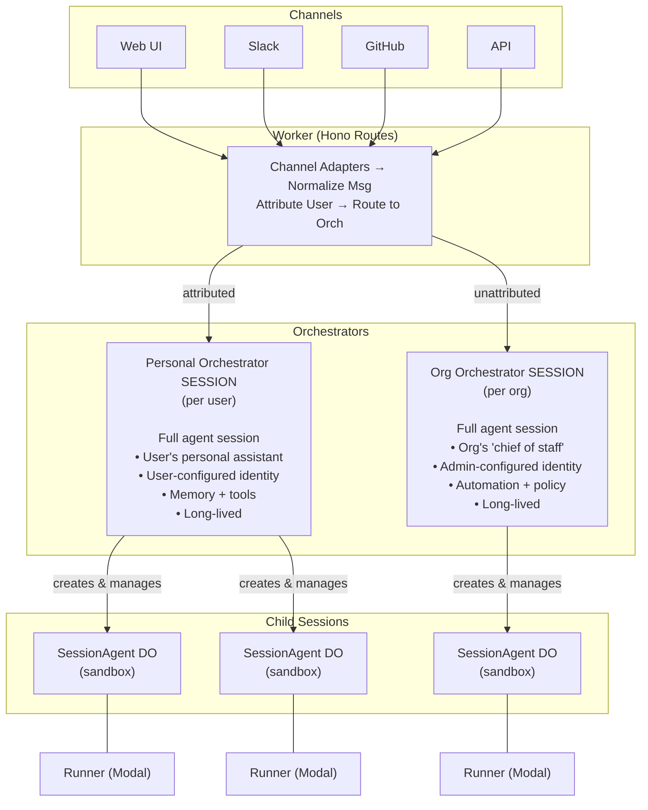
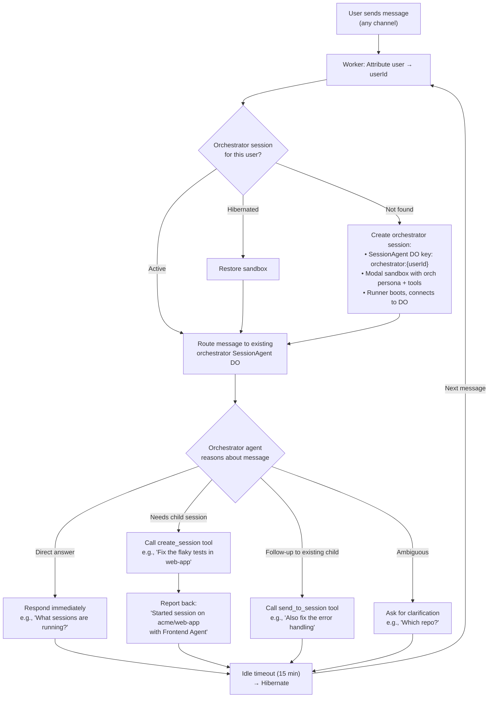
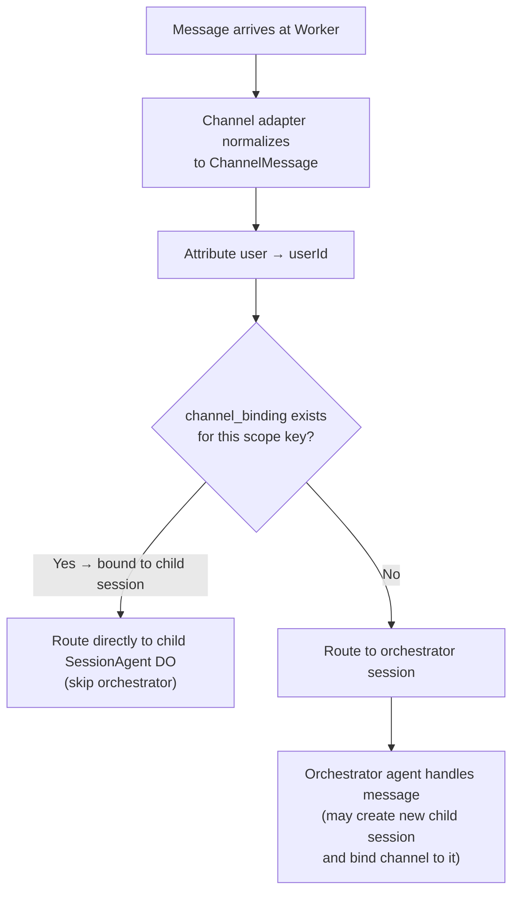
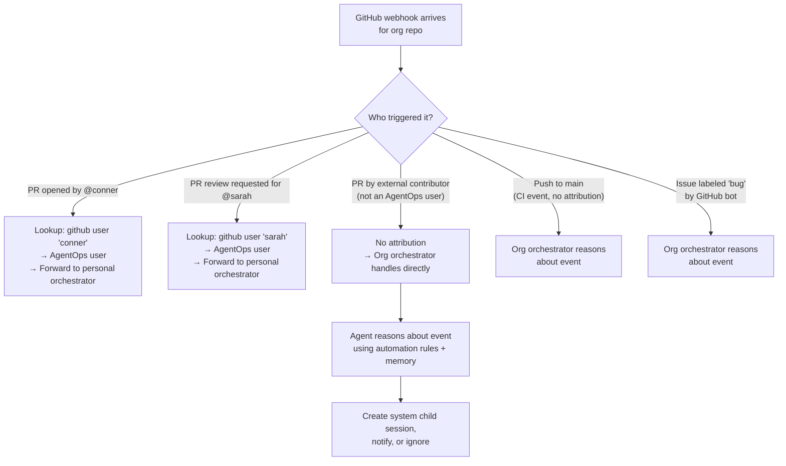
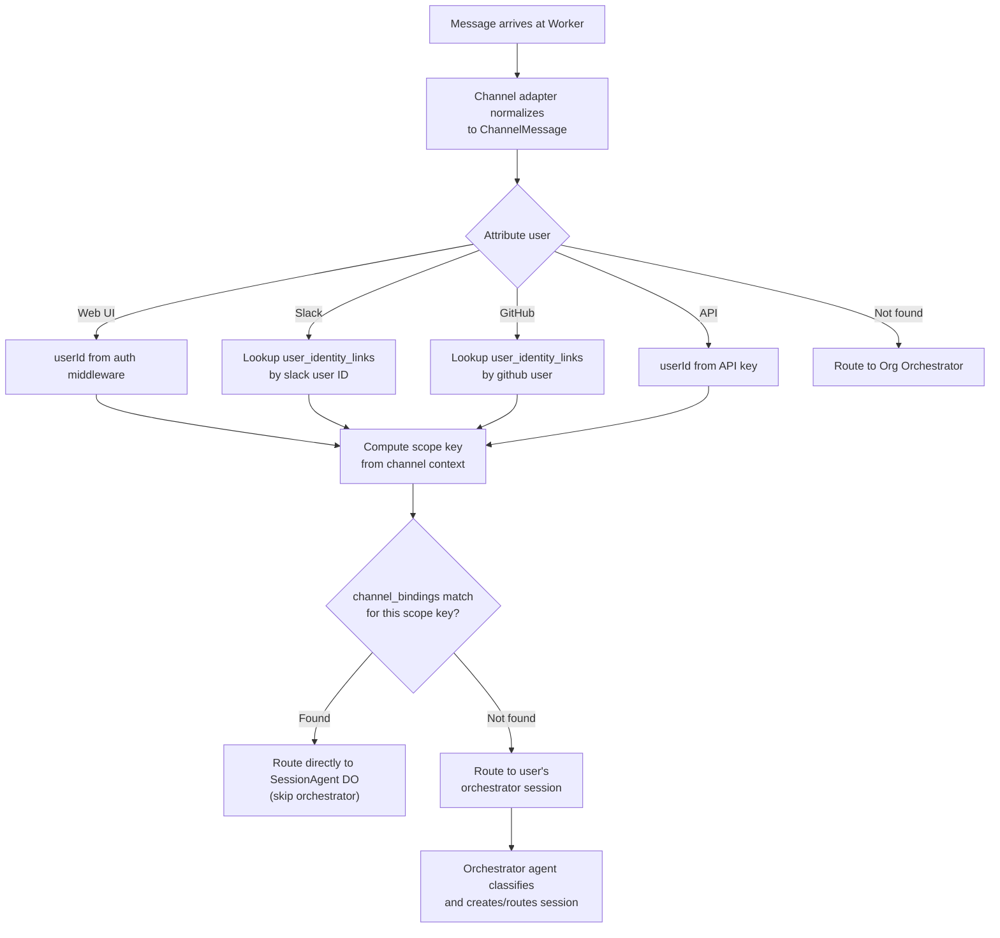
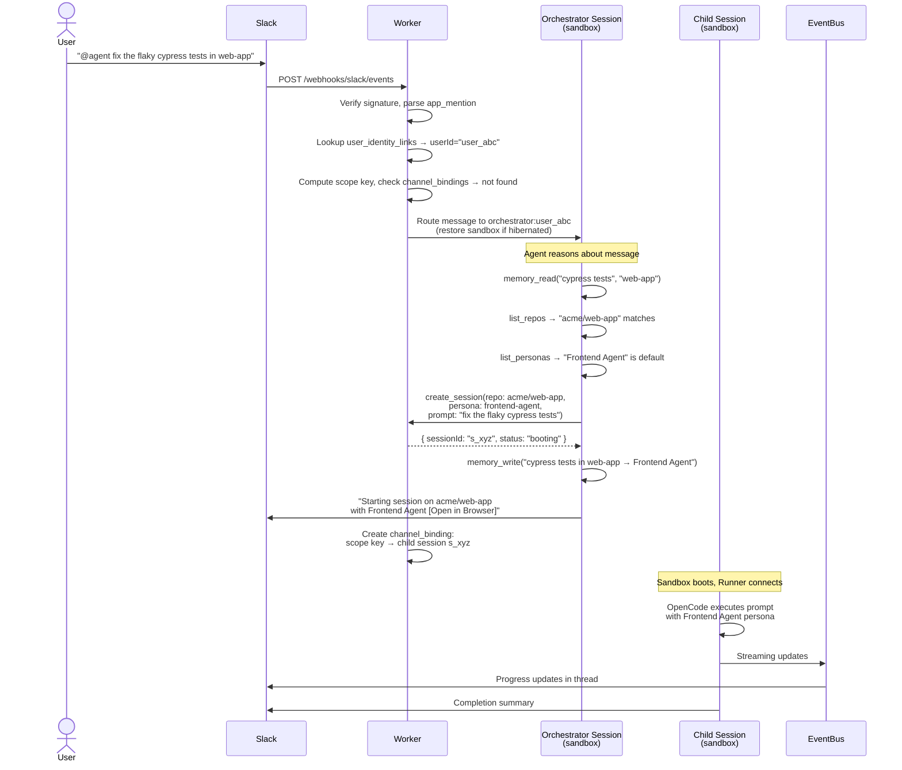
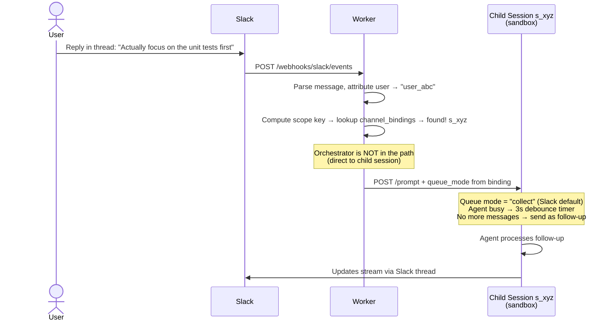
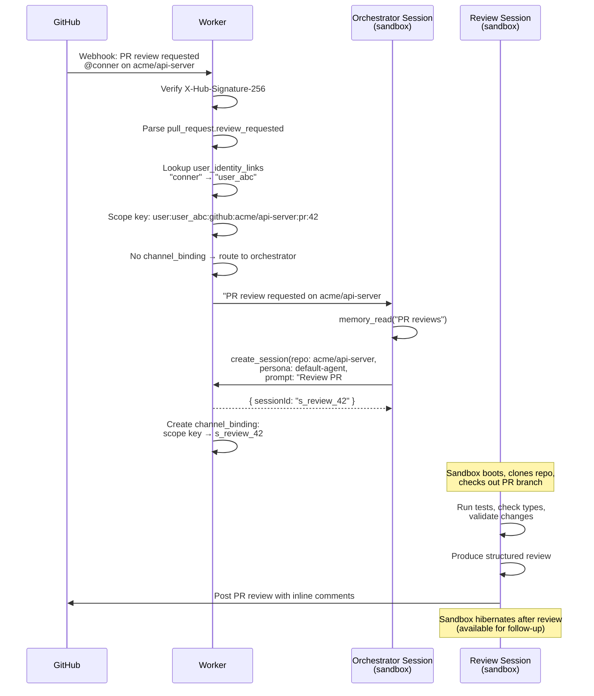
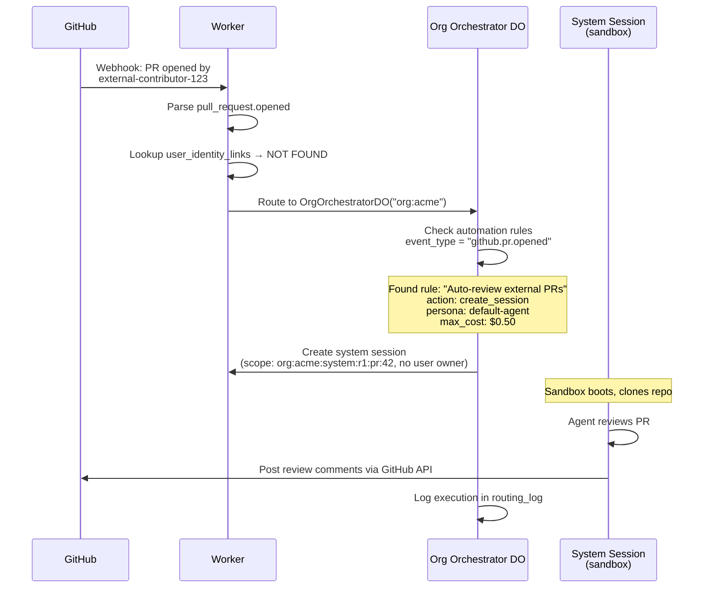
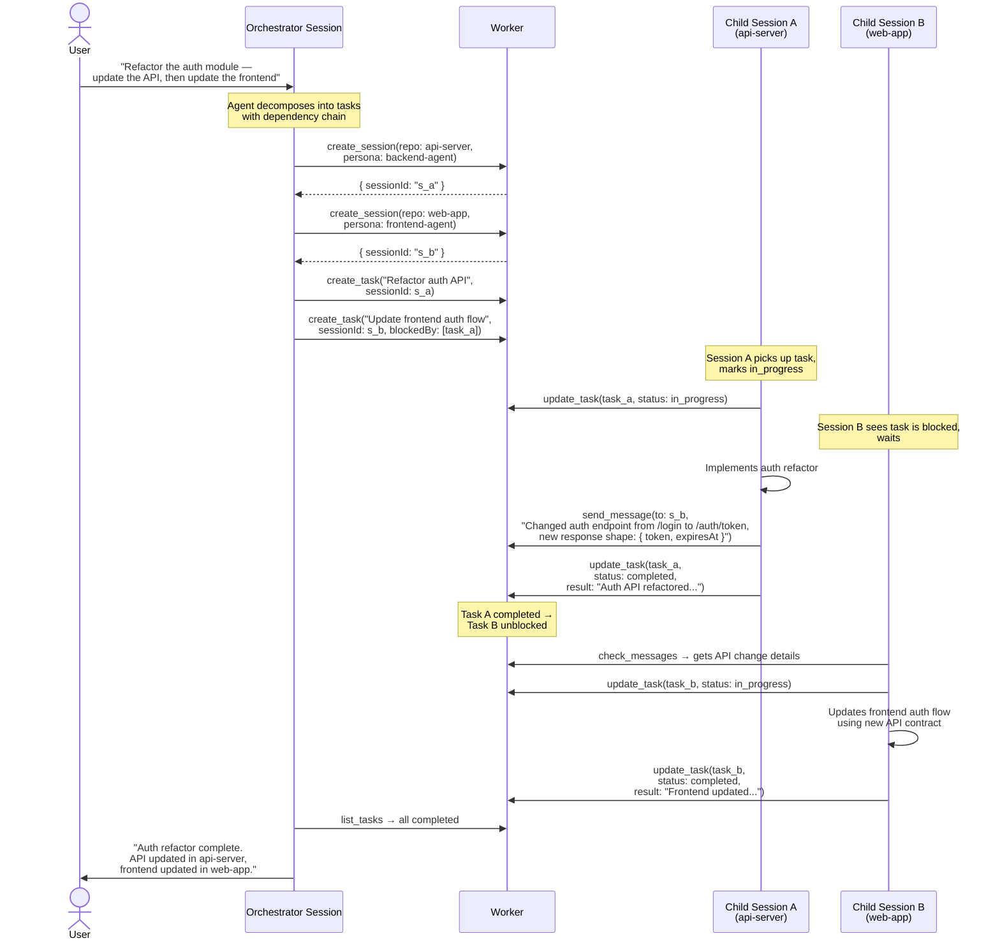

# Agent-Ops V2 — Orchestration Layer Architecture

> Companion to [V1.md](./V1.md). V1 defines the sandbox runtime, SessionAgent DO, Runner, and dev environment. V2 adds the orchestration layer on top: multi-channel routing, user/org orchestrators, org repositories, and agent personas.

## Table of Contents

1. [Motivation](#1-motivation)
2. [Design Principles](#2-design-principles)
3. [System Overview](#3-system-overview)
4. [Org Repositories](#4-org-repositories)
5. [Agent Personas](#5-agent-personas)
6. [Channel Abstraction](#6-channel-abstraction)
7. [Orchestrator Architecture](#7-orchestrator-architecture)
8. [Session Scoping & Routing](#8-session-scoping--routing)
9. [Queue Modes](#9-queue-modes)
10. [Data Flow & Sequences](#10-data-flow--sequences)
11. [Database Schema](#11-database-schema)
12. [API Surface](#12-api-surface)
13. [Relationship to V1 Phases](#13-relationship-to-v1-phases)
14. [Open Questions](#14-open-questions)

---

## 1. Motivation

V1 delivers a working system: users create sessions manually, each session gets an isolated sandbox, and users interact through the web UI. This works, but has limitations:

- **Sessions are manually created.** Users must click "New Session," pick a repo, and wait for a sandbox. There's no way for work to flow in automatically from Slack, GitHub, or other sources.
- **No routing intelligence.** The system doesn't know that a Slack message about "the failing auth tests" should go to the `api-server` repo, or that a GitHub PR comment should route to the PR author's session.
- **No behavioral consistency.** Each session starts from scratch with no org-level conventions. Two engineers working on the same repo may get completely different agent behavior.
- **No orchestration.** There's no layer that understands the full picture — what sessions are active, what repos are available, what work is in progress across the org.

V2 introduces an **orchestration layer** inspired by patterns from multi-channel agent gateway architectures (notably OpenClaw). The key patterns adopted are:

| Pattern | Inspiration | Adaptation |
|---------|------------|------------|
| Gateway orchestrator | OpenClaw's Gateway daemon | Per-user + per-org Durable Objects with LLM-assisted routing |
| Channel abstraction | OpenClaw's multi-channel messaging | Normalized channel adapters for web, Slack, GitHub, API |
| Session scoping | OpenClaw's deterministic session keys | Scope keys derived from context (repo + channel + user) |
| Queue modes | OpenClaw's collect/steer/followup | Per-channel queue mode configuration |
| Agent personas | OpenClaw's workspace bootstrap files | Org-level markdown persona definitions stored in D1 |
| Sub-session spawning | OpenClaw's sub-agents | Orchestrator-level parallel session creation |

**What V2 does NOT adopt from OpenClaw:**

- OpenClaw's agent runtime (pi-mono). We keep OpenCode (or any future runtime) as the engine inside sandboxes.
- OpenClaw's Docker-based sandboxing. We keep Modal sandboxes.
- OpenClaw's WebSocket RPC protocol. We keep our existing Runner ↔ DO WebSocket protocol.
- OpenClaw's workspace filesystem conventions (AGENTS.md, SOUL.md). We use our own persona file format injected as CLAUDE.md or equivalent.

---

## 2. Design Principles

### The orchestrator is your primary agent

Every user gets a **personal orchestrator session** — a full agent session (sandbox, Runner, OpenCode) that acts as their primary interface to the system. Think Jarvis. You talk to it all day, it manages your work, and it delegates to child sessions when tasks need repo-level isolation.

This is not a lightweight routing layer. The orchestrator is the most important session in the system. It has tools to create and manage child sessions, access to org resources (repos, personas), and persistent memory that makes it better over time.

The org also gets an **org orchestrator session** — the organization's "chief of staff." It's a full agent session too, configured by admins, handling org-level concerns that don't belong to any individual (unattributed events, automation, system tasks).

### Attribution-based routing

The fundamental routing question is: **can this event be attributed to a specific AgentOps user?** If yes, route to their personal orchestrator. If no, route to the org orchestrator.

Attribution is a lookup, not an LLM call. The intelligence about *what to do* with the event lives in whichever orchestrator receives it.

### Every session gets a sandbox

Every session gets a full Modal sandbox. There is no "lightweight" tier. Even tasks like PR review or code questions benefit from having the repo cloned, filesystem access, and the ability to run tools. The cost concern is managed through **hibernation** — idle sandboxes hibernate automatically, and restoring from a snapshot is fast. This keeps the architecture simple: one session model, one execution path, no branching logic in the orchestrator about "does this need a sandbox?"

### Channels are adapters, not features

Slack isn't a special integration bolted onto the side. It's a channel adapter — the same as the web UI, GitHub webhooks, or an API call. All channels normalize to a common message format and route through the same orchestrator.

### Agent personas are shared skills, the orchestrator is personal

There are two distinct concepts:

- **Agent personas** (e.g., "Frontend Agent", "DevOps Agent") are skill sets for child sessions — coding conventions, tool preferences, review criteria, domain knowledge. Any org member can create personas. They can be **private** (personal use) or **shared** (published to the org's persona library for everyone).
- **The personal orchestrator** is the user's own assistant. Each user configures their own orchestrator identity — name, handle, communication style, custom instructions. It belongs to the user, not the org.
- **The org orchestrator** is the organization's "chief of staff." It's configured by org admins, has its own identity and handle, and handles org-level concerns — unattributed events, automation rules, system tasks. It belongs to the organization.

---

## 3. System Overview



### Key Architectural Change from V1

Both orchestrators are **full agent sessions** — SessionAgent DO + Modal sandbox + Runner + OpenCode. The personal orchestrator is the user's "Jarvis"; the org orchestrator is the company's "chief of staff." Both create child sessions when work needs repo-level isolation. There are no lightweight DOs — every agent is a sandboxed session.

### New Components

| Component | Key / Identity | Cardinality | Purpose |
|-----------|---------------|-------------|---------|
| Personal Orchestrator Session | `orchestrator:{userId}` | 1 per user | Full agent session — user's personal assistant, task routing, session management, persistent memory |
| Org Orchestrator Session | `orchestrator:org:{orgId}` | 1 per org | Full agent session — org's chief of staff, unattributed event handling, automation, policy enforcement |

### Unchanged from V1

| Component | Notes |
|-----------|-------|
| `SessionAgentDO` | Per-session state, WebSocket to clients + runner, prompt queue, message ledger. **Now used for both orchestrator types and child sessions.** |
| `EventBusDO` | Real-time broadcast with user-tagged connections |
| Runner | Bridges agent runtime to SessionAgent DO inside sandbox |
| Modal Backend | Sandbox lifecycle (create, terminate, hibernate, restore) |

---

## 4. Org Repositories

Org repositories are the shared resource foundation. An org admin connects the organization's GitHub account and selects which repositories are available to all org members.

### Concept

- Repositories belong to the **org**, not individual users
- All org members can create sessions against any org repo
- GitHub webhooks for org repos route through the org orchestrator
- Work on org repos (PRs, branches, issues) is attributed to **individual users** — the repo is org-owned, the work is user-scoped

### Configuration

Admins manage org repos through the web UI or API. The system syncs repo metadata from GitHub (description, default branch, language, topics) for routing context.

```sql
CREATE TABLE org_repositories (
  id TEXT PRIMARY KEY,
  org_id TEXT NOT NULL,
  provider TEXT NOT NULL DEFAULT 'github',
  owner TEXT NOT NULL,                      -- GitHub org/owner name
  name TEXT NOT NULL,                       -- Repository name
  full_name TEXT NOT NULL,                  -- "owner/name"
  description TEXT,                         -- From GitHub, for classifier context
  default_branch TEXT DEFAULT 'main',
  language TEXT,                            -- Primary language
  topics TEXT DEFAULT '[]',                 -- JSON array of GitHub topics
  webhook_id TEXT,                          -- GitHub webhook ID (for cleanup)
  webhook_secret TEXT,                      -- HMAC secret for this repo's webhooks
  enabled BOOLEAN DEFAULT true,
  created_at TEXT DEFAULT (datetime('now')),
  updated_at TEXT DEFAULT (datetime('now')),
  FOREIGN KEY (org_id) REFERENCES orgs(id) ON DELETE CASCADE,
  UNIQUE(org_id, provider, full_name)
);
CREATE INDEX idx_org_repos_org ON org_repositories(org_id);
```

### How Repos Are Used

1. **Orchestrator routing**: When a user says "fix the auth tests," the user orchestrator queries org repos to classify which repo is relevant. The repo list + descriptions provide context for classification.
2. **Session creation**: The orchestrator passes `repoFullName` to session creation, which clones the repo into the sandbox workspace.
3. **Webhook routing**: GitHub webhooks for org repos arrive at the worker. The worker looks up the repo → org mapping, then attributes the event to a user (PR author, issue assignee, etc.) and routes to their orchestrator.
4. **Persona matching**: Repos can have a default persona association (e.g., `infra` repo defaults to "DevOps Agent" persona).

### Repo-Persona Associations

Repos can optionally be associated with a default persona:

```sql
CREATE TABLE org_repo_persona_defaults (
  id TEXT PRIMARY KEY,
  org_repo_id TEXT NOT NULL,
  persona_id TEXT NOT NULL,
  created_at TEXT DEFAULT (datetime('now')),
  FOREIGN KEY (org_repo_id) REFERENCES org_repositories(id) ON DELETE CASCADE,
  FOREIGN KEY (persona_id) REFERENCES agent_personas(id) ON DELETE CASCADE,
  UNIQUE(org_repo_id)
);
```

When the orchestrator creates a session for a repo that has a default persona, it uses that persona unless the user explicitly overrides.

---

## 5. Agent Personas

Agent personas are reusable skill sets for child sessions. They're shared markdown configurations that get injected into the agent's context at session creation time. Think of them as agent skills — "Frontend Agent" knows React conventions, "DevOps Agent" knows Terraform patterns.

### Concept

A persona is a collection of markdown files that instruct the agent on:
- **How to behave** — coding conventions, review criteria, communication style
- **What tools to prefer** — test runners, linters, build commands
- **What to avoid** — patterns to reject, unsafe operations
- **Domain knowledge** — framework-specific guidance, architecture patterns

Any org member can create personas. Personas have two visibility levels:

- **Private** — Only visible to the creator. Good for experimenting, personal workflows, or niche tasks. Default for new personas.
- **Shared** — Visible to all org members. Published to the org's shared persona library. Anyone can use them; only the creator (or an admin) can edit them.

Every child session using a given persona behaves the same way regardless of who created the session or which channel it came from.

### Persona Structure

Each persona has a name, description (for display/classification), and one or more markdown files:

```
Persona: "Frontend Agent"
├── SYSTEM.md     — Core instructions, coding conventions, framework guidance
├── TOOLS.md      — Preferred tools, test commands, build pipeline
└── REVIEW.md     — Code review criteria specific to frontend work

Persona: "DevOps Agent"
├── SYSTEM.md     — Infrastructure conventions, Terraform patterns, K8s guidance
├── TOOLS.md      — CLI tools, deployment commands, monitoring
└── SAFETY.md     — Production safety rules, change management process

Persona: "Default Agent"
├── SYSTEM.md     — General coding assistant, org-wide conventions
└── TOOLS.md      — Standard build and test commands
```

### File Types

Persona files are freeform markdown. The filename convention provides semantic meaning but is not enforced — creators can include any files they want. Common conventions:

| Filename | Purpose | Injected as |
|----------|---------|-------------|
| `SYSTEM.md` | Core behavior instructions | Prepended to CLAUDE.md (or equivalent agent config) |
| `TOOLS.md` | Tool preferences and commands | Appended to CLAUDE.md |
| `REVIEW.md` | Code review criteria | Included when session is in review mode |
| `SAFETY.md` | Safety constraints and guardrails | Prepended to CLAUDE.md (high priority) |
| `PROCESS.md` | Process checklists and workflows | Appended to CLAUDE.md |

### Context Layering

When a session is created, the agent's context is assembled from multiple layers:

```
1. Agent runtime base prompt (OpenCode's built-in system prompt)
2. Persona files from .agent-ops/persona/*.md (org-level conventions)
3. Repo-level CLAUDE.md or AGENTS.md (from the repository itself, if present)
4. Session-specific instructions (from the creating prompt)
```

All layers are loaded by the agent runtime's rules/instruction system — they coexist as additive context, not overrides. This means:
- The persona sets org-wide conventions (coding standards, tool preferences)
- The repo's own CLAUDE.md provides repo-specific context (architecture, patterns, build commands)
- The creating prompt provides task-specific direction
- No layer "replaces" another — they stack

### Schema

```sql
CREATE TABLE agent_personas (
  id TEXT PRIMARY KEY,
  org_id TEXT NOT NULL,
  name TEXT NOT NULL,
  slug TEXT NOT NULL,
  description TEXT,                         -- Short description for UI and classifier context
  icon TEXT,                                -- Emoji or icon identifier
  visibility TEXT NOT NULL DEFAULT 'private', -- 'private' (creator only) | 'shared' (all org members)
  is_default BOOLEAN DEFAULT false,          -- Fallback when no persona is specified (shared only)
  created_by TEXT NOT NULL,
  created_at TEXT DEFAULT (datetime('now')),
  updated_at TEXT DEFAULT (datetime('now')),
  FOREIGN KEY (org_id) REFERENCES orgs(id) ON DELETE CASCADE,
  FOREIGN KEY (created_by) REFERENCES users(id),
  UNIQUE(org_id, slug)
);
CREATE INDEX idx_personas_org ON agent_personas(org_id);

CREATE TABLE agent_persona_files (
  id TEXT PRIMARY KEY,
  persona_id TEXT NOT NULL,
  filename TEXT NOT NULL,                   -- "SYSTEM.md", "TOOLS.md", etc.
  content TEXT NOT NULL,                    -- Markdown content
  sort_order INTEGER DEFAULT 0,            -- Injection order
  created_at TEXT DEFAULT (datetime('now')),
  updated_at TEXT DEFAULT (datetime('now')),
  FOREIGN KEY (persona_id) REFERENCES agent_personas(id) ON DELETE CASCADE,
  UNIQUE(persona_id, filename)
);
```

### How Personas Are Selected

The user orchestrator selects a persona using this precedence:

1. **User explicitly specified** — "use the DevOps agent for this"
2. **Repo default** — the repo has a default persona via `org_repo_persona_defaults`
3. **Orchestrator classification** — the orchestrator infers from the task description (e.g., "deploy to staging" → DevOps, "fix the button layout" → Frontend)
4. **Org default** — the persona marked `is_default = true`

### How Personas Are Injected

The injection interface is **a directory of numbered markdown files**. This is deliberately runtime-agnostic — any agent runtime that can read instruction files from a directory works. If we ever swap OpenCode for another runtime, the persona system doesn't change.

**Workspace layout at boot:**

```
/workspace/
├── .agent-ops/
│   └── persona/
│       ├── 00-SYSTEM.md       ← Core behavior instructions
│       ├── 01-TOOLS.md        ← Tool preferences and commands
│       └── 02-REVIEW.md       ← Code review criteria (if present)
├── CLAUDE.md                  ← Repo's own instructions (from git, if present)
└── ... (repo files)
```

The `sort_order` column on `agent_persona_files` maps to the filename prefix (`00-`, `01-`, `02-`), controlling load order.

**Runtime wiring (currently OpenCode):**

OpenCode's rules system loads the persona files via the `instructions` glob in `opencode.json`:

```json
{
  "instructions": [".agent-ops/persona/*.md"]
}
```

OpenCode loads all matching files into its system prompt context alongside the repo's own `AGENTS.md` or `CLAUDE.md`. This means persona instructions (org-level) and repo instructions (repo-level) coexist naturally — no conflict, no overwriting.

**Injection flow:**

1. Worker resolves the persona for the session
2. Worker queries `agent_persona_files` for the persona's markdown files (ordered by `sort_order`)
3. The persona files are passed to the Modal backend as part of the sandbox creation payload
4. `start.sh` writes each file to `/workspace/.agent-ops/persona/{sort_order}-{filename}` before starting the agent runtime
5. The agent runtime reads the files via its instruction/rules mechanism

**Why this design:**

- **Runtime-agnostic** — The interface is "directory of markdown files," not an OpenCode-specific config. Swapping runtimes means pointing the new runtime at the same directory.
- **Composable** — Persona files (org-level) layer with repo `CLAUDE.md` (repo-level) without conflicts. The context stack is: runtime base prompt → persona files → repo instructions → prompt.
- **No Runner changes** — The Runner doesn't know or care about personas. It sends prompts the same way regardless.
- **Debuggable** — You can SSH into a sandbox and `cat .agent-ops/persona/*` to see exactly what instructions the agent received.

### Session Assignment

Sessions track which persona was used:

```sql
ALTER TABLE sessions ADD COLUMN persona_id TEXT
  REFERENCES agent_personas(id);
```

This enables:
- Auditing: "Which persona was active when the agent did X?"
- Analytics: "Which persona is used most? Which produces the best results?"
- Filtering: "Show me all sessions that used the Frontend Agent"

---

## 6. Channel Abstraction

Every input source to Agent-Ops is a **channel**. Channels normalize messages into a common format and route them through the orchestrator layer.

### Channel Types

| Channel | Input Events | Output Capabilities |
|---------|-------------|---------------------|
| **Web UI** | User sends prompt via WebSocket | Real-time streaming, full session UI |
| **Slack** | Slash commands, @mentions, thread replies | Block Kit messages, thread updates, reactions |
| **GitHub** | PR comments, issue comments, review requests, webhooks | PR comments, review comments, status checks |
| **API** | HTTP POST with prompt | JSON response (sync or webhook callback) |
| **Linear** | Issue updates, comments | Issue comments, status updates |

### Common Message Format

All channels normalize inbound messages to:

```typescript
interface ChannelMessage {
  // Identity
  channelType: "web" | "slack" | "github" | "api" | "linear";
  channelId: string;              // Unique channel context identifier

  // Sender
  senderId: string;               // AgentOps user ID (after attribution)
  senderName: string;             // Display name
  senderExternalId?: string;      // Platform-specific ID (Slack user ID, etc.)

  // Content
  content: string;                // The message text / prompt
  attachments?: Attachment[];     // Files, images, code snippets

  // Routing context
  scopeKey?: string;              // Pre-computed scope key if follow-up
  sessionId?: string;             // Explicit session target (for web UI)

  // Channel-specific metadata
  metadata: {
    // Slack
    slackTeamId?: string;
    slackChannelId?: string;
    slackThreadTs?: string;
    slackMessageTs?: string;

    // GitHub
    githubRepoFullName?: string;
    githubPrNumber?: number;
    githubIssueNumber?: number;
    githubAction?: string;        // "opened", "commented", "review_requested"

    // Linear
    linearIssueId?: string;
    linearTeamId?: string;

    // API
    apiCallbackUrl?: string;      // For async result delivery
    apiIdempotencyKey?: string;
  };
}
```

### Channel Adapters

Each channel has an adapter that:
1. Receives raw platform events (Slack webhook, GitHub webhook, etc.)
2. Verifies authenticity (signature verification)
3. Attributes to an AgentOps user (lookup by platform user ID)
4. Normalizes to `ChannelMessage`
5. Routes to the appropriate orchestrator

```typescript
interface ChannelAdapter {
  // Inbound: normalize platform events
  parseEvent(rawEvent: unknown): ChannelMessage | null;
  attributeUser(msg: ChannelMessage): Promise<string | null>;  // Returns userId

  // Outbound: send responses back through the channel
  sendMessage(channelId: string, content: string): Promise<void>;
  updateMessage(channelId: string, messageRef: string, content: string): Promise<void>;
  sendStreamStart(channelId: string): Promise<StreamHandle>;
  sendReaction(channelId: string, messageRef: string, emoji: string): Promise<void>;
}
```

### Channel Bindings

When a session is created from a channel, a binding is stored so responses route back correctly:

```sql
CREATE TABLE channel_bindings (
  id TEXT PRIMARY KEY,
  session_id TEXT NOT NULL,
  channel_type TEXT NOT NULL,
  channel_id TEXT NOT NULL,           -- Scope key for the channel context
  user_id TEXT,                       -- Owner (NULL for org-level sessions)
  org_id TEXT NOT NULL,

  -- Channel-specific references for sending responses
  slack_channel_id TEXT,
  slack_thread_ts TEXT,
  slack_initial_message_ts TEXT,      -- For updating status in Block Kit message
  github_repo_full_name TEXT,
  github_pr_number INTEGER,
  github_comment_id TEXT,

  created_at TEXT DEFAULT (datetime('now')),
  FOREIGN KEY (session_id) REFERENCES sessions(id) ON DELETE CASCADE,
  UNIQUE(channel_type, channel_id)
);
CREATE INDEX idx_channel_bindings_session ON channel_bindings(session_id);
CREATE INDEX idx_channel_bindings_channel ON channel_bindings(channel_type, channel_id);
```

This replaces the V1 `slack_sessions` table with a generalized version that supports any channel.

### User Identity Linking

Users may interact from multiple channels. Identity linking maps platform-specific IDs to AgentOps users:

```sql
CREATE TABLE user_identity_links (
  id TEXT PRIMARY KEY,
  user_id TEXT NOT NULL,
  provider TEXT NOT NULL,              -- "slack", "github", "linear"
  external_id TEXT NOT NULL,           -- Platform user ID
  external_name TEXT,                  -- Display name on that platform
  team_id TEXT,                        -- Slack team ID, GitHub org, etc.
  created_at TEXT DEFAULT (datetime('now')),
  FOREIGN KEY (user_id) REFERENCES users(id) ON DELETE CASCADE,
  UNIQUE(provider, external_id)
);
CREATE INDEX idx_identity_links_user ON user_identity_links(user_id);
```

When a Slack message arrives, the worker looks up `user_identity_links` by `(provider='slack', external_id=slackUserId)` to find the AgentOps user.

---

## 7. Orchestrator Architecture

### 7.1 User Orchestrator Session

The user orchestrator is the user's **primary agent** — their "Jarvis." It is a full agent session with the same stack as any other session (SessionAgent DO + Modal sandbox + Runner + OpenCode), but with a special orchestrator persona and orchestrator-specific tools.

Users interact with their orchestrator directly. It's a long-lived, persistent session that spans the workday. When work needs to happen in an isolated repo context (code changes, reviews, deploys), the orchestrator creates **child sessions** and delegates to them. But most day-to-day conversation — asking questions, triaging issues, checking status, planning work — happens in the orchestrator session itself.

**Session ID**: `orchestrator:{userId}` (well-known, deterministic)
**Cardinality**: 1 per user
**Lifecycle**: Long-lived. Hibernates when idle, resumes on next interaction. Never explicitly "ended" by the user.

#### What Makes It Different from a Regular Session

The orchestrator session is a regular SessionAgent DO + sandbox — it uses the same infrastructure as every other session. What makes it special:

1. **Orchestrator persona** — A special system persona (not org-configurable) that instructs the agent to act as a task router, session manager, and conversational assistant. This is injected via the same `.agent-ops/persona/*.md` mechanism.

2. **Orchestrator tools** — Custom OpenCode tools that give the agent the ability to manage child sessions, query org resources, and persist memories. These tools are what make the orchestrator an orchestrator.

3. **Long-lived conversation** — Regular sessions are task-scoped and typically short. The orchestrator session persists across the user's day. Its conversation history is the user's ongoing dialogue with the system.

4. **Channel hub** — All inbound messages (from any channel) route to the orchestrator session first. The orchestrator agent decides whether to handle them directly or delegate to a child session.

5. **Memory** — The orchestrator has persistent memory (backed by D1) that builds up over time. It learns the user's preferences, repo affinities, and work patterns.

#### Orchestrator Tools

These are custom OpenCode tools available only in orchestrator sessions, exposed via `docker/opencode/tools/`:

```typescript
// Conceptual tool definitions — actual implementation in OpenCode tool format

tools: {
  create_session: {
    description: "Create a new child session for a specific task",
    parameters: {
      repo: "string",            // Org repo full name (e.g., "acme/api-server")
      persona?: "string",        // Persona slug (e.g., "frontend-agent")
      prompt: "string",          // Initial prompt for the child session
      scopeKey?: "string",       // For channel binding (auto-generated if omitted)
    },
    // Calls POST /api/sessions with parentSessionId = orchestrator session ID
    // Returns { sessionId, status, url }
  },

  list_sessions: {
    description: "List active child sessions and their status",
    parameters: {
      status?: "string",         // Filter: "active", "idle", "completed"
      repo?: "string",           // Filter by repo
    },
    // Calls GET /api/sessions?creatorId={userId}&parent={orchestratorSessionId}
    // Returns [{ sessionId, repo, persona, status, lastActivity, summary }]
  },

  send_to_session: {
    description: "Send a follow-up message to an existing child session",
    parameters: {
      sessionId: "string",
      message: "string",
    },
    // Calls POST /api/sessions/{sessionId}/prompt
  },

  get_session_status: {
    description: "Get detailed status of a child session including recent output",
    parameters: {
      sessionId: "string",
    },
    // Calls GET /api/sessions/{sessionId}
    // Returns session details + recent messages + agent status
  },

  list_repos: {
    description: "List available org repositories with descriptions",
    parameters: {
      query?: "string",          // Search/filter
    },
    // Calls GET /api/orgs/{orgId}/repos
  },

  list_personas: {
    description: "List available agent personas",
    parameters: {},
    // Calls GET /api/orgs/{orgId}/personas
  },

  memory_read: {
    description: "Search persistent memories for relevant context",
    parameters: {
      query?: "string",
      category?: "string",
    },
    // Reads from D1 orchestrator_memories table
  },

  memory_write: {
    description: "Save a memory for future reference",
    parameters: {
      content: "string",
      category: "string",        // 'repo_affinity', 'task_pattern', 'persona_preference', 'general'
    },
    // Writes to D1 orchestrator_memories table
  },
}
```

The orchestrator agent uses these tools based on its own reasoning. There's no hardcoded classification flow — the agent decides:
- "This message is about deploying the API. Let me create a child session with the DevOps persona on acme/api-server."
- "The user is asking what's running. Let me call list_sessions."
- "This is a quick question I can answer directly without spinning up a session."

#### Orchestrator Persona

The orchestrator persona is assembled from two layers:

**Layer 1: System base (immutable)** — Defines core orchestration behavior. This is not user-configurable — it ensures the orchestrator always knows how to manage sessions, use tools, and route work correctly. Injected as `.agent-ops/persona/00-ORCHESTRATOR-SYSTEM.md`.

The system base instructs the agent to:
- Use `list_repos` and `list_personas` to understand what's available before creating sessions
- Delegate repo-specific work to child sessions rather than trying to do everything locally
- Track active sessions and provide status updates when asked
- Remember user preferences and work patterns using `memory_write`
- Consult memories using `memory_read` when making routing decisions
- Ask for clarification when the intent is ambiguous (which repo? what task?)
- Respond conversationally for simple questions — not everything needs a child session
- Respond to messages from other users' orchestrators (cross-user messaging)

**Layer 2: User identity & personality (user-configurable)** — Defines who the orchestrator *is*. Users personalize their orchestrator during onboarding and can update it anytime. Injected as `.agent-ops/persona/01-IDENTITY.md`.

This layer includes:
- **Name** — What the orchestrator calls itself ("Jarvis", "Friday", "Hal", or just "Agent")
- **Handle** — Org-unique identifier for cross-user messaging (e.g., `@jarvis`, `@conner-bot`)
- **Communication style** — Terse vs verbose, formal vs casual, emoji usage, humor level
- **Custom instructions** — Freeform markdown the user writes to shape behavior ("Always suggest writing tests first", "I prefer functional React patterns", "Remind me to take breaks")

#### Orchestrator Identity

Each orchestrator has a public identity within the org. This enables cross-user interaction — you can message a colleague's orchestrator the same way you'd message a colleague.

```sql
CREATE TABLE orchestrator_identities (
  id TEXT PRIMARY KEY,
  user_id TEXT,                                -- NULL for org orchestrator
  org_id TEXT NOT NULL,
  type TEXT NOT NULL DEFAULT 'personal',       -- 'personal' | 'org'
  name TEXT NOT NULL DEFAULT 'Agent',          -- Display name ("Jarvis", "Ops")
  handle TEXT NOT NULL,                        -- Org-unique handle ("jarvis", "ops")
  avatar TEXT,                                 -- Emoji or image URL
  custom_instructions TEXT,                    -- Markdown personality/preferences
  created_at TEXT DEFAULT (datetime('now')),
  updated_at TEXT DEFAULT (datetime('now')),
  FOREIGN KEY (user_id) REFERENCES users(id) ON DELETE CASCADE,
  FOREIGN KEY (org_id) REFERENCES orgs(id) ON DELETE CASCADE,
  UNIQUE(org_id, handle),
  UNIQUE(org_id, user_id)                     -- One personal orchestrator per user per org
);
```

**Personal orchestrator onboarding:**

When a user joins the org or first accesses Agent-Ops, they go through a quick setup:
1. **Name your orchestrator** — "What should your agent be called?" (default: "Agent")
2. **Pick a handle** — "Choose a handle for your agent" → `@jarvis` (must be unique in org)
3. **Set personality** (optional) — "How should your agent communicate?" (presets: Professional, Casual, Terse, or custom)

This can be updated anytime via settings.

**Org orchestrator setup** (admin):

Admins configure the org orchestrator identity via settings — name, handle (e.g., `@ops`, `@chief`), avatar, and custom instructions that define org-level behavior priorities.

#### Cross-User Orchestrator Messaging

Users can send messages to each other's orchestrators. This opens up async collaboration patterns:

- **Status checks**: "Hey @conner-bot, what's the status of the API refactor?" → Conner's orchestrator checks its active sessions and memories, responds with a summary.
- **Delegation**: "@sarah-agent, can you review PR #42 on api-server?" → Sarah's orchestrator creates a review child session on her behalf.
- **Handoffs**: "I'm done with the frontend changes. @conner-bot, the API endpoint needs updating to match." → Conner's orchestrator gets context and can create a session.

**How it works:**

Cross-user messages arrive through any channel (Slack @mention of the handle, web UI direct message, API). The worker resolves the handle → target user → target orchestrator session, and delivers the message with sender attribution:

```
From: @sarah (sarah's orchestrator)
To: @conner-bot (conner's orchestrator)
Message: "What's the status of the API refactor?"
```

The receiving orchestrator sees who sent the message and can respond back through the same channel. The orchestrator's memory includes context about cross-user interactions.

**Permissions:** Cross-user messaging is opt-in and scoped to the org. Users can only message orchestrators within their own org. The receiving orchestrator can only share information that the receiving user has access to (no privilege escalation).

**Context available to the orchestrator agent:**

The orchestrator's workspace doesn't have a repo cloned (it's not repo-scoped). Instead, it has:
- The orchestrator persona files (`.agent-ops/persona/*.md`) — system base + user identity
- Orchestrator tool definitions
- Access to org repos and personas via tools
- Access to memories via tools
- The ongoing conversation history
- Its identity (name, handle) for self-reference in responses

#### Lifecycle



#### Channel Routing

All inbound messages route to the orchestrator session first, regardless of channel:



**Optimization**: Follow-up messages in a Slack thread or GitHub PR that are already bound to a child session bypass the orchestrator entirely. The orchestrator is only in the path for new conversations and unbound messages.

#### Orchestrator Memory

The orchestrator agent has persistent memory that makes it better over time. Unlike the old design where memory was a separate DO SQLite schema, memory is now a **tool** the orchestrator agent uses explicitly — `memory_read` and `memory_write`.

**What gets remembered (agent decides):**

- **Repo affinity** — "When I mention 'auth', I usually mean the api-server repo"
- **Routing corrections** — "I prefer the DevOps persona for the infra repo, not Default"
- **Task patterns** — "I do deploy tasks on Fridays", "I usually work on the payments service"
- **Persona preferences** — "Always use the Frontend Agent for web-app repo"
- **Session outcomes** — "Last time we tried X approach on api-server, it didn't work because Y"

**Storage:** Orchestrator memories live in D1 (`orchestrator_memories` table), not in the DO's SQLite. This is because the orchestrator sandbox may be hibernated/recreated, but memories must persist across sandbox lifecycles.

The orchestrator agent reads memories at the start of each interaction (or when it needs context) via `memory_read`, and writes new memories when it learns something via `memory_write`. The persona instructions tell it when to do this.

**Memory maintenance** is handled by the memory tool implementation (server-side):
- **Relevance decay** — entries decay over time, boosted on access
- **Pruning** — entries below threshold are cleaned up
- **Cap** — max ~200 entries per user to keep reads manageable

### 7.2 Org Orchestrator Session

The org orchestrator is the organization's "chief of staff" — a full agent session (SessionAgent DO + sandbox + Runner + OpenCode) that handles org-level concerns. It has its own identity configured by admins, and is the same stack as a personal orchestrator but scoped to the org rather than a user.

**Session ID**: `orchestrator:org:{orgId}` (well-known, deterministic)
**Cardinality**: 1 per org
**Lifecycle**: Long-lived, hibernates when idle. Always available for inbound org events.

#### What Makes It Different from a Personal Orchestrator

| | Personal Orchestrator | Org Orchestrator |
|---|---|---|
| **Belongs to** | A user | The organization |
| **Configured by** | The user | Org admins |
| **Identity** | User picks name/handle | Admin picks name/handle (e.g., `@ops`, `@chief`) |
| **Receives** | User-attributed events from any channel | Unattributed events (external PRs, bots, cron) |
| **Tools** | `create_session`, `list_sessions`, `memory_*`, etc. | Same tools + `list_automation_rules`, `enforce_policy`, `attribute_user` |
| **Memory** | Personal routing intelligence | Org-level patterns (which rules fire most, common external contributors, etc.) |
| **Creates** | Child sessions owned by the user | System sessions (no user owner) |

#### Responsibilities

1. **Unattributed event handling** — Receive org-level events where no user can be identified (external contributor PRs, bot events, cron jobs) and decide what to do.
2. **Attribution routing** — Try to attribute events to a user, and forward to their personal orchestrator via tools.
3. **Policy enforcement** — Enforce org-level limits (max concurrent sessions org-wide, budget caps).
4. **System session management** — Create and manage child sessions that don't belong to any user (automated tasks, cron-triggered work).
5. **Automation execution** — Has access to admin-configured automation rules and can execute them based on inbound events.

#### Org Orchestrator Tools

Same base tools as the personal orchestrator (`create_session`, `list_sessions`, `send_to_session`, `memory_read`, `memory_write`) plus org-specific tools:

```typescript
// Org-specific tools (in addition to standard orchestrator tools)

tools: {
  list_automation_rules: {
    description: "List configured automation rules for this org",
    parameters: { event_type?: "string", enabled?: "boolean" },
  },

  enforce_policy: {
    description: "Check org-level policy constraints (budget, concurrency)",
    parameters: { action: "string" },
    // Returns { allowed: boolean, reason?: string }
  },

  attribute_user: {
    description: "Look up an AgentOps user from an external identity",
    parameters: {
      provider: "string",        // "github", "slack", "linear"
      externalId: "string",
    },
    // Returns { userId, handle } or null
  },

  forward_to_user: {
    description: "Forward an event to a user's personal orchestrator",
    parameters: {
      userId: "string",
      message: "string",
    },
  },
}
```

#### Org Orchestrator Persona

The org orchestrator has an admin-configured persona that defines its behavior. Like personal orchestrators, it has two layers:

- **System base** (immutable) — Core orchestration behavior: use automation rules, enforce policy, attribute and forward events, create system sessions.
- **Admin identity & instructions** (admin-configurable) — Name, handle, avatar, and custom instructions that shape how the org orchestrator behaves ("Always auto-review external PRs", "Notify #eng-alerts on failed CI", etc.).

#### Attribution Logic



#### Org Automation Rules

Automation rules are admin-configured and stored in D1. The org orchestrator agent has access to these rules via tools and uses them to inform its decisions:

```sql
CREATE TABLE org_automation_rules (
  id TEXT PRIMARY KEY,
  org_id TEXT NOT NULL,
  name TEXT NOT NULL,
  enabled BOOLEAN DEFAULT true,

  -- Trigger
  event_type TEXT NOT NULL,           -- "github.pr.opened", "github.issue.created", "cron"
  event_filter TEXT DEFAULT '{}',     -- JSON filter conditions

  -- Action
  action_type TEXT NOT NULL,          -- "create_session", "notify", "ignore"
  action_config TEXT NOT NULL,        -- JSON: { persona_slug, ... }

  -- Limits
  max_cost_per_run REAL,             -- Budget cap per execution
  max_runs_per_day INTEGER,

  created_by TEXT NOT NULL,
  created_at TEXT DEFAULT (datetime('now')),
  updated_at TEXT DEFAULT (datetime('now')),
  FOREIGN KEY (org_id) REFERENCES orgs(id) ON DELETE CASCADE,
  FOREIGN KEY (created_by) REFERENCES users(id)
);
```

The org orchestrator agent reads these rules and uses them to decide how to handle events. Because it's a full agent, it can also reason beyond the rules — for example, noticing patterns across events, or asking an admin for guidance on edge cases.

### 7.3 Permissions Model

| Role | Org Repos | Personas | Automation Rules | Budget/Limits | User Orchestrator |
|------|-----------|----------|-----------------|---------------|-------------------|
| **Org Admin** | CRUD | CRUD any, set defaults | CRUD | CRUD | View all |
| **Org Member** | Read, use | CRUD own, use shared | Read | Read own usage | Own only |
| **Org Orchestrator** | Read | Read | Read, execute | Enforce | Forward to |
| **User Orchestrator** | Read | Read | — | Check limits | Self |

Admins configure org repos, automation rules, and budgets. Any org member can create and share agent personas (skills). Members manage their own orchestrator identity. The org orchestrator enforces policies mechanically.

### 7.4 Agent Memory

Agent memory comes in two tiers: **orchestrator memory** (routing intelligence and user preferences, stored in D1, accessed via orchestrator tools) and **session memory** (repo/workspace knowledge, stored in D1, optionally available to child sessions as a tool).

Both tiers use the same mechanism — OpenCode tools that call back to the worker API. The difference is scope and semantics.

#### Tier 1: Orchestrator Memory

The orchestrator agent has `memory_read` and `memory_write` tools (see [Section 7.1](#orchestrator-tools)). These are always available in the orchestrator session.

**Storage:** `orchestrator_memories` table in D1 (see [Section 11](#11-database-schema)). Scoped by `user_id` + `org_id`. Persists across sandbox hibernation/recreation — the orchestrator sandbox is ephemeral, but memories are durable.

**What gets remembered (agent decides):**
- Repo affinity, routing corrections, task patterns, persona preferences, session outcomes
- The orchestrator persona instructs the agent on when to read and write memories

**Maintenance (server-side, in the memory tool API):**
- Relevance decay (0.99x per day, boosted on read)
- Pruning below threshold (0.1)
- Deduplication (new entry on same topic replaces old)
- Cap at ~200 entries per user

#### Tier 2: Session Memory (Tool-Based)

Regular child sessions don't have memory access by default — they're ephemeral, task-scoped coding sessions. However, memory can be exposed as an **optional tool** that the agent can invoke to read and write persistent knowledge scoped to a repo.

**How it works:**

The memory tool is a custom OpenCode tool (defined in `docker/opencode/tools/`) that calls back to the worker API. When enabled, the agent can:

1. **Read memories** — Query memories scoped to the current user + repo. Useful for recalling past decisions, preferences, or patterns.
2. **Write memories** — Persist a new memory entry. The agent decides when something is worth remembering (e.g., "this repo uses a specific test pattern", "user prefers X approach").

**Storage:** Session memories use V1's existing `agent_memories` table in D1, scoped by `user_id` + `workspace` (repo full name):

```sql
-- From V1.md — no schema changes needed
CREATE TABLE agent_memories (
  id TEXT PRIMARY KEY,
  user_id TEXT NOT NULL,
  session_id TEXT,
  workspace TEXT,                     -- Repo full name, e.g., "acme/api-server"
  content TEXT NOT NULL,
  category TEXT DEFAULT 'general',
  created_at TEXT DEFAULT (datetime('now')),
  updated_at TEXT DEFAULT (datetime('now')),
  FOREIGN KEY (user_id) REFERENCES users(id)
);
```

**When session memory is available:**

Memory is NOT enabled by default. It's controlled by the persona or session configuration:

- **Orchestrator sessions**: Always have memory (Tier 1 — `memory_read`/`memory_write` orchestrator tools)
- **Child sessions with memory-enabled persona**: The persona can include a `TOOLS.md` that references the memory tool, or the session creation payload includes `enableMemory: true`
- **Child sessions without memory**: The tool simply isn't loaded into OpenCode's tool set

This keeps the common case simple (most child sessions are ephemeral, stateless coding tasks) while allowing specific personas to build up persistent repo knowledge over time.

#### Memory Tiers Summary

| Tier | Scope | Storage | Access Pattern | Available In |
|------|-------|---------|----------------|--------------|
| Orchestrator | Per-user routing intelligence | D1 (`orchestrator_memories`) | Tool invocation by orchestrator agent | Orchestrator session only |
| Session | Per-user + per-repo workspace knowledge | D1 (`agent_memories`) | Tool invocation by child session agent | Opt-in per persona/session |

#### Relationship Between Tiers

The two tiers are independent but complementary:

- **Orchestrator memory** helps the orchestrator manage work correctly ("when I mention 'checkout', route to the payments service", "I prefer the DevOps persona for infra")
- **Session memory** helps the agent inside a child session do better work ("this repo uses vitest not jest", "the team prefers functional React components")

They don't share storage or access patterns. The orchestrator has its own memory table; child sessions use V1's `agent_memories` table. This keeps the separation of concerns clean.

### 7.5 Inter-Session Coordination & Messaging

When an orchestrator delegates work to multiple child sessions, those sessions need structured coordination — not just fire-and-forget. And when agents finish work, encounter errors, or need decisions, they need a way to reach humans who may not be watching. Inspired by Claude Code's AgentTeams model, the system provides three coordination primitives: a **shared task board**, a **unified mailbox** (where both agents and humans are addressable), and **plan approval**.

#### Shared Task Board

The orchestrator maintains a task board that both it and its child sessions can read and update. This gives the orchestrator visibility into progress without polling, and gives child sessions a structured way to report status.

```typescript
interface TaskItem {
  id: string;
  sessionId: string;              // Which child session owns this task
  parentTaskId?: string;          // For sub-tasks
  title: string;                  // Short description
  description?: string;           // Detailed requirements
  status: "pending" | "in_progress" | "completed" | "blocked";
  blockedBy?: string[];           // Task IDs that must complete first
  result?: string;                // Completion summary
  createdAt: string;
  updatedAt: string;
}
```

**How it works:**

1. **Orchestrator creates tasks** when spawning child sessions. A single user request ("refactor the auth module and update the API docs") may become multiple tasks across multiple sessions.
2. **Child sessions update tasks** as they progress — marking in_progress when starting, completed when done, blocked when waiting on dependencies.
3. **Orchestrator monitors tasks** and can react: unblock dependent sessions, provide additional context, or synthesize results when all tasks complete.
4. **Task dependencies** enable orchestrated multi-step workflows. Session B's task can be blocked by Session A's task — when A completes, B is automatically unblocked.

**Storage:** Task board lives in D1 (`session_tasks` table), scoped to the orchestrator session. Both orchestrator and child sessions access it via tools.

```sql
CREATE TABLE session_tasks (
  id TEXT PRIMARY KEY,
  orchestrator_session_id TEXT NOT NULL,   -- The orchestrator that owns this board
  session_id TEXT,                         -- Child session assigned to this task (NULL = unassigned)
  parent_task_id TEXT,                     -- For sub-tasks
  title TEXT NOT NULL,
  description TEXT,
  status TEXT NOT NULL DEFAULT 'pending',  -- 'pending', 'in_progress', 'completed', 'blocked'
  result TEXT,                             -- Completion summary written by child
  created_at TEXT DEFAULT (datetime('now')),
  updated_at TEXT DEFAULT (datetime('now')),
  FOREIGN KEY (orchestrator_session_id) REFERENCES sessions(id) ON DELETE CASCADE,
  FOREIGN KEY (session_id) REFERENCES sessions(id) ON DELETE SET NULL,
  FOREIGN KEY (parent_task_id) REFERENCES session_tasks(id) ON DELETE CASCADE
);
CREATE INDEX idx_session_tasks_orch ON session_tasks(orchestrator_session_id);
CREATE INDEX idx_session_tasks_session ON session_tasks(session_id);
CREATE INDEX idx_session_tasks_status ON session_tasks(orchestrator_session_id, status);

CREATE TABLE session_task_dependencies (
  task_id TEXT NOT NULL,
  blocked_by_task_id TEXT NOT NULL,
  PRIMARY KEY (task_id, blocked_by_task_id),
  FOREIGN KEY (task_id) REFERENCES session_tasks(id) ON DELETE CASCADE,
  FOREIGN KEY (blocked_by_task_id) REFERENCES session_tasks(id) ON DELETE CASCADE
);
```

**Orchestrator tools (additions to existing tool set):**

```typescript
tools: {
  create_task: {
    description: "Create a task on the shared task board",
    parameters: {
      title: "string",
      description?: "string",
      sessionId?: "string",       // Assign to child session (or leave unassigned)
      blockedBy?: "string[]",     // Task IDs this depends on
    },
  },

  list_tasks: {
    description: "List tasks on the shared board, optionally filtered",
    parameters: {
      status?: "string",          // Filter by status
      sessionId?: "string",       // Filter by assigned session
    },
  },

  update_task: {
    description: "Update a task's status or details",
    parameters: {
      taskId: "string",
      status?: "string",
      result?: "string",          // Completion summary
    },
  },
}
```

**Child session tools (subset):**

Child sessions get read/update access to their own tasks only:

```typescript
tools: {
  my_tasks: {
    description: "List tasks assigned to this session",
    parameters: { status?: "string" },
  },

  update_task: {
    description: "Update status or result of an assigned task",
    parameters: {
      taskId: "string",
      status?: "string",
      result?: "string",
    },
  },
}
```

#### Unified Mailbox

The mailbox is the universal async communication primitive. Both **sessions** (agents) and **users** (humans) are addressable participants. Every message has a sender (session or user) and a recipient (session or user).

This unifies several previously separate concepts:
- Agent ↔ agent coordination (child sessions messaging each other)
- Agent → human notifications (task complete, question needs answer, escalation)
- Human → agent messages (instructions sent when you're not in the session UI)
- Human ↔ human messaging (via the platform, mediated by their orchestrators or direct)
- Cross-user orchestrator messaging (now just a special case — orchestrator sends to user)

**What this enables:**

- **Child → user**: "I finished the auth refactor. Here's the summary and PR link." (delivered to your inbox at 3am, you read it in the morning)
- **Orchestrator → user**: "I need clarification — should I use the staging or production DB for this migration?" (surfaces in Slack DM, web UI notification, or email)
- **Child → child**: "I changed the API contract, here's the new schema" (coordination between parallel sessions)
- **User → child session**: "Actually, skip the migration for now" (sent from inbox, queued for the agent)
- **User → user**: "@sarah, can you take a look at the review my agent posted on PR #42?" (goes to Sarah's inbox)
- **Orchestrator → user (different user)**: "@conner, your orchestrator finished the deploy. Here's the status." (cross-user notification)

**Message schema:**

```sql
CREATE TABLE messages (
  id TEXT PRIMARY KEY,

  -- Sender (exactly one of these is set)
  from_session_id TEXT,
  from_user_id TEXT,

  -- Recipient (exactly one of these is set)
  to_session_id TEXT,
  to_user_id TEXT,

  -- Content
  content TEXT NOT NULL,
  message_type TEXT NOT NULL DEFAULT 'message',  -- 'message', 'notification', 'question', 'escalation'

  -- State
  read BOOLEAN DEFAULT false,

  -- Context (optional — links message to a task, session, or PR for threading)
  context_task_id TEXT,
  context_session_id TEXT,
  context_ref TEXT,                              -- Freeform reference ("github:acme/api:pr:42")

  created_at TEXT DEFAULT (datetime('now')),
  FOREIGN KEY (from_session_id) REFERENCES sessions(id) ON DELETE SET NULL,
  FOREIGN KEY (from_user_id) REFERENCES users(id) ON DELETE SET NULL,
  FOREIGN KEY (to_session_id) REFERENCES sessions(id) ON DELETE CASCADE,
  FOREIGN KEY (to_user_id) REFERENCES users(id) ON DELETE CASCADE,
  FOREIGN KEY (context_task_id) REFERENCES session_tasks(id) ON DELETE SET NULL,
  CHECK (
    (from_session_id IS NOT NULL AND from_user_id IS NULL) OR
    (from_session_id IS NULL AND from_user_id IS NOT NULL)
  ),
  CHECK (
    (to_session_id IS NOT NULL AND to_user_id IS NULL) OR
    (to_session_id IS NULL AND to_user_id IS NOT NULL)
  )
);
CREATE INDEX idx_messages_to_session ON messages(to_session_id, read);
CREATE INDEX idx_messages_to_user ON messages(to_user_id, read);
CREATE INDEX idx_messages_from_session ON messages(from_session_id);
CREATE INDEX idx_messages_from_user ON messages(from_user_id);
CREATE INDEX idx_messages_context ON messages(context_session_id);
```

**Agent tools (available to all sessions):**

```typescript
tools: {
  send_message: {
    description: "Send a message to a session or user",
    parameters: {
      to: "string",               // Session ID, user ID, or @handle
      content: "string",
      messageType?: "string",     // 'message' | 'notification' | 'question' | 'escalation'
      contextTaskId?: "string",   // Link to a task for threading
    },
  },

  check_messages: {
    description: "Check for unread messages",
    parameters: {},
    // Returns unread messages, marks them as read
  },
}
```

**Delivery:**

Messages to agents are delivered via the SessionAgent DO — injected as a follow-up prompt if active, queued if idle, delivered on wake if hibernated.

Messages to users are delivered through their **preferred channels** with a fallback chain:

1. **Web UI** — Notification badge in the inbox (always delivered here)
2. **Slack DM** — If the user has a linked Slack identity, send a DM (configurable)
3. **Email** — For escalations or if other channels are disabled (future)

Users configure delivery preferences per message type:

| Message Type | Default Delivery | Purpose |
|-------------|-----------------|---------|
| `message` | Web UI only | General messages, status updates |
| `notification` | Web UI + Slack DM | Task completions, session summaries |
| `question` | Web UI + Slack DM | Agent needs human input |
| `escalation` | All channels | Urgent — agent is blocked, error, needs attention |

#### User Inbox

Every user has an inbox — a unified view of all messages sent to them by agents and other users. The inbox is the primary way humans stay in the loop when they're not actively watching a session.

**Web UI inbox features:**
- Unread count badge in the nav bar
- Filterable by: message type, sender (which agent/user), context (which session/task)
- Click-through to the relevant session, task, or PR
- Reply directly (message routes to the sending session or user)
- Mark as read, archive, snooze

**Inbox is NOT a chat replacement.** It's a notification + async communication channel. Real-time conversation with an agent still happens in the session UI. The inbox is for:
- Messages that arrive when you're not looking
- Cross-session summaries from your orchestrator
- Questions from agents that need human judgment
- Messages from other users or their agents

**How cross-user messaging works with the inbox:**

Previously, cross-user messaging was orchestrator-to-orchestrator (Section 7.1). With the unified mailbox, it becomes more flexible:

- **User → user's orchestrator**: "@sarah-agent, review PR #42" → message goes to Sarah's orchestrator session (agent handles it autonomously)
- **User → user**: "@sarah, can you check the deploy?" → message goes to Sarah's inbox (human reads it)
- **Agent → user**: Sarah's orchestrator replies: "PR review is done, here's the summary" → goes to your inbox

The `@handle` resolution works like this:
- Handles from `orchestrator_identities` resolve to the orchestrator **session** (agent receives it)
- User display names or a future `@user:sarah` syntax resolves to the **user** (human receives it in inbox)
- The sending agent's tool prompt makes this distinction clear: "send to @jarvis to reach Sarah's agent, or send to Sarah to reach her directly"

#### Plan Approval

Before a child session begins implementing, the orchestrator can require it to present a plan for approval. This is especially useful for:

- **High-cost operations** — The orchestrator reviews the approach before the child burns compute
- **Policy enforcement** — The org orchestrator can review child session plans against org policies
- **Multi-session coordination** — The orchestrator ensures child sessions' plans don't conflict

**How it works:**

1. Child session receives a task and formulates a plan (file list, approach, estimated scope)
2. Child sends plan to orchestrator via mailbox: `send_message(orchestratorSessionId, "Plan for task X: ...")`
3. Child updates task status to `blocked` (waiting for approval)
4. Orchestrator reviews the plan, sends approval or redirection via mailbox
5. Child proceeds with implementation (or revises plan)

Plan approval is **not mandatory** — it's controlled by the orchestrator's persona instructions. The orchestrator can be configured to require approval for all tasks, only high-risk tasks, or never. This is a behavioral instruction, not a system constraint.

#### Coordination Model Summary

| Primitive | Direction | Purpose | Storage |
|-----------|-----------|---------|---------|
| **Task Board** | Orchestrator ↔ children | Structured work tracking with dependencies | D1 (`session_tasks`) |
| **Unified Mailbox** | Any participant ↔ any participant (sessions + users) | Async messaging, notifications, questions, escalations | D1 (`messages`) |
| **User Inbox** | Agents/users → human | Notification hub with multi-channel delivery | D1 (`messages`) + delivery preferences |
| **Plan Approval** | Child → orchestrator → child | Review approach before execution | Via mailbox (behavioral, not structural) |

These primitives compose naturally with the existing orchestrator tools. The orchestrator's `create_session` tool can now also create tasks and assign them. The child session's persona can include instructions about checking messages, updating task status, and requesting plan approval when appropriate. The unified mailbox subsumes the cross-user orchestrator messaging from Section 7.1 — `@handle` resolution routes to the orchestrator session, while direct user addressing routes to the human's inbox.

---

## 8. Session Scoping & Routing

### Scope Keys

Every session gets a **scope key** — a deterministic string that identifies the conversation context. Scope keys enable follow-up routing: when a second message arrives in the same context, the orchestrator knows to route it to the existing session.

| Context | Scope Key Pattern | Example |
|---------|-------------------|---------|
| Web UI (manual) | `user:{userId}:manual:{sessionId}` | `user:abc:manual:s_123` |
| Slack thread | `user:{userId}:slack:{teamId}:{channelId}:{threadTs}` | `user:abc:slack:T1:C2:1234.5678` |
| GitHub PR | `user:{userId}:github:{repoFullName}:pr:{number}` | `user:abc:github:acme/api:pr:42` |
| GitHub issue | `user:{userId}:github:{repoFullName}:issue:{number}` | `user:abc:github:acme/api:issue:15` |
| API (with key) | `user:{userId}:api:{idempotencyKey}` | `user:abc:api:req_xyz` |
| System (no user) | `org:{orgId}:system:{ruleId}:{eventRef}` | `org:acme:system:r1:pr_99` |

### Routing Flow



**Optimization**: For follow-up messages (same Slack thread, same PR), the worker can route directly to the existing SessionAgent DO by looking up `channel_bindings`. The orchestrator is only involved for new conversations.

---

## 9. Queue Modes

Building on the SessionAgent DO's existing prompt queue (V1), queue modes define how concurrent messages are handled. The mode is configurable per-channel:

### Modes

| Mode | Behavior | Best For |
|------|----------|----------|
| **followup** | Queue message, execute after current prompt completes | Web UI (user expects sequential turns) |
| **collect** | Debounce rapid messages, merge into single prompt | Slack (users often send multiple messages quickly) |
| **steer** | Interrupt current work, redirect agent to new message | Urgent corrections ("stop, do X instead") |

### Configuration

Queue mode is set at the channel binding level:

```sql
ALTER TABLE channel_bindings ADD COLUMN queue_mode TEXT DEFAULT 'followup';
-- Valid: 'followup', 'collect', 'steer'

ALTER TABLE channel_bindings ADD COLUMN collect_debounce_ms INTEGER DEFAULT 3000;
-- Only used when queue_mode = 'collect'
```

Default modes per channel type:
- Web UI: `followup`
- Slack: `collect` (3s debounce)
- GitHub: `followup`
- API: `followup`

### Collect Mode Implementation

When `queue_mode = 'collect'` and the agent is busy:

1. Message arrives → stored in a collect buffer (in-memory on SessionAgent DO)
2. Timer starts (debounce window)
3. If another message arrives within the window → reset timer, add to buffer
4. When timer expires → merge all buffered messages into a single prompt:
   ```
   [Follow-up messages from @conner]:
   1. "Also fix the error handling"
   2. "And make sure the tests pass"
   3. "Use the new ErrorBoundary component"
   ```
5. Send merged prompt to runner

### Steer Mode Implementation

When `queue_mode = 'steer'`:

1. Message arrives while agent is busy
2. SessionAgent DO sends `abort` to runner
3. Runner tells OpenCode to stop current generation
4. Runner sends `aborted` back to DO
5. DO sends the new message as the next prompt
6. Previous work is preserved in message history (not lost)

---

## 10. Data Flow & Sequences

### 10.1 Slack Message → New Child Session



### 10.2 Slack Thread Follow-Up (Existing Child Session)



### 10.3 GitHub PR Review (Orchestrator Creates Child)



### 10.4 Unattributed GitHub Event (Org Orchestrator)



### 10.5 Multi-Session Coordination (Task Board + Mailbox)



---

## 11. Database Schema

### New Tables (V2 additions to V1 schema)

```sql
-- ============ Organizations ============

-- NOTE: orgs table may already exist or need to be created.
-- This is the minimal definition needed for V2.
CREATE TABLE IF NOT EXISTS orgs (
  id TEXT PRIMARY KEY,
  name TEXT NOT NULL,
  slug TEXT NOT NULL UNIQUE,
  created_at TEXT DEFAULT (datetime('now')),
  updated_at TEXT DEFAULT (datetime('now'))
);

CREATE TABLE org_members (
  id TEXT PRIMARY KEY,
  org_id TEXT NOT NULL,
  user_id TEXT NOT NULL,
  role TEXT NOT NULL DEFAULT 'member',    -- 'admin' | 'member'
  created_at TEXT DEFAULT (datetime('now')),
  FOREIGN KEY (org_id) REFERENCES orgs(id) ON DELETE CASCADE,
  FOREIGN KEY (user_id) REFERENCES users(id) ON DELETE CASCADE,
  UNIQUE(org_id, user_id)
);

-- ============ Org Repositories ============

CREATE TABLE org_repositories (
  id TEXT PRIMARY KEY,
  org_id TEXT NOT NULL,
  provider TEXT NOT NULL DEFAULT 'github',
  owner TEXT NOT NULL,
  name TEXT NOT NULL,
  full_name TEXT NOT NULL,
  description TEXT,
  default_branch TEXT DEFAULT 'main',
  language TEXT,
  topics TEXT DEFAULT '[]',
  webhook_id TEXT,
  webhook_secret TEXT,
  enabled BOOLEAN DEFAULT true,
  created_at TEXT DEFAULT (datetime('now')),
  updated_at TEXT DEFAULT (datetime('now')),
  FOREIGN KEY (org_id) REFERENCES orgs(id) ON DELETE CASCADE,
  UNIQUE(org_id, provider, full_name)
);
CREATE INDEX idx_org_repos_org ON org_repositories(org_id);

-- ============ Agent Personas ============

CREATE TABLE agent_personas (
  id TEXT PRIMARY KEY,
  org_id TEXT NOT NULL,
  name TEXT NOT NULL,
  slug TEXT NOT NULL,
  description TEXT,
  icon TEXT,
  visibility TEXT NOT NULL DEFAULT 'private',  -- 'private' | 'shared'
  is_default BOOLEAN DEFAULT false,            -- shared only
  created_by TEXT NOT NULL,
  created_at TEXT DEFAULT (datetime('now')),
  updated_at TEXT DEFAULT (datetime('now')),
  FOREIGN KEY (org_id) REFERENCES orgs(id) ON DELETE CASCADE,
  FOREIGN KEY (created_by) REFERENCES users(id),
  UNIQUE(org_id, slug)
);
CREATE INDEX idx_personas_org ON agent_personas(org_id);

CREATE TABLE agent_persona_files (
  id TEXT PRIMARY KEY,
  persona_id TEXT NOT NULL,
  filename TEXT NOT NULL,
  content TEXT NOT NULL,
  sort_order INTEGER DEFAULT 0,
  created_at TEXT DEFAULT (datetime('now')),
  updated_at TEXT DEFAULT (datetime('now')),
  FOREIGN KEY (persona_id) REFERENCES agent_personas(id) ON DELETE CASCADE,
  UNIQUE(persona_id, filename)
);

CREATE TABLE org_repo_persona_defaults (
  id TEXT PRIMARY KEY,
  org_repo_id TEXT NOT NULL,
  persona_id TEXT NOT NULL,
  created_at TEXT DEFAULT (datetime('now')),
  FOREIGN KEY (org_repo_id) REFERENCES org_repositories(id) ON DELETE CASCADE,
  FOREIGN KEY (persona_id) REFERENCES agent_personas(id) ON DELETE CASCADE,
  UNIQUE(org_repo_id)
);

-- ============ Channel System ============

CREATE TABLE channel_bindings (
  id TEXT PRIMARY KEY,
  session_id TEXT NOT NULL,
  channel_type TEXT NOT NULL,
  channel_id TEXT NOT NULL,
  scope_key TEXT NOT NULL,
  user_id TEXT,
  org_id TEXT NOT NULL,
  queue_mode TEXT DEFAULT 'followup',
  collect_debounce_ms INTEGER DEFAULT 3000,

  -- Channel-specific references
  slack_channel_id TEXT,
  slack_thread_ts TEXT,
  slack_initial_message_ts TEXT,
  github_repo_full_name TEXT,
  github_pr_number INTEGER,
  github_comment_id TEXT,

  created_at TEXT DEFAULT (datetime('now')),
  FOREIGN KEY (session_id) REFERENCES sessions(id) ON DELETE CASCADE,
  UNIQUE(channel_type, channel_id)
);
CREATE INDEX idx_channel_bindings_session ON channel_bindings(session_id);
CREATE INDEX idx_channel_bindings_scope ON channel_bindings(scope_key);

CREATE TABLE user_identity_links (
  id TEXT PRIMARY KEY,
  user_id TEXT NOT NULL,
  provider TEXT NOT NULL,
  external_id TEXT NOT NULL,
  external_name TEXT,
  team_id TEXT,
  created_at TEXT DEFAULT (datetime('now')),
  FOREIGN KEY (user_id) REFERENCES users(id) ON DELETE CASCADE,
  UNIQUE(provider, external_id)
);
CREATE INDEX idx_identity_links_user ON user_identity_links(user_id);

-- ============ Org Automation ============

CREATE TABLE org_automation_rules (
  id TEXT PRIMARY KEY,
  org_id TEXT NOT NULL,
  name TEXT NOT NULL,
  enabled BOOLEAN DEFAULT true,
  event_type TEXT NOT NULL,
  event_filter TEXT DEFAULT '{}',
  action_type TEXT NOT NULL,
  action_config TEXT NOT NULL,
  max_cost_per_run REAL,
  max_runs_per_day INTEGER,
  created_by TEXT NOT NULL,
  created_at TEXT DEFAULT (datetime('now')),
  updated_at TEXT DEFAULT (datetime('now')),
  FOREIGN KEY (org_id) REFERENCES orgs(id) ON DELETE CASCADE,
  FOREIGN KEY (created_by) REFERENCES users(id)
);
CREATE INDEX idx_automation_rules_org ON org_automation_rules(org_id);
CREATE INDEX idx_automation_rules_event ON org_automation_rules(org_id, event_type);

-- ============ Orchestrator Memory (D1 replica) ============

CREATE TABLE orchestrator_memories (
  id TEXT PRIMARY KEY,
  user_id TEXT NOT NULL,
  org_id TEXT NOT NULL,
  category TEXT NOT NULL,             -- 'repo_affinity', 'routing_correction',
                                      -- 'task_pattern', 'persona_preference', 'general'
  content TEXT NOT NULL,
  relevance_score REAL DEFAULT 1.0,
  access_count INTEGER DEFAULT 0,
  created_at TEXT DEFAULT (datetime('now')),
  last_accessed_at TEXT DEFAULT (datetime('now')),
  FOREIGN KEY (user_id) REFERENCES users(id) ON DELETE CASCADE,
  FOREIGN KEY (org_id) REFERENCES orgs(id) ON DELETE CASCADE
);
CREATE INDEX idx_orch_memories_user ON orchestrator_memories(user_id);
CREATE INDEX idx_orch_memories_category ON orchestrator_memories(user_id, category);

-- ============ Session Extensions ============

-- Add persona tracking to sessions
ALTER TABLE sessions ADD COLUMN persona_id TEXT
  REFERENCES agent_personas(id);

-- Add scope key to sessions for routing
ALTER TABLE sessions ADD COLUMN scope_key TEXT;

-- Add parent session for orchestrator → child relationship
ALTER TABLE sessions ADD COLUMN parent_session_id TEXT
  REFERENCES sessions(id);

-- Mark orchestrator sessions (well-known, one per user)
ALTER TABLE sessions ADD COLUMN is_orchestrator BOOLEAN DEFAULT false;

CREATE INDEX idx_sessions_scope ON sessions(scope_key);
CREATE INDEX idx_sessions_parent ON sessions(parent_session_id);

-- ============ Orchestrator Identity ============

CREATE TABLE orchestrator_identities (
  id TEXT PRIMARY KEY,
  user_id TEXT,                                -- NULL for org orchestrator
  org_id TEXT NOT NULL,
  type TEXT NOT NULL DEFAULT 'personal',       -- 'personal' | 'org'
  name TEXT NOT NULL DEFAULT 'Agent',
  handle TEXT NOT NULL,
  avatar TEXT,
  custom_instructions TEXT,
  created_at TEXT DEFAULT (datetime('now')),
  updated_at TEXT DEFAULT (datetime('now')),
  FOREIGN KEY (user_id) REFERENCES users(id) ON DELETE CASCADE,
  FOREIGN KEY (org_id) REFERENCES orgs(id) ON DELETE CASCADE,
  UNIQUE(org_id, handle),
  UNIQUE(org_id, user_id)
);

-- ============ Inter-Session Coordination ============

CREATE TABLE session_tasks (
  id TEXT PRIMARY KEY,
  orchestrator_session_id TEXT NOT NULL,
  session_id TEXT,                         -- NULL = unassigned
  parent_task_id TEXT,
  title TEXT NOT NULL,
  description TEXT,
  status TEXT NOT NULL DEFAULT 'pending',  -- 'pending', 'in_progress', 'completed', 'blocked'
  result TEXT,
  created_at TEXT DEFAULT (datetime('now')),
  updated_at TEXT DEFAULT (datetime('now')),
  FOREIGN KEY (orchestrator_session_id) REFERENCES sessions(id) ON DELETE CASCADE,
  FOREIGN KEY (session_id) REFERENCES sessions(id) ON DELETE SET NULL,
  FOREIGN KEY (parent_task_id) REFERENCES session_tasks(id) ON DELETE CASCADE
);
CREATE INDEX idx_session_tasks_orch ON session_tasks(orchestrator_session_id);
CREATE INDEX idx_session_tasks_session ON session_tasks(session_id);
CREATE INDEX idx_session_tasks_status ON session_tasks(orchestrator_session_id, status);

CREATE TABLE session_task_dependencies (
  task_id TEXT NOT NULL,
  blocked_by_task_id TEXT NOT NULL,
  PRIMARY KEY (task_id, blocked_by_task_id),
  FOREIGN KEY (task_id) REFERENCES session_tasks(id) ON DELETE CASCADE,
  FOREIGN KEY (blocked_by_task_id) REFERENCES session_tasks(id) ON DELETE CASCADE
);

CREATE TABLE messages (
  id TEXT PRIMARY KEY,
  from_session_id TEXT,
  from_user_id TEXT,
  to_session_id TEXT,
  to_user_id TEXT,
  content TEXT NOT NULL,
  message_type TEXT NOT NULL DEFAULT 'message',  -- 'message', 'notification', 'question', 'escalation'
  read BOOLEAN DEFAULT false,
  context_task_id TEXT,
  context_session_id TEXT,
  context_ref TEXT,
  created_at TEXT DEFAULT (datetime('now')),
  FOREIGN KEY (from_session_id) REFERENCES sessions(id) ON DELETE SET NULL,
  FOREIGN KEY (from_user_id) REFERENCES users(id) ON DELETE SET NULL,
  FOREIGN KEY (to_session_id) REFERENCES sessions(id) ON DELETE CASCADE,
  FOREIGN KEY (to_user_id) REFERENCES users(id) ON DELETE CASCADE,
  FOREIGN KEY (context_task_id) REFERENCES session_tasks(id) ON DELETE SET NULL
);
CREATE INDEX idx_messages_to_session ON messages(to_session_id, read);
CREATE INDEX idx_messages_to_user ON messages(to_user_id, read);
CREATE INDEX idx_messages_from_session ON messages(from_session_id);
CREATE INDEX idx_messages_from_user ON messages(from_user_id);
CREATE INDEX idx_messages_context ON messages(context_session_id);

-- User notification delivery preferences
CREATE TABLE user_notification_preferences (
  id TEXT PRIMARY KEY,
  user_id TEXT NOT NULL,
  message_type TEXT NOT NULL,                     -- 'message', 'notification', 'question', 'escalation'
  deliver_web BOOLEAN DEFAULT true,               -- Always true for web inbox
  deliver_slack BOOLEAN DEFAULT false,
  deliver_email BOOLEAN DEFAULT false,
  created_at TEXT DEFAULT (datetime('now')),
  updated_at TEXT DEFAULT (datetime('now')),
  FOREIGN KEY (user_id) REFERENCES users(id) ON DELETE CASCADE,
  UNIQUE(user_id, message_type)
);
```

### Wrangler DO Bindings (additions)

```toml
# Note: Both personal and org orchestrator sessions use the existing SessionAgentDO.
# No new DO classes needed. Orchestrators are regular sessions with well-known IDs:
#   Personal: "orchestrator:{userId}"
#   Org:      "orchestrator:org:{orgId}"
```

---

## 12. API Surface

### New Routes

```
# Channel webhooks (inbound)
POST /webhooks/slack/commands        → Slack slash command
POST /webhooks/slack/events          → Slack Events API
POST /webhooks/slack/interactions    → Slack interactive components
POST /webhooks/github                → GitHub webhooks (org repos)
POST /webhooks/linear                → Linear webhooks

# Org repos (admin)
GET    /api/orgs/:orgId/repos                    → List org repos
POST   /api/orgs/:orgId/repos                    → Add org repo
PUT    /api/orgs/:orgId/repos/:repoId            → Update repo config
DELETE /api/orgs/:orgId/repos/:repoId            → Remove org repo
POST   /api/orgs/:orgId/repos/sync               → Sync repos from GitHub

# Agent personas (any org member)
GET    /api/orgs/:orgId/personas                 → List personas
POST   /api/orgs/:orgId/personas                 → Create persona
GET    /api/orgs/:orgId/personas/:personaId       → Get persona with files
PUT    /api/orgs/:orgId/personas/:personaId       → Update persona
DELETE /api/orgs/:orgId/personas/:personaId       → Delete persona
PUT    /api/orgs/:orgId/personas/:personaId/files → Update persona files

# Repo-persona defaults (admin)
GET    /api/orgs/:orgId/repos/:repoId/persona    → Get default persona for repo
PUT    /api/orgs/:orgId/repos/:repoId/persona    → Set default persona for repo

# Automation rules (admin)
GET    /api/orgs/:orgId/automation                → List rules
POST   /api/orgs/:orgId/automation                → Create rule
PUT    /api/orgs/:orgId/automation/:ruleId        → Update rule
DELETE /api/orgs/:orgId/automation/:ruleId        → Delete rule

# Channel-agnostic prompt (routes to orchestrator session)
POST   /api/prompt                               → Send message to user's orchestrator session
  Body: { content, channelType?, metadata? }

# Orchestrator session & identity
GET    /api/me/orchestrator                      → Get orchestrator session info (ID, status)
POST   /api/me/orchestrator/wake                 → Ensure orchestrator is active (resume if hibernated)
GET    /api/me/orchestrator/identity              → Get orchestrator identity (name, handle, etc.)
PUT    /api/me/orchestrator/identity              → Update orchestrator identity
  Body: { name?, handle?, avatar?, customInstructions? }

# Org directory (handles, agents, users)
GET    /api/orgs/:orgId/agents                   → List org orchestrator identities (handles, names)
GET    /api/orgs/:orgId/members                  → List org members (for user-to-user messaging)

# Identity linking
GET    /api/me/identity-links                    → List linked identities
POST   /api/me/identity-links                    → Link external identity
DELETE /api/me/identity-links/:id                → Unlink identity

# Agent memory (tool callbacks — called by agent in sandbox)
GET    /api/me/memories                          → List orchestrator memories (filtered by category)
POST   /api/me/memories                          → Write an orchestrator memory
DELETE /api/me/memories/:id                       → Delete a memory
GET    /api/me/memories/session                  → List session memories (filtered by repo/category)
POST   /api/me/memories/session                  → Write a session memory

# Task board (tool callbacks — called by orchestrator/child agents)
GET    /api/sessions/:sessionId/tasks            → List tasks for orchestrator's board
POST   /api/sessions/:sessionId/tasks            → Create a task
PUT    /api/sessions/:sessionId/tasks/:taskId    → Update task status/result
GET    /api/sessions/:sessionId/my-tasks         → List tasks assigned to this session (child view)

# Unified mailbox — agent tool callbacks (called by agent in sandbox)
GET    /api/sessions/:sessionId/messages         → Get unread messages for this session
POST   /api/messages                             → Send message (to session or user)
  Body: { to, content, messageType?, contextTaskId? }
PUT    /api/sessions/:sessionId/messages/read    → Mark session messages as read

# User inbox (called by web UI / human)
GET    /api/me/inbox                             → List messages for current user (paginated, filterable)
  Query: { unreadOnly?, messageType?, fromSessionId?, limit?, cursor? }
GET    /api/me/inbox/count                       → Unread message count (for badge)
PUT    /api/me/inbox/:messageId/read             → Mark message as read
POST   /api/me/inbox/:messageId/reply            → Reply to a message (routes to sender)
  Body: { content }

# Notification preferences
GET    /api/me/notification-preferences          → Get delivery preferences per message type
PUT    /api/me/notification-preferences          → Update delivery preferences
  Body: { messageType, deliverSlack?, deliverEmail? }
```

### Modified Routes

```
# Sessions — add persona, scope key, and parent session support
POST /api/sessions
  Body (extended): { ..., personaSlug?, scopeKey?, parentSessionId? }

GET /api/sessions/:id
  Response (extended): { ..., persona?, scopeKey?, channelBindings?, parentSessionId? }

GET /api/sessions
  Query (extended): { ..., parent?: string }   → Filter by parent session (child sessions)
```

---

## 13. Relationship to V1 Phases

V2 does not replace V1's phases — it extends them. The orchestration layer builds on top of the working V1 system.

### Where V2 Fits

| V1 Phase | V2 Dependencies |
|----------|-----------------|
| Phase 1 (Core Sandbox) | **Required before V2.** SessionAgent DO, Runner, sandbox must work. |
| Phase 2 (Dev Environment) | Independent. V2 doesn't affect iframe panels. |
| Phase 3 (Real-Time & Multiplayer) | **Partially overlaps.** V2's channel bindings extend EventBus integration. |
| Phase 4 (Integrations) | **Replaced by V2 channel system.** V2 provides a better Slack integration via the channel abstraction. GitHub OAuth still needed independently. |
| Phase 5 (Cost Management) | **Extended.** Org orchestrator enforces org-level budgets. Usage tracking unchanged. |
| Phase 6 (Optimization) | Independent. Warm pools, snapshots, image pipeline unchanged. |

### Suggested V2 Implementation Order

The phases are sequenced by **what's usable at each milestone**, not by technical subsystem. Each phase delivers a working vertical slice that can be tested and used before moving on.

**V2 Phase A: Org Foundation + Personas** (after V1 Phase 1)

> *Milestone: Org members can create sessions with persona-driven agent behavior. No orchestrator yet — sessions are still created manually, but they now carry org context and persona instructions.*

1. `orgs` + `org_members` tables and basic org CRUD
2. `org_repositories` table and admin UI for managing repos
3. `agent_personas` + `agent_persona_files` tables and persona CRUD UI
4. Private/shared persona visibility and org persona library
5. Persona injection into sandbox creation flow (write `.agent-ops/persona/*.md` to workspace)
6. `sessions.persona_id` column and persona selection in session creation UI
7. Repo-persona default associations (`org_repo_persona_defaults`)

**V2 Phase B: Personal Orchestrator** (after V2 Phase A)

> *Milestone: Every user has a "Jarvis" — a persistent orchestrator session accessible through the web UI. The orchestrator can create child sessions, manage them, and build up memory. This is the single biggest UX leap.*

1. Orchestrator session creation with well-known ID `orchestrator:{userId}`
2. Orchestrator persona: system base (`00-ORCHESTRATOR-SYSTEM.md`) + identity layer (`01-IDENTITY.md`)
3. Orchestrator OpenCode tools: `create_session`, `list_sessions`, `send_to_session`, `get_session_status`, `list_repos`, `list_personas`
4. Parent-child session relationship (`parent_session_id`, `is_orchestrator` on sessions)
5. Orchestrator identity: `orchestrator_identities` table, onboarding flow (name, handle), settings UI
6. Orchestrator memory: `orchestrator_memories` table, `memory_read`/`memory_write` tools
7. Web UI: orchestrator as the default landing experience (talk to your orchestrator, not a session list)

**V2 Phase C: Messaging + Coordination** (after V2 Phase B)

> *Milestone: Agents can coordinate with each other and reach humans. The orchestrator can decompose tasks across sessions, track progress, and notify users when work is done. Users have an inbox.*

1. Unified mailbox: `messages` table, `send_message`/`check_messages` agent tools
2. Shared task board: `session_tasks` + `session_task_dependencies` tables, `create_task`/`list_tasks`/`update_task` tools
3. Child session coordination tools: `my_tasks`, `update_task` (child-scoped)
4. User inbox: web UI inbox page, unread badge, message filtering, reply-from-inbox
5. Notification preferences: `user_notification_preferences` table, settings UI
6. Cross-user messaging: `@handle` resolution, org directory (`/api/orgs/:orgId/agents`)

**V2 Phase D: Channel System + External Integrations** (after V2 Phase C)

> *Milestone: Agent-Ops receives work from Slack, GitHub, and other external sources. The orchestrator routes inbound events. Sessions are accessible cross-channel.*

1. `ChannelMessage` type and channel adapter interface
2. `user_identity_links` table and linking UI
3. `channel_bindings` table (replaces V1's `slack_sessions`)
4. Web UI as implicit channel (refactor existing WebSocket to use channel bindings)
5. Scope key computation and follow-up routing (channel_bindings bypass to child sessions)
6. Queue modes (followup, collect, steer) on SessionAgent DO
7. Slack channel adapter (slash commands, Events API, interactive components)
8. GitHub channel adapter (webhooks for org repos, attribution routing)
9. Multi-channel message delivery (Slack DM delivery for inbox messages)
10. Cross-channel session visibility (see Slack session in web UI and vice versa)

**V2 Phase E: Org Orchestrator + Automation** (after V2 Phase D)

> *Milestone: The org has its own "chief of staff" agent that handles unattributed events, runs automation rules, and enforces policy. The system works autonomously.*

1. Org orchestrator session with well-known ID `orchestrator:org:{orgId}`
2. Org orchestrator identity (admin-configured name, handle, avatar, instructions)
3. Org-specific tools: `list_automation_rules`, `enforce_policy`, `attribute_user`, `forward_to_user`
4. Attribution routing: webhook → attribute user → forward to personal orchestrator or handle in org orchestrator
5. `org_automation_rules` table and admin UI
6. Automation rule execution in org orchestrator
7. Orchestrator routing log and debugging tools

---

## 14. Open Questions

### Decided

1. **Orchestrator granularity**: **Per-user**, not per-org. Each user gets their own orchestrator session. Avoids resource contention. Org orchestrator exists but is thin (not a full session).

2. **Personas are agent skills with private/shared visibility**: Any org member can create agent personas. Private personas are personal; shared personas are published to the org library for everyone. Admins can edit any persona and set org defaults. The orchestrator identity is separate — it's personal to the user, not a persona.

3. **Channel bindings replace slack_sessions**: The V1 `slack_sessions` table is superseded by the generalized `channel_bindings` table.

4. **Attribution-based routing**: Not LLM-based. Webhook → lookup user → route. Simple and fast.

5. **Org orchestrator is a full agent session**: Same stack as a personal orchestrator (SessionAgent DO + sandbox + Runner + OpenCode). It's the org's "chief of staff" — admin-configured identity, handles unattributed events, executes automation rules, enforces policy. Uses well-known session ID `orchestrator:org:{orgId}`.

6. **Every session gets a sandbox**: No lightweight/LLM-only tier. Even reviews and triage get a sandbox. Hibernation manages cost. Simplifies the architecture — one session model, one execution path.

7. **Persona pinned at session creation**: Persona files are written to the sandbox workspace when the session is created. If someone updates a persona, running sessions are unaffected — only new sessions pick up changes. This prevents mid-session behavioral shifts.

8. **Single org per deployment (V2)**: Users belong to one org. The system supports the configured GitHub org. Multi-org support is future work.

9. **Orchestrator has persistent memory**: Inspired by OpenClaw's memory system. The orchestrator agent has `memory_read`/`memory_write` tools backed by D1. Memories persist across sandbox hibernation/recreation. The agent learns repo affinity, routing corrections, task patterns, and persona preferences over time. See [Section 7.1 — Orchestrator Memory](#orchestrator-memory).

10. **Orchestrator model is org-configurable**: Since the orchestrator is a full agent session, the model powering it matters. Org admin configures the provider/model. Doesn't need to be the cheapest — this is the primary agent the user interacts with. Child sessions can use different models as configured per persona.

11. **Channel adapters run inline in the Worker**: No separate services. Channel adapters are modules within the Cloudflare Worker that normalize inbound events and route outbound responses. Keeps the architecture simple.

12. **Two-tier memory model**: Orchestrator memory is persisted to D1 (`orchestrator_memories`) via tools, accessed by the orchestrator agent. Session memory is an optional tool for child sessions using V1's `agent_memories` table. The two tiers are independent. See [Section 7.4 — Agent Memory](#74-agent-memory).

13. **Orchestrator is a full agent session**: The user orchestrator is not a lightweight routing DO — it is a full agent session (SessionAgent DO + sandbox + Runner + OpenCode) with orchestrator-specific tools and persona. It is the user's primary agent ("Jarvis"), persists across the workday, and creates child sessions for repo-scoped work. Uses the existing `SessionAgentDO` class with a well-known ID `orchestrator:{userId}`. No separate `UserOrchestratorDO` class needed.

14. **Orchestrator persona is two-layered**: System base (immutable — orchestration behavior, tool usage, session management) + user-configurable identity (name, handle, communication style, custom instructions). Users name and personalize their orchestrator during onboarding. The system base ensures the orchestrator always works; the identity layer makes it theirs.

15. **Cross-user orchestrator messaging**: Users can message each other's orchestrators via handle (e.g., `@jarvis`). Enables async collaboration patterns — status checks, delegation, handoffs. Scoped to org, opt-in, no privilege escalation. The orchestrator identity (`orchestrator_identities` table) provides the handle and display name.

16. **Inter-session coordination via task board + unified mailbox**: Inspired by Claude Code's AgentTeams. Orchestrators coordinate child sessions through three primitives: (1) a shared task board with dependencies (`session_tasks` table) for structured work tracking, (2) a unified mailbox (`messages` table) for async messaging between any participant (sessions and users), and (3) plan approval as a behavioral pattern (child sends plan via mailbox, waits for orchestrator approval). These are tools available to agents, not system-enforced flows. See [Section 7.5 — Inter-Session Coordination](#75-inter-session-coordination).

17. **Unified mailbox with user inbox**: The mailbox is not just session-to-session — humans are first-class participants. Agents can message users (notifications, questions, escalations) and users can message agents and each other. Every user has an inbox in the web UI with multi-channel delivery (Slack DM, email) based on message type and user preferences. This subsumes cross-user orchestrator messaging (#15) — `@handle` routes to the orchestrator session (agent receives it), while direct user addressing routes to the human's inbox. See [Section 7.5 — Unified Mailbox and User Inbox](#unified-mailbox).
