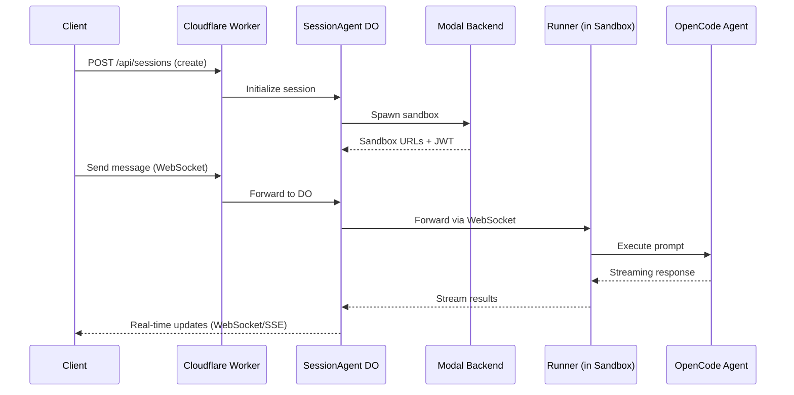

# Architecture Deep Dive

## Request Flow



## How Auth Works

```
Browser                   Worker (:8787)              GitHub/Google
  |                           |                           |
  |-- click "Sign in" ------>|                           |
  |                          |-- 302 to provider ------->|
  |                          |                           |-- user grants access
  |                          |<-- callback?code=xxx -----|
  |                          |-- exchange code for token  |
  |                          |-- encrypt + store token    |
  |                          |-- create auth_session      |
  |<-- 302 to /auth/callback?token=yyy                   |
  |-- store token in localStorage                        |
  |-- GET /api/auth/me ----->|                           |
  |<-- { user, providers } --|                           |
```

- Session tokens: random 32-byte hex, SHA-256 hashed, 7-day expiry
- GitHub access tokens: AES-256-GCM encrypted in `oauth_tokens`
- JWT tokens: issued by Worker for sandbox service auth, validated by Runner gateway

## Sandbox Services

Each sandbox container runs the following services:

| Service | Port | Purpose |
|---------|------|---------|
| OpenCode agent | 4096 | AI coding agent (HTTP + SSE) |
| VS Code (code-server) | 8080 | Web IDE |
| noVNC | 6080 | Virtual display GUI (Xvfb on :99) |
| TTYD | 7681 | Web terminal |
| Auth gateway | 9000 | JWT proxy that routes to all services above |
| Runner | — | Bridges OpenCode <-> SessionAgent DO via WebSocket |

The auth gateway on port 9000 is the single entry point. It validates JWTs issued by the Worker and proxies authenticated requests to the internal services.
