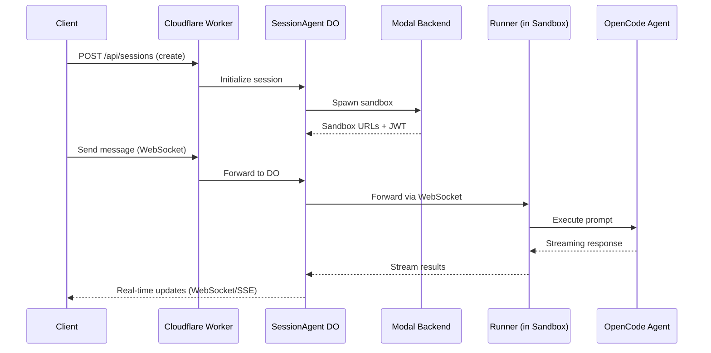
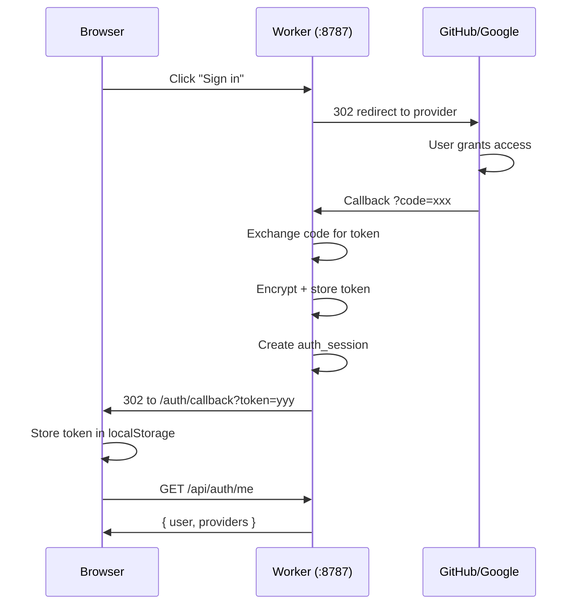
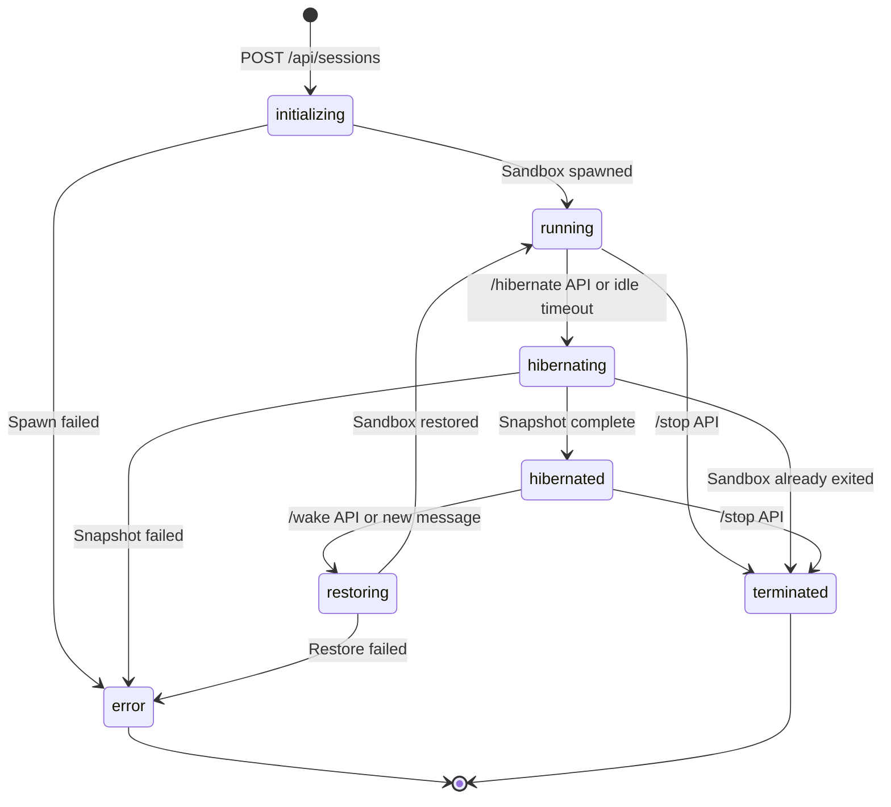
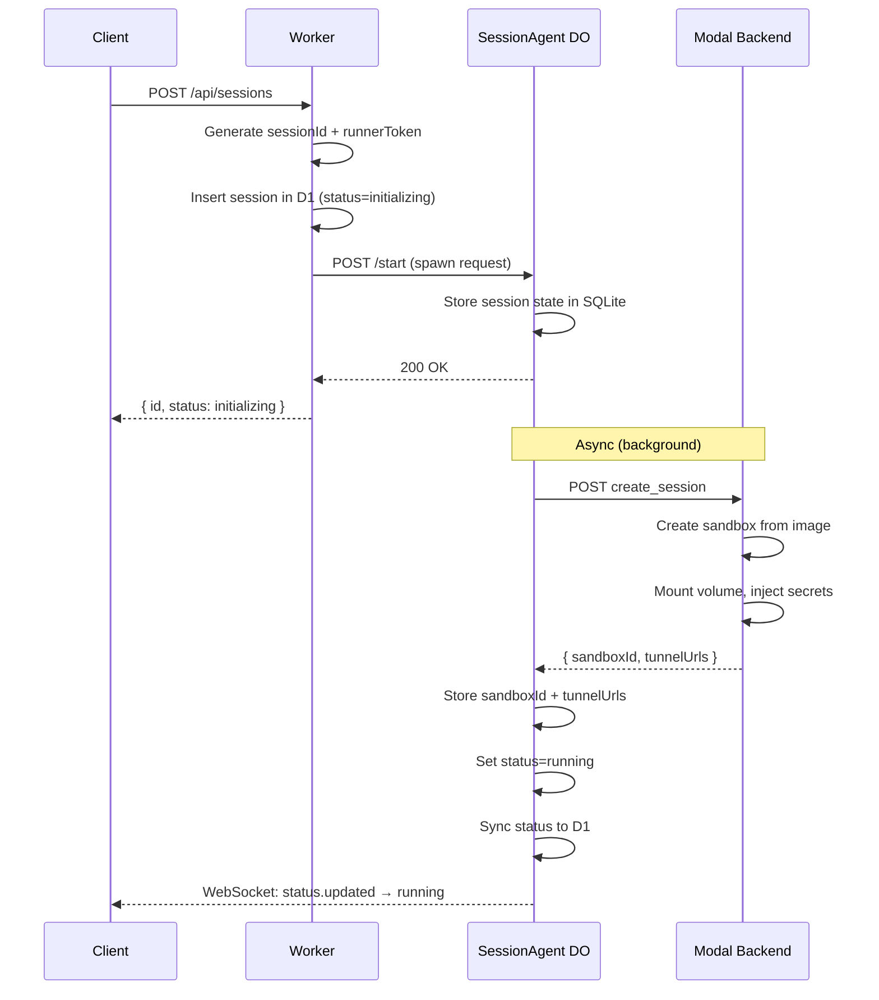
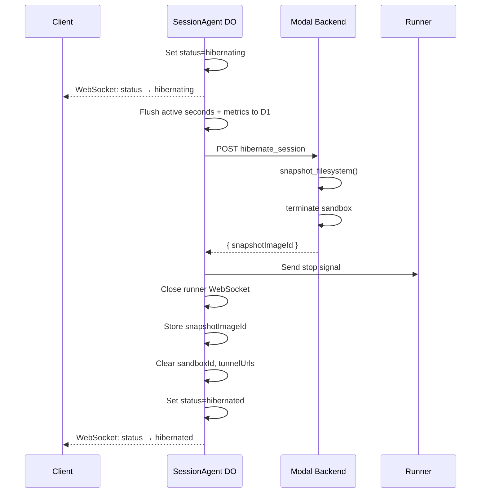
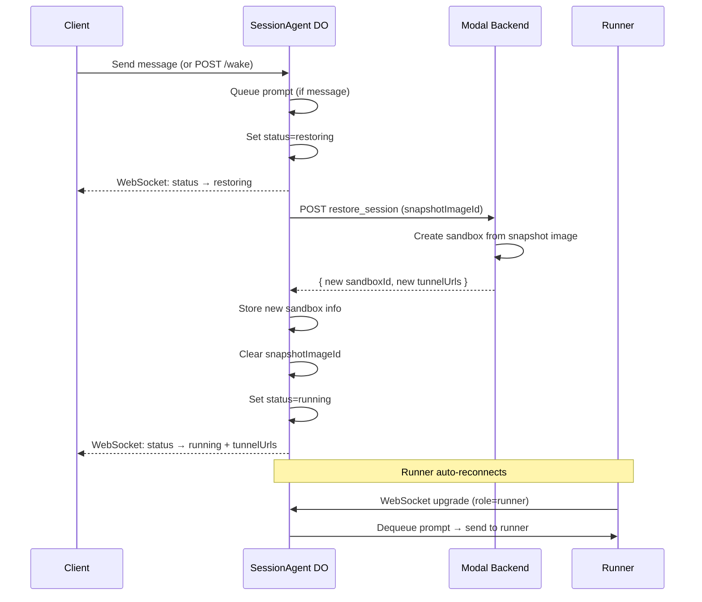
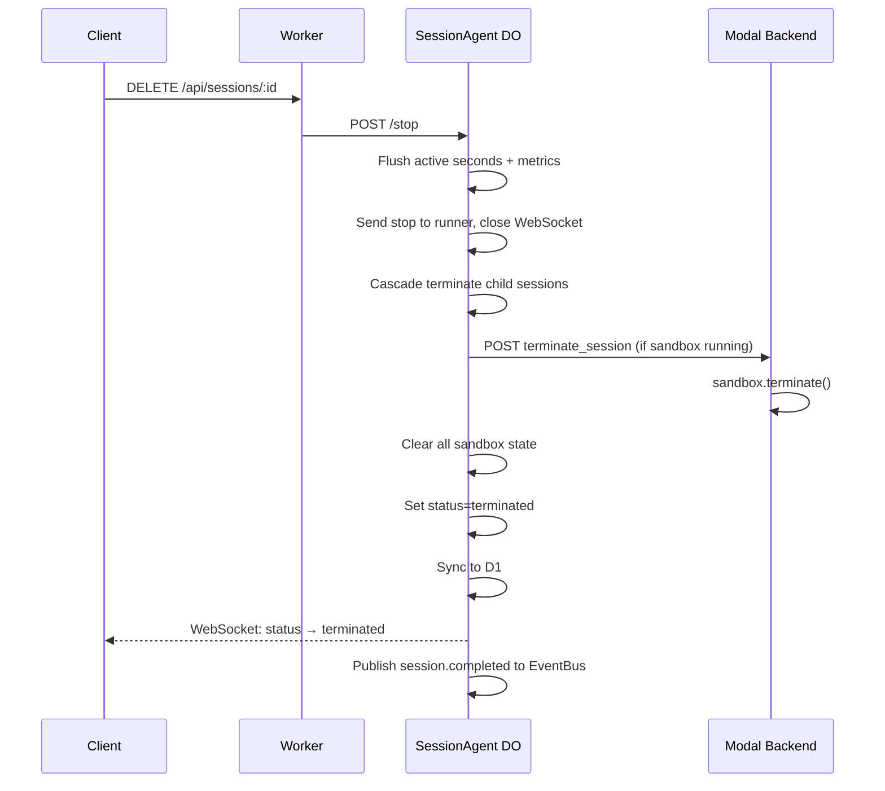
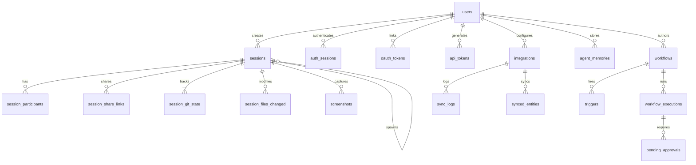

# Architecture Deep Dive

## Request Flow



## How Auth Works



- Session tokens: random 32-byte hex, SHA-256 hashed, 7-day expiry
- GitHub access tokens: AES-256-GCM encrypted in `oauth_tokens`
- JWT tokens: issued by Worker for sandbox service auth, validated by Runner gateway

## Session Lifecycle

Sessions move through a defined set of states. Each transition involves coordination between the Cloudflare Worker, the SessionAgent Durable Object, and the Modal backend.

### State Machine



### Creation



The Worker returns immediately with `status: initializing`. Sandbox creation happens asynchronously in the DO. Once the Modal sandbox is running, the DO updates its state and broadcasts the new status to connected clients.

### Hibernation

Hibernation snapshots the sandbox filesystem and terminates the container to save resources. It's triggered either explicitly via the API or automatically when the idle timeout expires.



If the sandbox has already exited (e.g. Modal reclaimed it), the DO receives a 409 and transitions to `terminated` instead.

### Restoration (Wake)

Waking a session creates a new sandbox from the stored snapshot. It's triggered explicitly via `/wake` or automatically when a user sends a message to a hibernated session.



The prompt queue ensures messages sent during hibernation or restoration are delivered once the runner reconnects.

### Termination



### Idle Timeout

Sessions track `lastUserActivityAt` (updated on every user message and runner activity). An alarm fires at `lastUserActivityAt + idleTimeoutMs`. If the session is still idle when the alarm fires, hibernation begins automatically.

## SessionAgent Durable Object

The SessionAgent DO is the central coordination point for each session. It manages WebSocket connections, message history, prompt queuing, and sandbox lifecycle.

### SQLite Schema

The DO maintains a local SQLite database with 5 tables:

| Table | Purpose |
|-------|---------|
| `messages` | Full message history (user, assistant, tool, system) |
| `questions` | Agent questions pending user answers (5-min expiry) |
| `prompt_queue` | Queued prompts waiting for runner (queued → processing → completed) |
| `state` | Key-value store for session metadata (status, sandboxId, tunnelUrls, etc.) |
| `connected_users` | Currently connected client user IDs |

### WebSocket Architecture

The DO accepts two types of WebSocket connections, differentiated by a `role` query parameter:

**Client connections** (`role=client`):
- Tagged with `client:{userId}` for multiplayer user tracking
- Receive an `init` message on connect with full session state, message history, and pending questions
- Trigger a `user.joined` broadcast to other connected clients

**Runner connection** (`role=runner`):
- Tagged with `runner`
- Authenticated via `runnerToken` (256-bit hex, generated at session creation)
- Only one runner connection allowed at a time — new connections close existing ones
- On disconnect, any `processing` prompts revert to `queued` status

### Message Types

**Client → DO**: `prompt`, `answer`, `abort`, `revert`, `diff`, `review`, `ping`

**Runner → DO** (27 types): `stream`, `result`, `tool`, `question`, `agentStatus`, `complete`, `error`, `screenshot`, `create-pr`, `update-pr`, `git-state`, `files-changed`, `child-session`, `spawn-child`, `models`, `aborted`, `reverted`, and more.

**DO → Client**: `init`, `message`, `message.updated`, `status`, `question`, `user.joined`, `user.left`, `streaming`, `tunnelUrls`, and more.

### Prompt Queue

The prompt queue is a 3-state FSM that ensures no messages are lost, even across runner disconnections and session hibernation.

```
queued → processing → completed
  ↑          |
  └──────────┘  (on runner disconnect)
```

**Dispatch logic** when a prompt arrives:
1. If runner is connected and not busy → send directly, mark `runnerBusy=true`
2. If runner is busy or disconnected → insert into `prompt_queue` with status `queued`
3. If session is hibernated → queue the prompt, then trigger wake

**Queue drain** after each prompt completes:
1. Mark current prompt as `completed`
2. Check for next `queued` prompt
3. If found → mark `processing`, send to runner
4. If empty → set `runnerBusy=false`

### Init Payload

On WebSocket connection, clients receive:

```typescript
{
  type: 'init',
  session: {
    id, status, workspace, title,
    messages: [{ id, role, content, parts, authorId, authorEmail, authorName, authorAvatarUrl, createdAt }]
  },
  data: {
    sandboxRunning: boolean,
    runnerConnected: boolean,
    runnerBusy: boolean,
    promptsQueued: number,
    connectedClients: number,
    connectedUsers: [{ userId, name, email, avatarUrl }],
    availableModels: string[]
  }
}
```

Pending questions are sent as separate `question` messages immediately after init.

### Metrics and Time Tracking

- **Active seconds**: Tracked via `markRunningStarted()` / `flushActiveSeconds()`. Elapsed time is computed and flushed to D1's `sessions.active_seconds` column on every state transition out of `running`.
- **Message and tool-call counts**: Incremented locally in DO SQLite, flushed to D1 after each agent turn and on state transitions.

## Sandbox Services

Each sandbox container runs the following services:

| Service | Port | Purpose |
|---------|------|---------|
| OpenCode agent | 4096 | AI coding agent (HTTP + SSE) |
| VS Code (code-server) | 8765 | Web IDE |
| noVNC | 6080 | Virtual display GUI (Xvfb on :99) |
| TTYD | 7681 | Web terminal |
| Auth gateway | 9000 | JWT proxy that routes to all services above |
| Runner | — | Bridges OpenCode ↔ SessionAgent DO via WebSocket |

The auth gateway on port 9000 is the single entry point. It validates JWTs issued by the Worker and proxies authenticated requests to the internal services.

## D1 Data Model

The Worker uses Cloudflare D1 (SQLite) as its primary database. D1 is the source of truth for session listings, user data, and org config. The SessionAgent DO's local SQLite is the source of truth for real-time state (messages, connected users, prompt queue).

### Entity Relationship Overview



### Tables by Domain

**Auth (4 tables)**

| Table | Key Columns | Notes |
|-------|-------------|-------|
| `users` | id, email, name, avatar_url, github_id, role | Role is `admin` or `member` |
| `auth_sessions` | token_hash, user_id, provider, expires_at | 7-day expiry, SHA-256 hashed tokens |
| `oauth_tokens` | user_id, provider, encrypted_access_token | AES-256-GCM encrypted, unique per user+provider |
| `api_tokens` | user_id, token_hash, prefix, scopes | Revocable, optional expiry |

**Sessions (4 tables)**

| Table | Key Columns | Notes |
|-------|-------------|-------|
| `sessions` | id, user_id, workspace, status, sandbox_id, tunnel_urls | Denormalized metrics: message_count, tool_call_count, active_seconds |
| `session_git_state` | session_id (unique), source_type, branch, pr_number, pr_state | 1:1 with session, tracks PR lifecycle |
| `session_files_changed` | session_id, file_path, status, additions, deletions | Unique per session+file_path |
| `screenshots` | session_id, r2_key, description | R2-backed image storage |

**Multiplayer (2 tables)**

| Table | Key Columns | Notes |
|-------|-------------|-------|
| `session_participants` | session_id, user_id, role | Roles: owner, collaborator, viewer |
| `session_share_links` | session_id, token, role, max_uses, use_count | Revocable, optional expiry |

**Organization (3 tables)**

| Table | Key Columns | Notes |
|-------|-------------|-------|
| `org_settings` | name, allowed_email_domain, default_session_visibility | Singleton row (id=`default`) |
| `org_api_keys` | provider (unique), encrypted_key | Org-wide LLM provider keys |
| `invites` | code, email, role, expires_at | One-time use invite codes |

**Integrations (3 tables)**

| Table | Key Columns | Notes |
|-------|-------------|-------|
| `integrations` | user_id, service, config, status | Unique per user+service |
| `sync_logs` | integration_id, status, records_synced | Per-sync operation tracking |
| `synced_entities` | integration_id, entity_type, external_id, data | Unique per integration+type+external_id |

**Workflows (4 tables)**

| Table | Key Columns | Notes |
|-------|-------------|-------|
| `workflows` | user_id, slug, name, data (JSON) | Workflow definition as JSON |
| `triggers` | workflow_id, type, config | Types: webhook, schedule, manual |
| `workflow_executions` | workflow_id, trigger_id, status, steps (JSON) | Execution history with step-level detail |
| `pending_approvals` | execution_id, step_id, status | Human-in-the-loop approval gates |

**Memory (1 table)**

| Table | Key Columns | Notes |
|-------|-------------|-------|
| `agent_memories` | user_id, workspace, content, category | Per-user, optionally scoped to workspace |

### Design Patterns

- **Timestamps as TEXT** in ISO format (`datetime('now')`)
- **JSON columns as TEXT** for flexible structured data (config, metadata, steps)
- **Denormalized metrics** on `sessions` for fast dashboard queries
- **Self-referential sessions** via `parent_session_id` for child session trees
- **Single-org model** with `org_settings` as a singleton row
