# Design: Sandbox Credential Isolation

## Problem

The current security model places the user's GitHub token inside the sandbox container as an environment variable. The runner process holds it in memory and injects it into git's credential helper, but every process in the container (OpenCode, its child processes, any code the agent writes and executes) can read it from the environment or from `/proc/*/environ`.

This means a prompt injection attack, a malicious dependency, or even a confused agent could:

1. Read `GITHUB_TOKEN` from the environment
2. Push arbitrary code to any branch the token has access to
3. Read private repos the user has access to but didn't intend to expose
4. Create/delete branches, tags, releases, or webhooks
5. Exfiltrate the token for later use

The agent should be treated as **adversarial for access control purposes** — not because it's malicious, but because it processes untrusted input (user prompts, repository contents, LLM outputs) and can be manipulated. The security model should make it impossible for even a fully compromised agent to do lasting damage outside its designated session branch.

This is the single largest credential exposure gap in the current architecture. LLM API keys are also exposed, but their blast radius is limited to cost (rate limits, billing alerts mitigate). A GitHub token with write access to production repos is a different class of risk.

## Models Under Consideration

Four models for isolating git credentials from the agent process, ordered from least to most isolated:

### Model A: Status Quo (Token in Sandbox)

```mermaid
graph LR
    subgraph sandbox["Sandbox Container"]
        direction LR
        runner["Runner + OpenCode<br/>🔑 holds GITHUB_TOKEN"]
        gitops["git commit / push"]
        runner --> gitops
    end
    gitops --> github[("GitHub")]

    style sandbox fill:#fee2e2,stroke:#dc2626,stroke-width:2px
    style github fill:#f3f4f6,stroke:#6b7280
```



**How it works today:** The worker decrypts the user's GitHub OAuth token from D1, passes it to Modal as a secret, Modal injects it as `GITHUB_TOKEN` env var. The runner configures git's credential helper to use it. The agent can run `git commit`, `git push`, and any other git command directly.

**What can go wrong:**
- Agent (or injected prompt) reads the token and exfiltrates it
- Agent pushes to wrong branch, force-pushes, deletes branches
- Agent pushes secrets, malware, or supply-chain attacks to the repo
- Agent accesses repos beyond the one it's working on

**What it gets right:**
- Simple. No extra infrastructure.
- Low latency — git operations are local
- Full git workflow available to the agent (interactive rebase, stash, worktrees, etc.)

---

### Model B: Worker-Mediated Push (GitHub API from Edge)

```mermaid
graph LR
    subgraph sandbox["Sandbox — no token"]
        direction LR
        agent["Runner + OpenCode"]
        localonly["git commit / diff<br/>(local only)"]
        agent --> localonly
    end

    agent -- "WSS changeset" --> DO["SessionAgent DO<br/>🔑 decrypts token"]
    DO -- "Git Data API" --> github[("GitHub")]

    style sandbox fill:#fef3c7,stroke:#d97706,stroke-width:2px
    style DO fill:#dbeafe,stroke:#2563eb
    style github fill:#f3f4f6,stroke:#6b7280
```



**How it works:** The sandbox has no GitHub token. The agent commits locally (no token needed for `git commit`). When the user clicks "Push" or "Create PR" in the web UI, the worker:

1. Sends a WebSocket message to the runner: `{ type: 'prepare-push' }`
2. Runner responds with a changeset: file contents, paths, commit messages, parent SHA
3. Worker decrypts the GitHub token from D1 (or uses GitHub App installation token)
4. Worker calls GitHub's Git Data API to create blobs, trees, commits, and update the branch ref
5. Worker creates the PR via `POST /repos/{owner}/{repo}/pulls`

The GitHub token never leaves Zone 1 (Cloudflare edge). It is decrypted in worker memory, used for API calls, and discarded.

**Changeset extraction (runner side):**
```
Runner receives 'prepare-push' →
  git diff --name-status origin/session/{id}..HEAD →
  for each changed file: read content →
  git log --format='%H %s' origin/session/{id}..HEAD →
  send structured payload over WebSocket
```

**Push execution (worker side):**
```
Worker receives changeset →
  decrypt GitHub token →
  for each file: POST /repos/.../git/blobs { content, encoding } →
  POST /repos/.../git/trees { base_tree, tree: [...] } →
  POST /repos/.../git/commits { message, tree, parents } →
  PATCH /repos/.../git/refs/heads/session/{id} { sha } →
  POST /repos/.../pulls (if PR requested)
```

**Branch scoping:** The worker only ever updates `refs/heads/session/{sessionId}`. This is a string check in the worker code, not a policy the agent can circumvent.

**Strengths:**
- GitHub token never enters the sandbox — eliminates the primary exfiltration risk
- Branch scoping enforced at the infrastructure layer
- PR creation becomes a first-class app action, not an agent-initiated side effect
- No extra sandboxes, no extra Modal cost
- Works with GitHub App installation tokens (enables bot-attributed commits, signed commits)
- The worker can validate the changeset before pushing (e.g., reject files matching `.env*`, reject diffs over a size threshold)

**Weaknesses:**
- Reimplements `git push` as a series of HTTP API calls
- File size limits: GitHub blob API accepts max 100 MB per blob, but base64 encoding inflates payloads ~33% over WebSocket
- Binary files need base64 encoding, large repos with many changed files hit API rate limits
- Edge cases: rename detection, symlinks, submodules, file mode changes (executable bit) all need explicit handling
- Cannot support `git push --force`, interactive rebase results, or other advanced git workflows without additional API mapping
- Changeset payload transits through the WebSocket (the DO sees all file contents)

**Complexity estimate:** Medium. The core happy path (text files, <50 changed files) is ~200 lines of worker code. Edge cases add more but can be deferred.

---

### Model C: Bastion Controller Sandbox (Shared Volume)

```mermaid
graph LR
    subgraph agent["Agent Sandbox — clean room"]
        direction LR
        opencode["OpenCode<br/>(LLM keys only)"]
        devtools["code-server / VNC / TTYD"]
    end

    subgraph controller["Controller Sandbox — bastion"]
        direction LR
        runner["Runner<br/>🔑 RUNNER_TOKEN"]
        gateway["Auth Gateway :9000<br/>🔑 JWT_SECRET"]
        gitctl["Git Controller<br/>🔑 GITHUB_TOKEN"]
        gitcli["git commit / push<br/>(branch-scoped)"]
        gitctl --> gitcli
    end

    volume[("Shared Volume<br/>/workspace")]
    agent -. "read/write" .-> volume
    controller -. "read/write" .-> volume

    browser["Browser"] -- "HTTPS" --> gateway
    gateway -- "proxy" --> devtools
    runner -- "HTTP" --> opencode
    runner -- "WSS" --> DO["SessionAgent DO"]
    gitcli --> github[("GitHub")]

    style agent fill:#fef3c7,stroke:#d97706,stroke-width:2px
    style controller fill:#dcfce7,stroke:#16a34a,stroke-width:2px
    style volume fill:#f3f4f6,stroke:#6b7280,stroke-width:2px
    style DO fill:#dbeafe,stroke:#2563eb
    style github fill:#f3f4f6,stroke:#6b7280
    style browser fill:#f3f4f6,stroke:#6b7280
```



**How it works:** Two Modal sandboxes per session, sharing a workspace volume. The key insight is that the runner and auth gateway — not just git — move to the controller sandbox, making the agent sandbox a true clean room.

- **Agent sandbox** runs OpenCode, code-server, VNC, and TTYD. It has **only LLM API keys** — the minimum needed for OpenCode to call Claude/GPT. It has no GitHub token, no runner token, no JWT secret, no 1Password credentials. All services bind to localhost. There are **no externally reachable ports**. Git is available for local operations (status, diff, log, commit) but the remote has no configured credentials.
- **Controller sandbox** is the bastion. It runs the runner, the auth gateway (port 9000), and the git controller. It holds all session credentials: `RUNNER_TOKEN`, `JWT_SECRET`, `GITHUB_TOKEN`, `OPENCODE_SERVER_PASSWORD`, `OP_SERVICE_ACCOUNT_TOKEN`. It never executes untrusted code or processes LLM output — it is a pure orchestrator and proxy.

**Communication between sandboxes:**

The runner currently talks to OpenCode via HTTP on `localhost:4096`. With the runner in a separate sandbox, this becomes a cross-sandbox network call. Options:

1. **Modal internal networking** — if both sandboxes are in the same Modal app, they can communicate over Modal's internal network. The runner connects to the agent sandbox's OpenCode on its internal hostname.
2. **Unix domain socket on the shared volume** — a `socat` relay on each side bridges a UDS on the volume to OpenCode's HTTP port. No Modal networking required.
3. **Tunnel via the DO** — the runner relays OpenCode commands through the SessionAgent DO. Adds latency but requires zero cross-sandbox networking.

Option 1 is cleanest if Modal supports it. Option 2 is the fallback.

**The auth gateway as bastion proxy:**

The gateway moves to the controller sandbox and becomes the sole external entry point for the entire session. Browser requests hit the controller's port 9000, the gateway validates JWTs, then proxies to the agent sandbox's internal services (code-server, VNC, TTYD) over the cross-sandbox network. The agent sandbox exposes nothing externally.

This is a classic bastion/jump-host architecture:
```
Browser → [Controller :9000] → [Agent code-server :8765]
                              → [Agent noVNC :6080]
                              → [Agent TTYD :7681]
```

**Credential distribution:**

| Credential | Controller Sandbox | Agent Sandbox |
|---|---|---|
| `GITHUB_TOKEN` | Yes | **No** |
| `RUNNER_TOKEN` | Yes | **No** |
| `JWT_SECRET` | Yes | **No** |
| `OPENCODE_SERVER_PASSWORD` | Yes | **No** |
| `OP_SERVICE_ACCOUNT_TOKEN` | Yes | **No** |
| `DO_WS_URL` | Yes | **No** |
| `ANTHROPIC_API_KEY` | No | Yes |
| `OPENAI_API_KEY` | No | Yes |
| `GOOGLE_API_KEY` | No | Yes |

The agent sandbox holds only LLM provider keys. A fully compromised agent can run up an LLM bill (mitigated by rate limits and billing alerts) but cannot:
- Authenticate to the SessionAgent DO
- Forge or validate gateway JWTs
- Push to GitHub
- Access 1Password secrets
- Reach any external service except LLM APIs (via network egress rules)

**Git operations** work the same as the original Model C — the controller has the token and runs `git push origin HEAD:refs/heads/session/{id}` on the shared volume when the user initiates a push.

**Controller RPC surface (git):**
```
ALLOWED COMMANDS:
  git status
  git diff [--cached]
  git add <paths>
  git commit -m <message>
  git push origin HEAD:refs/heads/session/{id}
  git fetch origin
  git log [--oneline] [-n N]

DENIED (everything else):
  git push --force
  git push origin HEAD:main
  git remote add/remove
  git config credential.*
  Any non-git command
```

**Strengths:**
- **True clean room.** The agent sandbox has no credentials except LLM keys, no externally reachable ports, and no way to authenticate to any system beyond calling LLM APIs.
- **Bastion architecture.** All external access (browser, DO WebSocket, GitHub) flows through the controller. Single audit point, single ingress path.
- Real git. No API reimplementation. Handles all edge cases (binary files, renames, submodules, large repos).
- GitHub token is in a separate process namespace — the agent sandbox literally cannot read it.
- Branch scoping enforced by the controller's command allowlist.
- Network egress can be restricted independently (agent sandbox: LLM APIs only; controller sandbox: GitHub + DO only).
- The controller handles `git clone` at session start, so the agent sandbox never needs remote credentials at all.
- The runner's prompt-forwarding and event-streaming logic doesn't change — it just talks to OpenCode over the network instead of localhost.

**Weaknesses:**
- **Cross-sandbox latency.** Every prompt sent to OpenCode and every streaming SSE chunk travels over the network instead of localhost. For streaming responses this adds per-chunk latency. Mitigation: Modal's internal network is low-latency within the same region; SSE chunks are small.
- **Git index locking.** If the agent runs `git status` while the controller runs `git commit`, they'll contend on `.git/index.lock`. Mitigation: the controller acquires a coordination lock (flock on a shared-volume file) before any git write operation, and the agent's git read operations retry on lock contention. Alternatively, the controller uses `git worktree` for its operations.
- **Two sandboxes per session.** Doubles the minimum Modal compute. The controller runs the runner (always-on) and gateway (always-on), so it can't be ephemeral like in the git-only variant. Mitigation: the controller image is minimal (Node/Bun runtime + git, no LLM deps, no VS Code, no Xvfb) so its resource footprint is small.
- **Lifecycle complexity.** The SessionAgent DO must track two sandbox IDs, handle health checks for both, and coordinate shutdown. If either sandbox dies, the other should be cleaned up.
- **Cross-sandbox networking dependency.** Requires either Modal internal networking between sandboxes or a UDS relay on the shared volume. If neither is reliable, falls back to tunneling through the DO (functional but higher latency).
- **Volume consistency.** Modal volumes are eventually consistent for some operations. Need to verify that file writes from the agent sandbox are immediately visible to the controller (POSIX semantics vs. distributed filesystem semantics).
- **Gateway proxy hop.** Browser requests to code-server/VNC/TTYD now traverse two network hops (browser → controller gateway → agent service) instead of one. Adds latency to interactive sessions. VNC in particular is latency-sensitive.

**Complexity estimate:** High. Requires changes to the Modal backend (two-sandbox orchestration, networking), SessionAgent DO (dual lifecycle management), runner (remote OpenCode connection), and gateway (remote proxy targets). The security improvement is substantial — this removes *all* non-LLM credentials from the agent sandbox, not just the GitHub token.

---

### Model D: Patch-Based Pipeline (No Shared Filesystem)

```mermaid
graph LR
    subgraph agent["Agent Sandbox — zero credentials"]
        direction LR
        agentproc["Runner + OpenCode"]
        patchgen["git commit (local)<br/>git format-patch"]
        agentproc --> patchgen
    end

    patchgen -- "WSS patch payload" --> DO["SessionAgent DO"]
    DO --> patchqueue[("Patch Queue<br/>SQLite / R2")]
    patchqueue -- "on user approval" --> applier

    subgraph ephemeral["Ephemeral Apply Sandbox"]
        applier["git clone → git am → git push<br/>🔑 GitHub token"]
    end

    applier --> github[("GitHub")]

    style agent fill:#fef3c7,stroke:#d97706,stroke-width:2px
    style DO fill:#dbeafe,stroke:#2563eb
    style patchqueue fill:#dbeafe,stroke:#2563eb
    style ephemeral fill:#dcfce7,stroke:#16a34a,stroke-width:2px
    style github fill:#f3f4f6,stroke:#6b7280
```



**How it works:** The agent works entirely locally. No shared volume. When work is ready:

1. Agent (or user) signals completion
2. Runner runs `git format-patch origin/main..HEAD --stdout` and sends the patch series over WebSocket to the DO
3. The DO stores the patches (in SQLite or R2)
4. User reviews the patch summary in the web UI
5. On approval, the worker spins up an ephemeral sandbox that:
   a. Clones the repo (using GitHub token)
   b. Applies the patches (`git am`)
   c. Pushes to `session/{id}` branch
   d. Creates PR if requested
   e. Terminates

**Strengths:**
- Maximum isolation. The agent sandbox has zero credentials — no GitHub token, no remote access, no shared volume.
- Patches are inspectable, auditable artifacts. The DO stores them as a record of exactly what the agent produced.
- User approval gate before anything touches the remote repo
- Supports rollback: patches can be selectively applied, reordered, or dropped
- The apply sandbox is completely ephemeral — exists for seconds, has minimal attack surface
- Enables diff preview in the UI before push (patches are just text)
- Naturally extends to multi-session workflows: patches from different sessions can be combined

**Weaknesses:**
- `git format-patch` doesn't handle binary files well (they're encoded but the patches get huge)
- Large changesets produce large patch payloads that transit through the WebSocket and DO
- The ephemeral sandbox needs to clone the repo every time — adds latency proportional to repo size (mitigated by shallow clone, or by caching a bare repo in a persistent volume)
- The agent loses the ability to do `git pull` / `git fetch` — its local repo diverges from remote over time. Long-running sessions would need periodic "sync" operations.
- Merge conflicts surface at apply time, not at coding time. The agent may produce work that doesn't apply cleanly.
- Highest implementation complexity: patch generation, storage, UI for review, ephemeral sandbox orchestration

**Complexity estimate:** Very high. This is essentially building a patch review pipeline. Powerful, but significant engineering investment.

---

## Comparison Matrix

| Dimension | A: Status Quo | B: Worker API | C: Bastion Sandbox | D: Patch Pipeline |
|-----------|:---:|:---:|:---:|:---:|
| **GitHub token in agent sandbox** | Yes | **No** | **No** | **No** |
| **Runner token in agent sandbox** | Yes | Yes | **No** | Yes |
| **Any credentials in agent sandbox** | All | All except GitHub | **LLM keys only** | All except GitHub |
| **Agent sandbox externally reachable** | Yes (gateway) | Yes (gateway) | **No (bastion proxy)** | Yes (gateway) |
| **Agent can push arbitrary branches** | Yes | **No** | **No** | **No** |
| **Agent can auth to SessionAgent DO** | Yes | Yes | **No** | Yes |
| **Agent can read other repos** | Yes | **No** | **No** | **No** |
| **Handles binary files** | Yes | Partial | Yes | Partial |
| **Handles large changesets** | Yes | Rate-limited | Yes | Slow |
| **Git edge cases (submodules, renames)** | Full | Manual mapping | Full | Full |
| **Push latency** | ~0s (local) | ~1-2s (API) | ~0s or ~3-5s | ~10-30s (clone+apply) |
| **Extra infra per session** | None | None | 1 sandbox | 1 ephemeral sandbox |
| **Extra Modal cost** | None | None | ~1.5x (small controller) | Minimal (ephemeral) |
| **Implementation complexity** | Done | Medium | High | Very High |
| **User approval gate** | No | Easy to add | Easy to add | Built-in |
| **Changeset inspection** | No | Possible | Possible | Built-in |
| **Rollback / selective apply** | No | No | No | Yes |
| **Branch scoping enforcement** | Convention | Infra-level | Infra-level | Infra-level |
| **Works with GitHub App tokens** | Config change | Yes | Yes | Yes |
| **Agent retains full git workflow** | Yes | Local only | Local only | Local only |

## Recommendation

**Start with Model B. Build toward Model C as the long-term architecture.**

Model B (worker-mediated push via GitHub API) provides the critical security improvement — removing the GitHub token from the sandbox — with the lowest implementation cost and no additional infrastructure. The 90% case for a coding agent is "changed a handful of text files" which maps cleanly to the Git Data API.

Model C (bastion controller sandbox) is the stronger long-term target. It doesn't just remove the GitHub token — it removes *all* credentials from the agent sandbox except LLM keys, eliminates external network ingress to the agent, and creates a proper bastion architecture. The upgrade path from B to C is incremental: the "Push" and "Create PR" UI actions work the same way, the runner's prompt-forwarding logic doesn't change, and the git operations move from the worker to the controller sandbox.

### Phase 1: Model B (immediate)

1. **Remove `GITHUB_TOKEN` from sandbox environment.** Stop passing it via Modal secrets. The agent can still `git init`, `git add`, `git commit` locally — these don't need a remote token.

2. **Clone via a trusted path.** At session start, either:
   - The worker pre-clones into the volume before the agent sandbox starts (using an ephemeral sandbox or the Git Data API to download a tarball)
   - Or: keep the token for the initial clone only, then rotate it out (Modal doesn't support hot-removing env vars, so this is architecturally messy — prefer the pre-clone approach)

3. **Add `prepare-push` / `push-result` WebSocket message types.** The runner extracts the changeset on demand and sends it to the DO. The DO relays to the worker, which executes the push via GitHub API.

4. **Add "Push" and "Create PR" actions to the session UI.** These are user-initiated, not agent-initiated. The agent can request a push (via a message), but the user must approve it.

5. **Enforce branch naming.** The worker only pushes to `refs/heads/session/{sessionId}`. No exceptions.

6. **Switch to GitHub App installation tokens.** This gives you bot-attributed commits (clear provenance), automatic branch protection compatibility, and fine-grained repository scoping (the app is installed on specific repos, not the user's entire account).

### Phase 2: Model C (target architecture)

1. **Split into two sandboxes.** Controller runs the runner, auth gateway, and git controller. Agent runs OpenCode and dev tools only.

2. **Move all non-LLM credentials to the controller.** `RUNNER_TOKEN`, `JWT_SECRET`, `GITHUB_TOKEN`, `OPENCODE_SERVER_PASSWORD`, `OP_SERVICE_ACCOUNT_TOKEN` all live in the controller. The agent sandbox gets only `ANTHROPIC_API_KEY`, `OPENAI_API_KEY`, `GOOGLE_API_KEY`.

3. **Gateway becomes a bastion proxy.** Browser traffic hits the controller's port 9000, gets JWT-validated, and proxies into the agent sandbox's internal services. The agent sandbox has no externally reachable ports.

4. **Runner connects to OpenCode over the network.** The runner in the controller sandbox talks to OpenCode in the agent sandbox via Modal internal networking or a UDS relay on the shared volume. Prompt forwarding and SSE streaming work the same way, just over a different transport.

5. **Git operations move from the worker to the controller.** Instead of the Git Data API, the controller just runs `git push` directly. Eliminates all the API edge cases from Phase 1.

Model D (patch pipeline) is the most architecturally elegant but is over-engineered for V1. It becomes interesting later if you want cross-session patch composition, formal review gates, or compliance audit trails. Keep it in mind for Phase 5+.

## Open Questions

1. **GitHub App vs. OAuth token:** If using a GitHub App, commits are attributed to the app bot (e.g., `agent-ops[bot]`). Is this acceptable for all orgs, or do some need commits attributed to the user? (Note: GitHub App commits *can* include a `Co-authored-by` trailer for the user.)

2. **Clone strategy without token in sandbox:** The cleanest path is the controller sandbox cloning into the shared volume at session start, before the agent sandbox begins work. This adds ~10-30s to session startup (depending on repo size). Is this acceptable? Alternatives: pre-populated volume cache per repo, or GitHub API tarball download.

3. **Agent-initiated push requests:** Should the agent be able to request a push (with user approval), or should push always be manually initiated from the UI? The former is more ergonomic for automated workflows; the latter is more secure.

4. **Concurrent volume mount semantics:** Need to verify that Modal volumes support simultaneous read-write mounts from two running sandboxes with POSIX consistency guarantees. If not, Model C needs a different file-sharing mechanism (NFS volume, `modal.NetworkFileSystem`, or tunneled I/O).

5. **`git pull` / sync:** With the token removed from the agent sandbox, the agent can't `git fetch` or `git pull`. For long-running sessions where the remote branch advances (e.g., CI pushes a fix), the controller can run `git fetch` + `git merge` on the shared volume on user request. This is a natural extension of the controller's role.

6. **Cross-sandbox networking for OpenCode:** The runner needs to reach OpenCode's HTTP API in the agent sandbox. Does Modal support inter-sandbox networking within the same app? If not, the fallback is a `socat` UDS-to-TCP relay on the shared volume, or tunneling OpenCode traffic through the DO (adds latency to every prompt/stream chunk).

7. **VNC latency through bastion proxy:** The gateway proxying VNC (websockify) through the controller adds a network hop to an already latency-sensitive protocol. Is the added latency perceptible? If so, VNC could be the one service that stays directly exposed on the agent sandbox (with its own JWT validation), trading some isolation for interactivity.

8. **LLM key exposure:** The agent sandbox still holds LLM API keys in its environment. A compromised agent could exfiltrate these for unauthorized use. For maximum isolation, the controller could proxy LLM API calls on behalf of OpenCode (acting as an LLM gateway with rate limiting). This adds complexity but would make the agent sandbox truly credential-free. Worth it?
