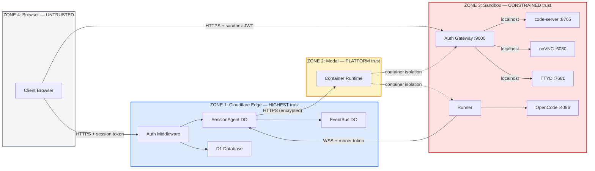

# Security Model

This document defines the security model for Agent-Ops: the trust boundaries, authentication and authorization mechanisms, data protection guarantees, and how each architectural decision serves security goals.

## Trust Boundaries

The system has four distinct trust zones, each with different privilege levels:



**Zone 1 (Cloudflare Edge)** is the root of trust. It holds `ENCRYPTION_KEY`, issues all tokens, and makes all authorization decisions. No other zone can escalate privileges without going through Zone 1.

**Zone 2 (Modal Infrastructure)** is trusted to provide container-level isolation between sandboxes. Agent-Ops does not attempt to re-implement container isolation — it delegates to Modal's infrastructure and treats it as a platform guarantee.

**Zone 3 (Sandbox Container)** runs arbitrary user code. It is given the minimum credentials needed for its task (the user's GitHub token, LLM API keys, a per-session runner token). The gateway on port 9000 is the only externally-reachable entry point, and it validates JWTs before proxying to internal services.

**Zone 4 (Client Browser)** is fully untrusted. All inputs are validated server-side. The browser never holds long-lived sandbox credentials — only short-lived JWTs (15-minute expiry) scoped to a specific session.

## Authentication

### User Authentication (OAuth)

Users authenticate via GitHub or Google OAuth. The flow:

1. Browser redirects to `/auth/{provider}` on the Worker
2. Worker generates a CSRF state JWT (signed with `ENCRYPTION_KEY`) and redirects to the OAuth provider
3. Provider redirects back with an authorization code
4. Worker exchanges the code for an OAuth access token, encrypts it with AES-GCM, and stores it in the `oauth_tokens` table
5. Worker generates a 256-bit random session token, SHA-256 hashes it, and stores the hash in `auth_sessions` (7-day expiry)
6. The plaintext token is returned to the browser, which stores it in a Zustand store backed by localStorage

All subsequent API requests include `Authorization: Bearer <token>`. The auth middleware hashes the token, looks up the hash in `auth_sessions`, verifies expiry, and sets `c.set('user', { id, email, role })` for downstream route handlers.

**Key files:** `packages/worker/src/routes/oauth.ts`, `packages/worker/src/middleware/auth.ts`

### Runner Authentication (Symmetric Token)

When a session is created, the Worker generates a 256-bit random hex token (the "runner token"). This token is:

- Stored in the SessionAgent DO's state
- Passed to the sandbox as the `RUNNER_TOKEN` environment variable via Modal secrets

The runner connects to the DO via WebSocket at `wss://.../ws?role=runner&token=<RUNNER_TOKEN>`. The DO validates the token by exact string comparison against its stored value. If it doesn't match, the connection is rejected with HTTP 401.

The DO enforces **single-runner-at-a-time**: any new runner connection closes the previous one with code 1000 and reason "Replaced by new runner connection". The runner process detects this and exits, preventing stale runners from operating.

**Key files:** `packages/worker/src/durable-objects/session-agent.ts` (lines 879-966), `packages/runner/src/agent-client.ts`

### Sandbox Gateway Authentication (JWT)

Browser access to sandbox services (VS Code, VNC, terminal) is mediated by a gateway proxy on port 9000 inside the sandbox. Access requires a short-lived JWT:

1. Client requests `GET /api/sessions/:id/sandbox-token` from the Worker
2. Worker verifies session access (`assertSessionAccess` with `'viewer'` role), then signs a JWT containing `{ sub: userId, sid: sessionId, exp: now + 15min }` using `ENCRYPTION_KEY`
3. Client loads the sandbox iframe with `?token=<JWT>` in the URL
4. Gateway verifies the JWT signature (HMAC-SHA256) and expiry
5. Gateway creates a 15-minute session cookie (`gateway_session`) so subsequent requests don't need the token in the URL
6. Gateway strips the token from the proxied request before forwarding to the internal service

**Key files:** `packages/runner/src/gateway.ts`, `packages/worker/src/routes/sessions.ts` (lines 634-681), `packages/worker/src/lib/jwt.ts`

### API Tokens (Programmatic Access)

Users can create API tokens for programmatic access. Tokens are 256-bit random hex strings, SHA-256 hashed before storage in the `api_tokens` table. The auth middleware falls back to this table if the token isn't found in `auth_sessions`. API tokens support expiry and revocation.

**Key files:** `packages/worker/src/routes/api-keys.ts`, `packages/worker/src/middleware/auth.ts`

## Authorization

### Session Access Control

All session routes call `assertSessionAccess(db, sessionId, userId, requiredRole)` before proceeding. The function implements a layered check:

```
assertSessionAccess(db, sessionId, userId, requiredRole)
│
├── Is user the session owner?  → ALLOW
│
├── Is this an orchestrator or workflow session?  → DENY
│   (these are unconditionally private)
│
├── Is user in session_participants with sufficient role?
│   (viewer < collaborator < owner)  → ALLOW
│
├── Org visibility setting:
│   'org_joinable'  → ALLOW (any role)
│   'org_visible' + requiredRole == 'viewer'  → ALLOW
│
└── DENY (throws NotFoundError to avoid information leakage)
```

Route-level role requirements:

| Operation | Required Role |
|-----------|--------------|
| Read session, list messages, view audit log | `viewer` |
| Send messages, answer questions | `collaborator` |
| Delete session, manage participants, create share links | `owner` |

**Key files:** `packages/worker/src/lib/db.ts` (lines 1396-1433), `packages/worker/src/routes/sessions.ts`

### Admin Authorization

Routes under `/api/admin/*` are protected by `adminMiddleware`, which checks `c.get('user').role === 'admin'`. Admin-only operations include:

- Managing org settings (domain gating, email allowlists, default session visibility)
- Managing org-level LLM API keys
- Managing user invites and roles

**Key files:** `packages/worker/src/middleware/admin.ts`, `packages/worker/src/routes/admin.ts`

### Workflow & Orchestrator Isolation

Orchestrator sessions (`is_orchestrator = 1`) and workflow sessions (`purpose = 'workflow'`) are unconditionally private — they bypass participant and org-visibility checks in `assertSessionAccess()`. They are also filtered from session listing queries so they don't appear in other users' session lists.

Workflow executions are user-scoped: all D1 queries filter by `user_id`. Concurrency limits are enforced per-user (default 5) and globally (default 50).

**Key files:** `packages/worker/src/lib/workflow-runtime.ts`, `packages/worker/src/routes/orchestrator.ts`

### Share Links

Session owners can create share links with:
- A specific role grant (`collaborator` or `viewer`)
- Optional expiry timestamp
- Optional max-use count

Redeeming a share link adds the user as a participant with the specified role. Links cannot be used to join orchestrator or workflow sessions (explicitly blocked in the join endpoint).

**Key files:** `packages/worker/src/routes/sessions.ts` (join endpoint), `packages/worker/src/lib/db.ts` (lines 1262-1356)

## Data Protection

### Encryption at Rest

| Data | Protection | Storage |
|------|-----------|---------|
| OAuth tokens (GitHub, Google) | AES-GCM with `ENCRYPTION_KEY` | D1 `oauth_tokens` table |
| Org LLM API keys | AES-GCM with `ENCRYPTION_KEY` | D1 `org_api_keys` table |
| User credentials (1Password) | AES-GCM with `ENCRYPTION_KEY` | D1 `user_credentials` table |
| Session tokens | SHA-256 hash (one-way) | D1 `auth_sessions` table |
| API tokens | SHA-256 hash (one-way) | D1 `api_tokens` table |
| Messages | Plaintext | D1 `messages` table + DO SQLite |
| Workspace files | Plaintext | Modal Volumes (per-session) |

### Credential Lifecycle

Encrypted credentials (OAuth tokens, API keys, 1Password tokens) are **only decrypted at session spawn time**. They are passed to the sandbox as environment variables via Modal's secrets mechanism, then used by the runner and OpenCode processes inside the container. They are never returned to the frontend.

The decryption flow:
1. Worker reads encrypted value from D1
2. Worker decrypts with `ENCRYPTION_KEY` (AES-GCM)
3. Plaintext is included in the `modal.Secret.from_dict()` call
4. Modal injects it as an environment variable in the container
5. Sandbox processes read from `process.env`

Core secrets (`DO_WS_URL`, `RUNNER_TOKEN`, `JWT_SECRET`, `OPENCODE_SERVER_PASSWORD`) cannot be overridden by caller-provided environment variables.

### Key Material

`ENCRYPTION_KEY` is the root secret for the system. It serves as:
1. AES-GCM encryption key for all at-rest encrypted data
2. HMAC-SHA256 signing key for sandbox gateway JWTs
3. HMAC-SHA256 signing key for OAuth state JWTs (CSRF protection)

This is a deliberate tradeoff: a single key simplifies operational management (one secret to rotate, one to audit) at the cost of blast radius if compromised — all encrypted data and all JWT signatures would be affected.

## Sandbox Isolation

### Container Isolation

Each session runs in a separate Modal container. Modal provides:
- Process isolation (separate PID namespace)
- Filesystem isolation (separate root filesystem)
- Network isolation (no inter-container communication)
- Resource limits (CPU, memory managed by Modal)

### Volume Isolation

Each session gets its own Modal Volume (`workspace-{sessionId}`). Volumes are only mountable by the sandbox they're assigned to. There is no mechanism for one session to mount another session's volume.

### Network Architecture

All internal services bind to `127.0.0.1` only:

| Service | Port | Binding |
|---------|------|---------|
| OpenCode | 4096 | `127.0.0.1` |
| code-server | 8765 | `127.0.0.1` |
| noVNC/websockify | 6080 | `127.0.0.1` |
| TTYD | 7681 | `127.0.0.1` |

The gateway on port 9000 is the only externally-reachable service. Modal marks ports 4096 and 9000 as `encrypted_ports`, ensuring traffic is encrypted in transit over Modal's network.

Even if Modal's network isolation were misconfigured, the localhost binding on internal services provides defense in depth — they would refuse connections from other containers.

### Credential Isolation

Each sandbox receives only its owner's credentials. User A's GitHub token is never present in User B's sandbox. The credential injection happens per-session at spawn time, with the Worker decrypting only the relevant user's credentials.

### Temporal Isolation

Sandboxes don't persist indefinitely:

| Limit | Value | Enforcement |
|-------|-------|-------------|
| Idle timeout | 15 minutes (+ 30 min Modal buffer) | Modal infrastructure |
| Hard timeout | 24 hours | Modal infrastructure |
| Gateway session cookie | 15 minutes | In-memory; lost on sandbox termination |
| Sandbox JWT | 15 minutes | Expiry claim in JWT |

Hibernation snapshots the filesystem and terminates the container. Restoration creates a new container with the snapshotted volume.

## Architectural Decisions as Security Controls

### WebSocket-only Runner ↔ DO Communication

A persistent, authenticated WebSocket channel eliminates per-request credential transmission. The runner authenticates once on connection, and all subsequent messages flow over the trusted channel. Compared to HTTP callbacks, this:
- Avoids exposing a publicly-routable callback URL inside the sandbox
- Eliminates the risk of token leakage in callback payloads or server logs
- Enables single-runner enforcement (new connections replace old ones)
- Supports connection health monitoring via 30-second keepalive pings

### Single Merged SessionAgent DO

A single DO per session creates a unified security perimeter. All authorization decisions — runner token validation, client connection tracking, message routing, prompt queue management, audit logging — happen in one place. Each DO has isolated SQLite storage, so there is no cross-session data leakage at the storage layer.

Compared to a split design (separate DOs for agent management and container orchestration), this eliminates:
- Inconsistent authorization checks between DOs
- Race conditions when coordinating state across DOs
- Additional attack surface from inter-DO communication

### Iframes for Sandbox Services (No Embedded JS Clients)

Iframes provide browser-enforced origin isolation. Sandbox services run under the Modal sandbox's origin (`*.sandbox.modal.run`), completely separate from the main app origin. This means:
- XSS in the terminal or VS Code cannot access the main app's cookies, localStorage, or session tokens
- A compromised sandbox service cannot escalate to the main application
- The browser's same-origin policy acts as a second defense layer behind the gateway JWT

Embedded JS clients would run in the main app's origin, giving sandbox-served content access to the main app's auth state.

### Single Auth Gateway Proxy (Port 9000)

The gateway is a chokepoint architecture — all external access flows through one authenticated proxy. This provides:
- **Defense in depth**: Internal services bind to localhost; they are unreachable even if network isolation fails
- **Token stripping**: JWTs are removed from proxied requests, preventing leakage to backend service logs
- **Single audit point**: All sandbox access flows through one path for logging and rate limiting
- **Cookie-based session continuity**: After initial JWT validation, a session cookie avoids re-transmitting the token in URLs

### Single-Org Deployment Model

The system is designed as a single-organization deployment. There is no `org_id` column on sessions, workflows, or messages — all data is implicitly scoped to one org. This eliminates an entire class of cross-tenant data leakage bugs. Access to the organization is controlled by:
- Email domain gating (`allowed_email_domain` in org settings)
- Explicit email allowlists
- Invite-based onboarding with admin approval

If multi-tenancy is ever needed, it requires adding `org_id` foreign keys across all tables — a well-understood migration that would be planned deliberately rather than bolted on.

## Comparison: Hosted Sandbox vs. Local Dev Machine

Most coding agents today run directly on the developer's local machine — inside their terminal, with full access to their filesystem, credentials, and network. Agent-Ops takes a fundamentally different approach by running the agent in an isolated remote sandbox. The table below contrasts the two models across key security dimensions.

| Dimension | Local Agent (e.g. CLI copilot) | Agent-Ops (remote sandbox) |
|-----------|-------------------------------|---------------------------|
| **Blast radius of agent error** | Entire developer machine. A bad `rm -rf`, a misconfigured git push, or an accidental credential write affects the real filesystem, real git remote, and real credentials. | Single disposable container. The worst case is a trashed sandbox — the developer's machine, other sessions, and production systems are unaffected. |
| **Credential exposure** | The agent inherits the developer's full shell environment: SSH keys, cloud provider credentials, browser cookies, `.env` files, git credentials for all repos. A prompt injection or tool misuse can exfiltrate any of them. | The sandbox receives only the credentials it needs for the current task (one GitHub token, one set of LLM keys). SSH keys, cloud credentials, and unrelated repo tokens are never present. |
| **Lateral movement** | A compromised agent can read other repos, access internal services on the corporate network, open connections to databases, or enumerate cloud resources — anything the developer can do. | The sandbox has no access to internal networks, other sandboxes, or the control plane. It can reach the public internet and its own SessionAgent DO via one authenticated WebSocket. Nothing else. |
| **Persistence** | A local agent can write to dotfiles, cron jobs, shell profiles, or git hooks. Malicious modifications persist across sessions and may not be noticed. | Sandboxes are ephemeral. They are terminated after idle timeout (45 min) or hard timeout (24 hours). Hibernation snapshots only the workspace volume, not system files. A new session starts from a clean image. |
| **Multi-user visibility** | No built-in audit trail. Other team members cannot see what the agent did, review its tool calls, or inspect its reasoning. Mistakes are discovered after the fact in code review. | Every message, tool call, and agent action is recorded in the session audit log and visible in real-time to any session participant. Multiplayer support means a colleague can watch or intervene while the agent works. |
| **Credential storage** | Credentials typically live in plaintext on disk (`.env`, `~/.aws/credentials`, `~/.ssh/`). The agent reads them directly. | Credentials are encrypted at rest (AES-GCM) in the control plane database. They are decrypted only at session spawn time and injected as environment variables via the platform secrets mechanism. They are never written to disk inside the sandbox. |
| **Session isolation** | There is one environment. Work on repo A and repo B shares the same filesystem, the same git config, and the same credentials. Cross-contamination is possible. | Each session is a separate container with a separate volume, separate credentials, and a separate agent instance. Work on repo A cannot read, write, or interfere with work on repo B. |
| **Revocation** | Revoking an agent's access means revoking the developer's own credentials, since they are the same. There is no way to cut off the agent without cutting off the developer. | Each session has its own runner token. Terminating a session invalidates the token immediately. The developer's OAuth tokens and API keys remain intact in the control plane. |
| **Observability** | The developer sees terminal output. There is no structured record of what files were read, what commands were run, or what network calls were made. | The SessionAgent DO records all messages and broadcasts all activity to connected clients in real-time. The audit log provides a queryable history of session events. |
| **Resource limits** | None by default. A runaway agent can consume all CPU, fill the disk, or fork-bomb the machine. | Sandboxes have platform-enforced CPU, memory, and time limits. Idle and hard timeouts prevent runaway sessions. Workflow concurrency limits prevent resource exhaustion at the org level. |

### What the sandbox model gives up

The sandbox model is not strictly better in all dimensions. The tradeoffs include:

- **Latency**: A local agent has zero-latency filesystem access. The sandbox adds network round-trips for every interaction (WebSocket to DO, iframe rendering via tunnel).
- **Tooling familiarity**: Developers have their local machine configured exactly how they like it — custom shell, editor plugins, font choices. The sandbox provides a standard environment that may not match.
- **Offline access**: A local agent works without internet. The sandbox requires connectivity to the control plane and Modal infrastructure.
- **Setup cost**: Running an agent locally requires no infrastructure. The sandbox model requires a control plane (Cloudflare Workers), a container runtime (Modal), and operational overhead.

These are acceptable tradeoffs for a hosted platform where the security and observability benefits outweigh the convenience costs. The sandbox model is designed for teams that need to run agents against production codebases, with shared credentials, where the blast radius of a mistake matters.

## Concurrency & Resource Controls

| Resource | Limit | Enforcement |
|----------|-------|-------------|
| Workflow executions per user | 5 concurrent | `checkWorkflowConcurrency()` in D1 |
| Workflow executions global | 50 concurrent | `checkWorkflowConcurrency()` in D1 |
| Runner connections per session | 1 | DO closes previous on new connect |
| Sandbox idle timeout | 45 minutes | Modal infrastructure |
| Sandbox hard timeout | 24 hours | Modal infrastructure |
| Prompt attachment size | 12 MB | Validation in DO |
| Session token expiry | 7 days | D1 `auth_sessions.expires_at` |
| API token expiry | Configurable | D1 `api_tokens.expires_at` |
| Sandbox JWT expiry | 15 minutes | JWT `exp` claim |
| Gateway cookie expiry | 15 minutes | `Max-Age=900` |

## Audit Trail

Session activity is recorded in the `session_audit_log` table:

```sql
CREATE TABLE session_audit_log (
  id TEXT PRIMARY KEY,
  session_id TEXT NOT NULL REFERENCES sessions(id) ON DELETE CASCADE,
  event_type TEXT NOT NULL,
  summary TEXT,
  actor_id TEXT,
  metadata TEXT,
  created_at TEXT DEFAULT (datetime('now'))
);
```

Audit log entries are queryable via `GET /api/sessions/:id/audit-log` (requires `viewer` access). Events include session lifecycle changes, participant additions/removals, and agent activity.
