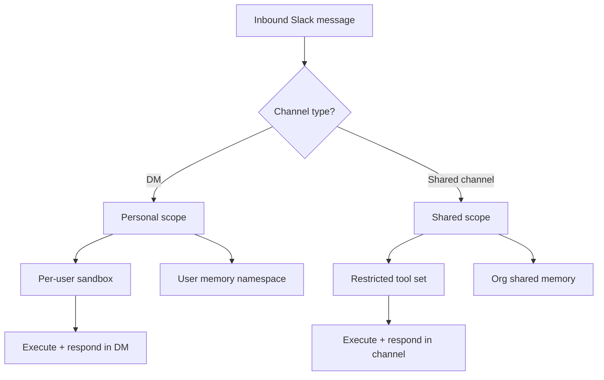
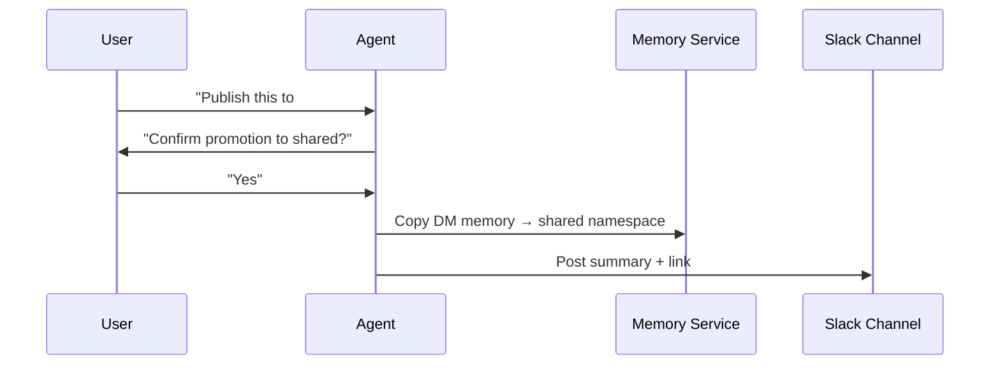
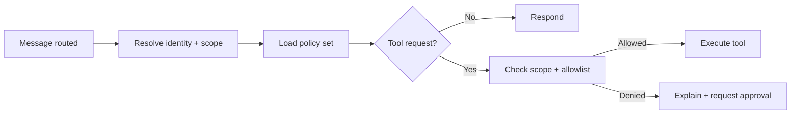

# PRD: Multi‑Tenant Agent Ops — Slack DM vs Shared Channel Routing

**Owner:** Agent Ops
**Status:** Draft
**Date:** 2026‑02‑27

## Summary
Organizations need **strong user isolation** in Slack DMs while still enabling **shared organizational knowledge** in channels. Today, the platform’s “gateway-style” model assumes a single trust boundary. This PRD defines routing, memory, and sandbox rules that treat **DMs as personal security boundaries** and **shared channels as org knowledge surfaces**, with explicit promotion/demotion of knowledge between them.

---

## Problem
- Slack DMs require **per-user privacy**, **tool isolation**, and **identity‑scoped memory**.
- Shared channels require **collaborative context**, **shared memory**, and **conservative tool execution**.
- Existing routing does not consistently separate these scopes, risking data leakage or improper tool access.

---

## Goals
1. **DMs route to per‑user sandboxes** with per‑user memory by default.
2. **Shared channels route to org‑shared memory** with restricted tool access.
3. Allow **explicit promotion** of knowledge from DM → shared (opt‑in).
4. Ensure **auditable boundaries** and predictable behavior for admins.

## Non‑Goals
- Full multi‑tenant billing or quotas in this phase.
- Cross‑org federation or shared agents across distinct orgs.
- Deep UI redesign; focus is routing + policy + memory segregation.

---

## Definitions
- **Personal scope**: User‑private sandbox + user‑private memory namespace.
- **Shared scope**: Org‑shared memory namespace + conservative tool access.
- **Promotion**: A user‑initiated action that copies DM insight into shared memory.

---

## Personas
- **Individual Contributor (IC)**: Uses DM to ask questions and do private work.
- **Team Lead**: Uses channels to create shared decisions and documentation.
- **Org Admin**: Needs auditability and predictable access controls.

---

## Assumptions
- Slack user identity is reliable and available in inbound events.
- We can store per‑user memory namespaces and org‑shared namespaces.
- Sandboxes can be configured per request (tools, env, storage).

---

## Product Requirements
### Routing
- **DM → Personal scope**
  - Per‑user sandbox
  - Per‑user memory namespace
  - Tools default to least‑privilege

- **Channel → Shared scope**
  - Shared memory namespace
  - Restricted tool set (read‑only or explicit allowlist)
  - Require mention or explicit invocation to execute tools

### Memory
- Personal and shared memories are **logically separate**.
- Default: **no cross‑pollination**.
- Promotion is explicit and auditable.

### Auth & Policy
- Routing is based on Slack identity + channel type.
- Execution policy checks are evaluated **after** routing, not before.
- Admins can override per‑channel tool allowlists.

---

## User Flows (Plain English)

### Flow A — DM (Personal)
1. User DMs the agent: “Summarize my notes from yesterday.”
2. Router resolves Slack user → personal scope.
3. Agent runs in a per‑user sandbox with user‑private memory.
4. Response stays private unless user explicitly promotes.

### Flow B — Channel (Shared)
1. User asks in #eng: “What’s the deploy status?”
2. Router resolves channel → shared scope.
3. Agent uses org‑shared memory and a restricted tool set.
4. Response is posted publicly to the channel.

### Flow C — Promotion (DM → Shared)
1. User in DM: “Publish this decision to the team channel.”
2. Agent asks for confirmation + target channel.
3. On confirm, the memory entry is copied to shared store + posted.

---

## Mermaid Diagrams

### 1) Routing Decision Flow


### 2) Promotion Flow


### 3) Policy Evaluation


---

## Data & Policy Model (Proposed)
```text
Tenant
  ├─ OrgMemoryNamespace (shared)
  ├─ UserMemoryNamespace (per user)
  └─ ChannelPolicy

ChannelPolicy
  - channel_id
  - scope: shared | personal
  - tool_allowlist
  - require_mention
  - promotion_allowed
```

---

## Rollout Plan
1. **Phase 1 (Routing + Memory Split)**
   - Implement routing logic
   - Introduce namespace separation
2. **Phase 2 (Promotion + UI controls)**
   - Explicit promotion UX
   - Audit logging
3. **Phase 3 (Admin Controls)**
   - Per‑channel tool policies
   - Policy overrides

---

## Risks & Mitigations
- **Leakage risk** → enforce namespace boundaries, audit promotions.
- **Tool abuse in channels** → default deny, require mention.
- **Confusing behavior** → explicit responses (“Using shared memory”).

---

## Open Questions
- Should promotion be reversible (shared → personal)?
- How strict should tool deny be in shared channels?
- Do we need per‑thread overrides in Slack?

---

## Success Metrics
- 0 critical incidents from DM/channel boundary violations.
- <1% of channel interactions require manual admin override.
- Promotion action success rate >95%.
